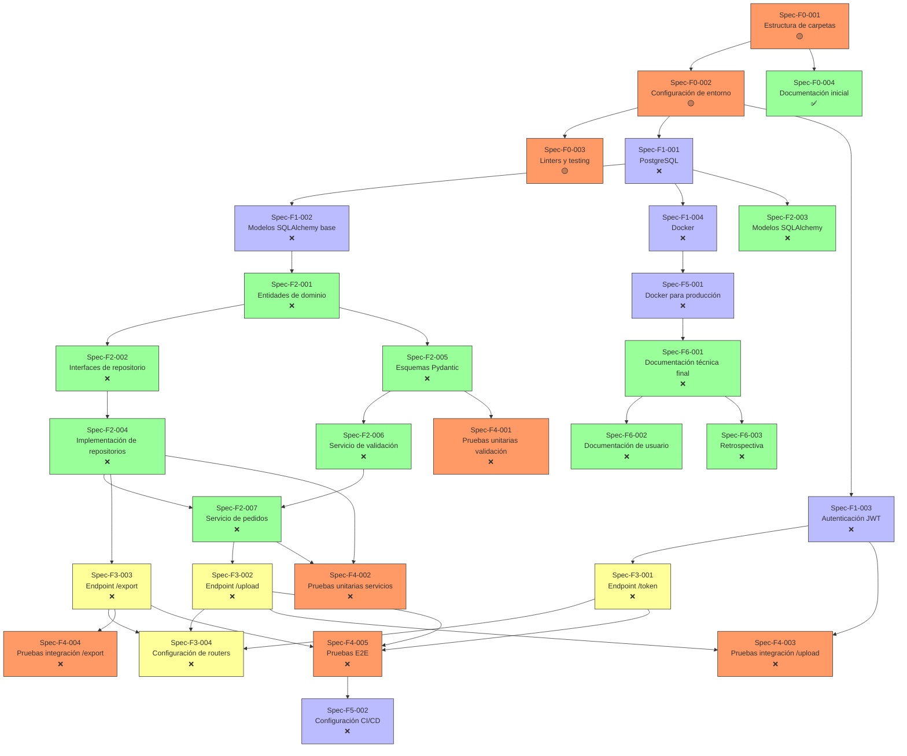

# **📋 WORKFLOW.md**

**Proyecto:** API de Importación/Exportación Masiva con Validación Estricta  
**Versión:** 1.0.0  
**Fecha:** 2026-05-25  
**Autor:** Fisherk2 
**Estado:** En Planificación  
**Metodología:** Spec-Driven Development (SDD)
**Repositorio:** https://github.com/Fisherk2/api-csv-bulk-import/

---

## **📌 Contexto del Proyecto**

### **Objetivo**

Desarrollar una **API REST** con **FastAPI** que permita:

- Importar datos masivos en formato **CSV/JSON** (detección automática).
- Validar los datos contra esquemas **Pydantic** con reglas estrictas.
- Persistir los datos válidos en **PostgreSQL** con manejo de transacciones por lote.
- Exportar datos en formato CSV/JSON.
- Autenticación mediante **JWT**.
- Reportes de errores estandarizados según **RFC 7807**.

**Propósito:** Herramienta para **portafolio técnico**, demostrando habilidades en:  
✅ Validación estricta.  
✅ Manejo de datos relacionales.  
✅ Procesamiento parcial con transacciones controladas.  
✅ Arquitectura **Domain-Driven Design (DDD)**.

---

### **Alcance**

- ✅ **Incluido:**
  - Endpoints `/upload` (POST) y `/export` (GET).
  - Validación estricta con Pydantic.
  - Persistencia en PostgreSQL.
  - Autenticación JWT.
  - Reportes de errores en formato RFC 7807.
  - Procesamiento parcial de datos.
  - Documentación OpenAPI (Swagger).
  - Pruebas unitarias, de integración y E2E.
- ❌ **Excluido:**
  - Pagos o integración con pasarelas de pago.
  - Notificaciones por email/SMS.
  - Almacenamiento de archivos (solo procesamiento en memoria).
  - Escalabilidad horizontal (foco en MVP local).
  - Monitorización avanzada (ej: Prometheus).

---

### **Stakeholders**

| **Rol**                 | **Nombre**  | **Contacto**                                | **Responsabilidades**                           |
| ----------------------- | ----------- | ------------------------------------------- | ----------------------------------------------- |
| Desarrollador Principal | Fisher Kdos | [fish@example.com](mailto:fish@example.com) | Diseño, implementación, testing, documentación. |
| Revisor de Código       | (Opcional)  | -                                           | Revisión de PRs y buenas prácticas.             |

---

## **🗺️ Roadmap de Implementación**

### **Metodología**

*Spec-Driven Development* (SDD) con las siguientes fases:

1. **Preparación (F0):** Configuración del entorno y documentación inicial.
2. **Infraestructura (F1):** Base de datos, autenticación, y configuración base.
3. **Núcleo (F2):** Modelos de datos, repositorios, y lógica de negocio.
4. **Interfaces (F3):** Endpoints de la API.
5. **Pruebas (F4):** Validación de calidad y cobertura.
6. **Despliegue (F5):** Configuración para producción.
7. **Cierre (F6):** Documentación final y retrospectiva.

**Enfoque:** Implementación por *specs* con seguimiento estricto de dependencias.

---

### **📅 Fases e Hitos**

| **Fase**                | **Duración Estimada** | **Fecha Inicio** | **Fecha Fin** | **Estado** | **Hitos Clave**                                          |
| ----------------------- | --------------------- | ---------------- | ------------- | ---------- | -------------------------------------------------------- |
| **F0: Preparación**     | 1 día                 | 2026-05-26       | 2026-05-26    | 🟡         | Estructura de carpetas, `AGENTS.MD`, `WORKFLOW.MD`.      |
| **F1: Infraestructura** | 2 días                | 2026-05-27       | 2026-05-28    | ❌          | Configuración de PostgreSQL, Docker, autenticación JWT.  |
| **F2: Núcleo**          | 3 días                | 2026-05-29       | 2026-05-31    | ❌          | Modelos de datos, repositorios, servicios de validación. |
| **F3: Interfaces**      | 2 días                | 2026-06-01       | 2026-06-02    | ❌          | Endpoints `/upload`, `/export`, `/token`.                |
| **F4: Pruebas**         | 2 días                | 2026-06-03       | 2026-06-04    | ❌          | Pruebas unitarias, integración, y E2E.                   |
| **F5: Despliegue**      | 1 día                 | 2026-06-05       | 2026-06-05    | ❌          | Docker para producción, configuración de CI/CD.          |
| **F6: Cierre**          | 1 día                 | 2026-06-06       | 2026-06-06    | ❌          | Documentación final, retrospectiva.                      |

---
## **📋 *Specs* y Seguimiento**

### **Fase 0: Preparación**

| **ID**      | **Nombre**                         | **Descripción**                                                                       | **Prioridad** | **Fase** | **Archivos Involucrados**                                                                    | **Dependencias** | **Checklist** | **Estado** | **Asignado a** | **Fechas**                             | **Aprobaciones**                                | **Notas** |
| ----------- | ---------------------------------- | ------------------------------------------------------------------------------------- | ------------- | -------- | -------------------------------------------------------------------------------------------- | ---------------- | ------------- | ---------- | -------------- | -------------------------------------- | ----------------------------------------------- | --------- |
| Spec-F0-001 | Estructura de carpetas             | Crear estructura de directorios según DDD (ver `AGENTS.MD`).                          | Alta          | F0       | Nuevos: `app/`, `tests/`, `migrations/`; Modificados: `-`                                    | Ninguna          | 0/1           | 🟡         | Fisher Kdos    | Límite: 2026-05-26; Inicio: 2026-05-26 | Diseño: ✅; Código: ❌; Pruebas: ❌; Despliegue: ❌ | &nbsp;    |
| Spec-F0-002 | Configuración de entorno           | Archivos `requirements.txt`, `pyproject.toml`, `.env.example`, `.gitignore`.          | Alta          | F0       | Nuevos: `requirements.txt`, `pyproject.toml`, `.env.example`, `.gitignore`; Modificados: `-` | Spec-F0-001      | 0/4           | 🟡         | Fisher Kdos    | Límite: 2026-05-26; Inicio: 2026-05-26 | Diseño: ✅; Código: ❌; Pruebas: ❌; Despliegue: ❌ | &nbsp;    |
| Spec-F0-003 | Configuración de linters y testing | Configurar `ruff`, `mypy`, `pytest`, y `pytest-cov`.                                  | Alta          | F0       | Nuevos: `.ruff.toml`, `mypy.ini`, `pytest.ini`; Modificados: `-`                             | Spec-F0-002      | 0/3           | 🟡         | Fisher Kdos    | Límite: 2026-05-26; Inicio: 2026-05-26 | Diseño: ✅; Código: ❌; Pruebas: ❌; Despliegue: ❌ | &nbsp;    |
| Spec-F0-004 | Documentación inicial              | Crear `AGENTS.MD`, `WORKFLOW.MD`, `CONTRIBUTING.MD`, y `README.md` (versión inicial). | Alta          | F0       | Nuevos: `AGENTS.MD`, `WORKFLOW.MD`, `CONTRIBUTING.MD`, `README.md`; Modificados: `-`         | Spec-F0-001      | 0/4           | ✅          | Fisher Kdos    | Límite: 2026-05-26; Inicio: 2026-05-26 | Diseño: ✅; Código: ✅; Pruebas: ❌; Despliegue: ❌ | &nbsp;    |

---

### **Fase 1: Infraestructura**

| **ID**      | **Nombre**                  | **Descripción**                                                                 | **Prioridad** | **Fase** | **Archivos Involucrados**                                                                                                                                    | **Dependencias** | **Checklist** | **Estado** | **Asignado a** | **Fechas**                             | **Aprobaciones**                                | **Notas** |
| ----------- | --------------------------- | ------------------------------------------------------------------------------- | ------------- | -------- | ------------------------------------------------------------------------------------------------------------------------------------------------------------ | ---------------- | ------------- | ---------- | -------------- | -------------------------------------- | ----------------------------------------------- | --------- |
| Spec-F1-001 | Configuración de PostgreSQL | Configurar conexión a PostgreSQL con SQLAlchemy y Alembic.                      | Alta          | F1       | Nuevos: `app/infrastructure/database/base.py`, `app/infrastructure/database/session.py`, `alembic.ini`, `migrations/env.py`; Modificados: `-`                | Spec-F0-002      | 0/4           | ❌          | Fisher Kdos    | Límite: 2026-05-27; Inicio: 2026-05-27 | Diseño: ❌; Código: ❌; Pruebas: ❌; Despliegue: ❌ | &nbsp;    |
| Spec-F1-002 | Modelos SQLAlchemy base     | Definir modelos base para SQLAlchemy (ej: `Base`, `UUIDType`).                  | Alta          | F1       | Nuevos: `app/infrastructure/database/models/__init__.py`; Modificados: `-`                                                                                   | Spec-F1-001      | 0/1           | ❌          | Fisher Kdos    | Límite: 2026-05-27; Inicio: 2026-05-27 | Diseño: ❌; Código: ❌; Pruebas: ❌; Despliegue: ❌ | &nbsp;    |
| Spec-F1-003 | Autenticación JWT           | Implementar servicio de JWT (`jwt_service.py`) y dependencias de autenticación. | Alta          | F1       | Nuevos: `app/infrastructure/auth/jwt_service.py`, `app/infrastructure/auth/password_service.py`, `app/infrastructure/auth/dependencies.py`; Modificados: `-` | Spec-F0-002      | 0/3           | ❌          | Fisher Kdos    | Límite: 2026-05-28; Inicio: 2026-05-27 | Diseño: ❌; Código: ❌; Pruebas: ❌; Despliegue: ❌ | &nbsp;    |
| Spec-F1-004 | Configuración de Docker     | Crear `Dockerfile` y `docker-compose.yml` para desarrollo local.                | Media         | F1       | Nuevos: `Dockerfile`, `docker-compose.yml`, `.dockerignore`; Modificados: `-`                                                                                | Spec-F1-001      | 0/3           | ❌          | Fisher Kdos    | Límite: 2026-05-28; Inicio: 2026-05-28 | Diseño: ❌; Código: ❌; Pruebas: ❌; Despliegue: ❌ | &nbsp;    |

---

### **Fase 2: Núcleo**

| **ID**      | **Nombre**                     | **Descripción**                                                                     | **Prioridad** | **Fase** | **Archivos Involucrados**                                                                                                                                                                                                | **Dependencias**         | **Checklist** | **Estado** | **Asignado a** | **Fechas**                             | **Aprobaciones**                                | **Notas** |
| ----------- | ------------------------------ | ----------------------------------------------------------------------------------- | ------------- | -------- | ------------------------------------------------------------------------------------------------------------------------------------------------------------------------------------------------------------------------ | ------------------------ | ------------- | ---------- | -------------- | -------------------------------------- | ----------------------------------------------- | --------- |
| Spec-F2-001 | Entidades de dominio (DDD)     | Definir entidades de dominio (`Order`, `Product`, `Customer`, `User`).              | Alta          | F2       | Nuevos: `app/core/entities/order.py`, `app/core/entities/product.py`, `app/core/entities/customer.py`, `app/core/entities/user.py`; Modificados: `-`                                                                     | Spec-F1-002              | 0/4           | ❌          | Fisher Kdos    | Límite: 2026-05-29; Inicio: 2026-05-29 | Diseño: ❌; Código: ❌; Pruebas: ❌; Despliegue: ❌ | &nbsp;    |
| Spec-F2-002 | Interfaces de repositorio      | Definir interfaces de repositorio para cada entidad.                                | Alta          | F2       | Nuevos: `app/core/repositories/order_repository.py`, `app/core/repositories/product_repository.py`, `app/core/repositories/customer_repository.py`; Modificados: `-`                                                     | Spec-F2-001              | 0/3           | ❌          | Fisher Kdos    | Límite: 2026-05-29; Inicio: 2026-05-29 | Diseño: ❌; Código: ❌; Pruebas: ❌; Despliegue: ❌ | &nbsp;    |
| Spec-F2-003 | Modelos SQLAlchemy             | Implementar modelos SQLAlchemy para cada entidad.                                   | Alta          | F2       | Nuevos: `app/infrastructure/database/models/order.py`, `app/infrastructure/database/models/product.py`, `app/infrastructure/database/models/customer.py`, `app/infrastructure/database/models/user.py`; Modificados: `-` | Spec-F1-001, Spec-F2-001 | 0/4           | ❌          | Fisher Kdos    | Límite: 2026-05-29; Inicio: 2026-05-29 | Diseño: ❌; Código: ❌; Pruebas: ❌; Despliegue: ❌ | &nbsp;    |
| Spec-F2-004 | Implementación de repositorios | Implementar repositorios para cada entidad usando SQLAlchemy.                       | Alta          | F2       | Nuevos: `app/infrastructure/repositories/order_repository.py`, `app/infrastructure/repositories/product_repository.py`, `app/infrastructure/repositories/customer_repository.py`; Modificados: `-`                       | Spec-F2-002, Spec-F2-003 | 0/3           | ❌          | Fisher Kdos    | Límite: 2026-05-30; Inicio: 2026-05-29 | Diseño: ❌; Código: ❌; Pruebas: ❌; Despliegue: ❌ | &nbsp;    |
| Spec-F2-005 | Esquemas Pydantic              | Definir esquemas Pydantic para request/response (incluyendo RFC 7807 para errores). | Alta          | F2       | Nuevos: `app/schemas/order.py`, `app/schemas/product.py`, `app/schemas/customer.py`, `app/schemas/user.py`, `app/schemas/error.py`; Modificados: `-`                                                                     | Spec-F2-001              | 0/5           | ❌          | Fisher Kdos    | Límite: 2026-05-30; Inicio: 2026-05-29 | Diseño: ❌; Código: ❌; Pruebas: ❌; Despliegue: ❌ | &nbsp;    |
| Spec-F2-006 | Servicio de validación         | Implementar `ValidationService` para validar datos antes de persistencia.           | Alta          | F2       | Nuevos: `app/core/services/validation_service.py`; Modificados: `-`                                                                                                                                                      | Spec-F2-005              | 0/1           | ❌          | Fisher Kdos    | Límite: 2026-05-30; Inicio: 2026-05-30 | Diseño: ❌; Código: ❌; Pruebas: ❌; Despliegue: ❌ | &nbsp;    |
| Spec-F2-007 | Servicio de pedidos            | Implementar `OrderService` para manejar lógica de negocio de pedidos.               | Alta          | F2       | Nuevos: `app/core/services/order_service.py`; Modificados: `-`                                                                                                                                                           | Spec-F2-004, Spec-F2-006 | 0/1           | ❌          | Fisher Kdos    | Límite: 2026-05-31; Inicio: 2026-05-30 | Diseño: ❌; Código: ❌; Pruebas: ❌; Despliegue: ❌ | &nbsp;    |

---

### **Fase 3: Interfaces**

| **ID**      | **Nombre**               | **Descripción**                                                 | **Prioridad** | **Fase** | **Archivos Involucrados**                                                                              | **Dependencias**                      | **Checklist** | **Estado** | **Asignado a** | **Fechas**                             | **Aprobaciones**                                | **Notas** |
| ----------- | ------------------------ | --------------------------------------------------------------- | ------------- | -------- | ------------------------------------------------------------------------------------------------------ | ------------------------------------- | ------------- | ---------- | -------------- | -------------------------------------- | ----------------------------------------------- | --------- |
| Spec-F3-001 | Endpoint `/token`        | Endpoint para obtener token JWT (OAuth2 Password Flow).         | Alta          | F3       | Nuevos: `app/infrastructure/api/endpoints/auth.py`; Modificados: `app/infrastructure/api/routers.py`   | Spec-F1-003                           | 0/1           | ❌          | Fisher Kdos    | Límite: 2026-06-01; Inicio: 2026-06-01 | Diseño: ❌; Código: ❌; Pruebas: ❌; Despliegue: ❌ | &nbsp;    |
| Spec-F3-002 | Endpoint `/upload`       | Endpoint para importar datos en CSV/JSON.                       | Alta          | F3       | Nuevos: `app/infrastructure/api/endpoints/upload.py`; Modificados: `app/infrastructure/api/routers.py` | Spec-F2-007, Spec-F1-003              | 0/1           | ❌          | Fisher Kdos    | Límite: 2026-06-01; Inicio: 2026-06-01 | Diseño: ❌; Código: ❌; Pruebas: ❌; Despliegue: ❌ | &nbsp;    |
| Spec-F3-003 | Endpoint `/export`       | Endpoint para exportar datos en CSV/JSON.                       | Alta          | F3       | Nuevos: `app/infrastructure/api/endpoints/export.py`; Modificados: `app/infrastructure/api/routers.py` | Spec-F2-004                           | 0/1           | ❌          | Fisher Kdos    | Límite: 2026-06-02; Inicio: 2026-06-01 | Diseño: ❌; Código: ❌; Pruebas: ❌; Despliegue: ❌ | &nbsp;    |
| Spec-F3-004 | Configuración de routers | Configurar routers de FastAPI para incluir todos los endpoints. | Alta          | F3       | Modificados: `app/infrastructure/api/routers.py`, `app/main.py`                                        | Spec-F3-001, Spec-F3-002, Spec-F3-003 | 0/1           | ❌          | Fisher Kdos    | Límite: 2026-06-02; Inicio: 2026-06-02 | Diseño: ❌; Código: ❌; Pruebas: ❌; Despliegue: ❌ | &nbsp;    |

---

### **Fase 4: Pruebas**

| **ID**      | **Nombre**                            | **Descripción**                                                | **Prioridad** | **Fase** | **Archivos Involucrados**                                                                  | **Dependencias**                      | **Checklist** | **Estado** | **Asignado a** | **Fechas**                             | **Aprobaciones**                                | **Notas** |
| ----------- | ------------------------------------- | -------------------------------------------------------------- | ------------- | -------- | ------------------------------------------------------------------------------------------ | ------------------------------------- | ------------- | ---------- | -------------- | -------------------------------------- | ----------------------------------------------- | --------- |
| Spec-F4-001 | Pruebas unitarias para validación     | Pruebas para `ValidationService` y esquemas Pydantic.          | Alta          | F4       | Nuevos: `tests/unit/test_validation.py`; Modificados: `-`                                  | Spec-F2-005, Spec-F2-006              | 0/1           | ❌          | Fisher Kdos    | Límite: 2026-06-03; Inicio: 2026-06-03 | Diseño: ❌; Código: ❌; Pruebas: ❌; Despliegue: ❌ | &nbsp;    |
| Spec-F4-002 | Pruebas unitarias para servicios      | Pruebas para `OrderService` y repositorios.                    | Alta          | F4       | Nuevos: `tests/unit/test_services.py`, `tests/unit/test_repositories.py`; Modificados: `-` | Spec-F2-004, Spec-F2-007              | 0/2           | ❌          | Fisher Kdos    | Límite: 2026-06-03; Inicio: 2026-06-03 | Diseño: ❌; Código: ❌; Pruebas: ❌; Despliegue: ❌ | &nbsp;    |
| Spec-F4-003 | Pruebas de integración para `/upload` | Pruebas para el endpoint `/upload` (incluyendo autenticación). | Alta          | F4       | Nuevos: `tests/integration/test_upload.py`; Modificados: `-`                               | Spec-F3-002, Spec-F1-003              | 0/1           | ❌          | Fisher Kdos    | Límite: 2026-06-04; Inicio: 2026-06-03 | Diseño: ❌; Código: ❌; Pruebas: ❌; Despliegue: ❌ | &nbsp;    |
| Spec-F4-004 | Pruebas de integración para `/export` | Pruebas para el endpoint `/export`.                            | Alta          | F4       | Nuevos: `tests/integration/test_export.py`; Modificados: `-`                               | Spec-F3-003                           | 0/1           | ❌          | Fisher Kdos    | Límite: 2026-06-04; Inicio: 2026-06-04 | Diseño: ❌; Código: ❌; Pruebas: ❌; Despliegue: ❌ | &nbsp;    |
| Spec-F4-005 | Pruebas E2E para flujo completo       | Pruebas para el flujo completo: login → `/upload` → `/export`. | Alta          | F4       | Nuevos: `tests/e2e/test_api.py`; Modificados: `-`                                          | Spec-F3-001, Spec-F3-002, Spec-F3-003 | 0/1           | ❌          | Fisher Kdos    | Límite: 2026-06-04; Inicio: 2026-06-04 | Diseño: ❌; Código: ❌; Pruebas: ❌; Despliegue: ❌ | &nbsp;    |

---

### **Fase 5: Despliegue**

| **ID**      | **Nombre**             | **Descripción**                                                 | **Prioridad** | **Fase** | **Archivos Involucrados**                                                              | **Dependencias**         | **Checklist** | **Estado** | **Asignado a** | **Fechas**                             | **Aprobaciones**                                | **Notas** |
| ----------- | ---------------------- | --------------------------------------------------------------- | ------------- | -------- | -------------------------------------------------------------------------------------- | ------------------------ | ------------- | ---------- | -------------- | -------------------------------------- | ----------------------------------------------- | --------- |
| Spec-F5-001 | Docker para producción | Optimizar `Dockerfile` y `docker-compose.yml` para producción.  | Media         | F5       | Modificados: `Dockerfile`, `docker-compose.yml`; Nuevos: `docker-compose.prod.yml`     | Spec-F1-004              | 0/2           | ❌          | Fisher Kdos    | Límite: 2026-06-05; Inicio: 2026-06-05 | Diseño: ❌; Código: ❌; Pruebas: ❌; Despliegue: ❌ | &nbsp;    |
| Spec-F5-002 | Configuración de CI/CD | Configurar GitHub Actions para testing y despliegue automático. | Baja          | F5       | Nuevos: `.github/workflows/test.yml`, `.github/workflows/deploy.yml`; Modificados: `-` | Spec-F4-001, Spec-F4-005 | 0/2           | ❌          | Fisher Kdos    | Límite: 2026-06-05; Inicio: 2026-06-05 | Diseño: ❌; Código: ❌; Pruebas: ❌; Despliegue: ❌ | &nbsp;    |

---

### **Fase 6: Cierre**

| **ID**      | **Nombre**                  | **Descripción**                                                            | **Prioridad** | **Fase** | **Archivos Involucrados**                                         | **Dependencias** | **Checklist** | **Estado** | **Asignado a** | **Fechas**                             | **Aprobaciones**                                | **Notas** |
| ----------- | --------------------------- | -------------------------------------------------------------------------- | ------------- | -------- | ----------------------------------------------------------------- | ---------------- | ------------- | ---------- | -------------- | -------------------------------------- | ----------------------------------------------- | --------- |
| Spec-F6-001 | Documentación técnica final | Actualizar `AGENTS.MD`, `WORKFLOW.MD`, y `README.md` con detalles finales. | Alta          | F6       | Modificados: `AGENTS.MD`, `WORKFLOW.MD`, `README.md`; Nuevos: `-` | Spec-F5-001      | 0/3           | ❌          | Fisher Kdos    | Límite: 2026-06-06; Inicio: 2026-06-06 | Diseño: ❌; Código: ❌; Pruebas: ❌; Despliegue: ❌ | &nbsp;    |
| Spec-F6-002 | Documentación de usuario    | Crear guía de uso para la API (ej: ejemplos con `curl`, Postman).          | Media         | F6       | Nuevos: `docs/usage.md`; Modificados: `-`                         | Spec-F6-001      | 0/1           | ❌          | Fisher Kdos    | Límite: 2026-06-06; Inicio: 2026-06-06 | Diseño: ❌; Código: ❌; Pruebas: ❌; Despliegue: ❌ | &nbsp;    |
| Spec-F6-003 | Retrospectiva               | Documentar lecciones aprendidas y mejoras futuras.                         | Baja          | F6       | Nuevos: `docs/retrospective.md`; Modificados: `-`                 | Spec-F6-001      | 0/1           | ❌          | Fisher Kdos    | Límite: 2026-06-06; Inicio: 2026-06-06 | Diseño: ❌; Código: ❌; Pruebas: ❌; Despliegue: ❌ | &nbsp;    |

---

## **🔗 Diagrama de Dependencia entre *Specs***

---

## **📜 Reglas de Flujo de Trabajo**

1. **Orden de implementación:**
  - **No implementar** un *spec* si sus dependencias (según el diagrama) no están en estado **✅ Completado**.
  - Actualizar el **estado** y **fechas** en la tabla de *specs* al iniciar/completar cada uno.
2. **Revisión de código:**
  - Cada *spec* debe ser **revisado y aprobado** antes de marcarlo como ✅.
  - Usar **checklists** para validar que todos los criterios se cumplen.
3. **Control de versiones:**
  - Usar **Git** con mensajes de commit descriptivos (ej: `feat: implement Spec-F2-001 (Order entity)`).
  - Crear una **rama por *spec*** (ej: `feat/Spec-F2-001`).
4. **Testing:**
  - Cada *spec* debe incluir **pruebas unitarias** (si aplica).
  - Ejecutar `pytest` antes de marcar un *spec* como ✅.
5. **Documentación:**
  - Actualizar `AGENTS.MD` y `WORKFLOW.MD` al completar cada fase.
  - Incluir **docstrings** en todo el código nuevo.

---

## **📌 Anexos**

- **Documentos relacionados:**
  - `[AGENTS.MD](api-import-export-spec)` (Especificación técnica detallada).
  - `CONTRIBUTING.MD` (Guía para contribuir al proyecto).
  - `README.md` (Documentación de usuario).
- **Herramientas:**
  - FastAPI, Pydantic, SQLAlchemy, Alembic, PostgreSQL, Docker, pytest.

---

## **💡 Notas para la IA Agentica**

1. **Prioridad de implementación:**
  - Seguir el **orden de fases** (F0 → F6) y el **diagrama de dependencias**.
  - **No saltar fases** ni *specs* sin completar sus dependencias.
2. **Reglas de código:**
  - **Siempre** usar tipado estático (`: type`).
  - **Siempre** incluir docstrings (formato Google).
  - **Nunca** usar `print` para debugging (usar `logging`).
3. **Testing:**
  - Cada *spec* debe incluir pruebas **unitarias** y/o de **integración**.
  - Cubrir al menos el **80%** del código con pruebas.
4. **Seguridad:**
  - Validar **todos** los inputs (incluso en APIs internas).
  - Usar **variables de entorno** para secretos.
5. **Documentación:**
  - Actualizar `WORKFLOW.MD` al completar cada *spec*.
  - Incluir ejemplos de uso en el `README.md`.

---