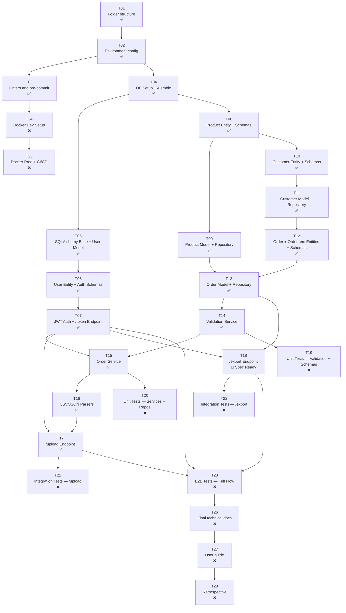

# 📋 WORKFLOW.md

**Project:** Bulk Import/Export API with Strict Validation
**Version:** 2.1.0 | **Date:** 2026-05-26 | **Author:** Fisherk2
**Status:** Under Implementation | **Methodology:** Spec-Driven Development (SDD) — Vertical Slices
**Repository:** https://github.com/Fisherk2/api-csv-bulk-import/

---

## 📍 Quick Reference

For project context, technical stack, architecture and conventions, refer to [AGENTS.md](AGENTS.md) and its linked documents:

- [Architecture & Design](docs/ARCHITECTURE.md) — Patterns, diagrams, folder structure
- [Domain & Requirements](docs/DOMAIN.md) — Entities, requirements, system boundaries
- [Code Style & Conventions](docs/CODE-STYLE.md) — Naming, SOLID, file rules
- [Testing Strategy](docs/TESTING.md) — Testing strategy, frameworks, examples
- [Security & Error Handling](docs/SECURITY.md) — Validation, errors, rate limiting, secrets
- [Implementation Plan](tasks/plan.md) — Detailed plan with vertical tasks, acceptance criteria and verification
- [Task Checklist](tasks/todo.md) — Phase progress checklist

---

## 🗺️ Implementation Roadmap

### Methodology

*Spec-Driven Development* (SDD) with **vertical slices** — each phase delivers complete, testable end-to-end functionality, rather than horizontal layers.

> **Change vs. v1.0:** The original phases (F0–F6) were horizontal (infra → domain → interfaces → tests). The new phases (P1–P8) are vertical: each one builds a complete path from database to endpoint. See [tasks/plan.md](tasks/plan.md) for the detailed mapping.

### 📅 Phases and Milestones (Vertical Slices)

| Phase | Duration | Start | End | Status | Key Milestones | Checkpoint |
|-------|----------|-------|-----|--------|----------------|------------|
| **P1: Foundation** | 1 day | 2026-05-26 | 2026-05-25 | ✅ Completed | Directories, configs, linters | ✅ Tools pass |
| **P2: Auth Slice** | 2 days | 2026-05-27 | 2026-05-28 | ✅ Completed | DB → User → JWT → `/token` + `GET /` health | ✅ Auth works |
| **P3: Product Slice** | 1 day | 2026-05-26 | 2026-05-26 | ✅ Completed | Product entity → model → repo | ✅ Tests pass |
| **P4: Upload Slice** | 3 days | 2026-05-28 | 2026-05-26 | ✅ Completed | Customer → Order → Validation → `/upload` | ✅ Upload works |
| **P5: Export Slice** | 1 day | 2026-06-02 | 2026-06-02 | 🔵 Spec Ready | `/export` with JSON/CSV | ✅ Full flow works |
| **P6: Testing** | 2 days | 2026-06-03 | 2026-06-04 | ❌ | Unit → Integration → E2E (≥80%) | ✅ Coverage ≥80% |
| **P7: Deployment** | 1 day | 2026-06-05 | 2026-06-05 | ❌ | Docker prod + CI/CD | — |
| **P8: Closure** | 1 day | 2026-06-06 | 2026-06-06 | ❌ | Docs, user guide, retrospective | ✅ All done |

---

## 📋 Specs and Tracking (Vertical Slices)

### Phase P1: Foundation

> **Objective:** Development environment ready with directories, configuration, and linters.
> **Detailed plan:** [tasks/plan.md — Tasks 1-3](tasks/plan.md)

| Task | Original Spec | Name | Description | Priority | Files | Dependencies | Checklist | Status |
|------|--------------|------|-------------|----------|-------|-------------|-----------|--------|
| T01 | Spec-F0-001 | Folder structure (DDD) | Create `app/`, `tests/`, `migrations/` with `__init__.py` | High | New: ~25 dirs | None | 4/4 | ✅ |
| T02 | Spec-F0-002 | Environment configuration | `requirements.txt`, `pyproject.toml`, `.env.example`, `Makefile` | High | Modified: 4 | T01 | 4/4 | ✅ |
| T03 | Spec-F0-003 | Linters and pre-commit | `.pre-commit-config.yaml` + configs in `pyproject.toml` | High | New: 1 | T02 | 4/4 | ✅ |

**P1 Notes:**
- Spec-F0-004 (Initial documentation) already ✅ — not included as a task.
- `.gitignore` is already complete (179 lines) — no changes needed.
- `Dockerfile` and `docker-compose.yml` are placeholders — completed in P7 (T24).
- `CONTRIBUTING.md` is empty — completed in P8 (T28).

### ✅ Checkpoint P1: Foundation

- [x] All directories exist with `__init__.py`
- [x] `pip install -r requirements.txt` works (correct format; PEP 668 on system does not affect `requirements.txt`)
- [x] `ruff check .`, `mypy .`, `pytest --co` run without config errors
- [x] `make help` shows all targets
- [x] `app/core/` has no external imports (verified by AST tests)
- [x] **Human review completed** — 5 axes: Correctness ✅, Readability ✅, Architecture ✅, Security ✅, Performance ✅

**P1 Closing Notes:**
- 33 tests passing, ruff zero issues, mypy zero issues.
- 8 commits on `feature/api-import-export`.
- P1 completed on 2026-05-25. P2 (Auth Slice) ready to define specs.

---

### Phase P2: Auth Vertical Slice

> **Objective:** A user can authenticate and obtain a JWT via `POST /token`, and protected endpoints can validate the token via `get_current_user`. Includes health check `GET /` and CORS.
> **Detailed spec:** [specs/P2-AUTH-SLICE.md](specs/P2-AUTH-SLICE.md) | **Detailed plan:** [tasks/plan.md — Tasks 4-7](tasks/plan.md)

**P2 Architectural Decisions:**
- **AD-P2-01:** SQLAlchemy async with `asyncpg` (runtime) + `psycopg2-binary` (Alembic migrations)
- **AD-P2-02:** Test fixtures to create test users (no registration endpoint in P2)
- **AD-P2-03:** Health check `GET /` included in P2
- **AD-P2-04:** CORS middleware with configurable origins via `CORS_ORIGINS`

| Task | Original Spec | Name | Description | Priority | Files | Dependencies | Checklist | Status |
|------|--------------|------|-------------|----------|-------|-------------|-----------|--------|
| T04 | Spec-F1-001 | DB Setup + Alembic (async) | `config.py`, `base.py`, `session.py` (async), Alembic init, `requirements.txt` update | High | New: 6-8 | T02 | 6/6 | ✅ |
| T05 | Spec-F1-002 + Spec-F2-003 (User) | SQLAlchemy Base + User Model | `UserModel` with UUID, `users` migration | High | New: 2-3 | T04 | 4/4 | ✅ |
| T06 | Spec-F2-001 (User) + Spec-F2-005 (Auth schemas) | User Entity + Auth Schemas | `User` entity, `TokenSchema`, `UserCreateSchema`, `ProblemDetailSchema` | High | New: 4-5 | T01, T02 | 6/6 | ✅ |
| T07 | Spec-F1-003 + Spec-F3-001 | JWT Auth + `/token` + `GET /` + CORS | `jwt_service.py`, `password_service.py`, `dependencies.py`, `/token`, `GET /`, `main.py` with CORS | High | New: 6-8 | T05, T06 | 7/7 | ✅ |

### ✅ Checkpoint P2: Auth Vertical Slice

- [x] `POST /token` returns JWT for valid credentials, 401 for invalid
- [x] `get_current_user` dependency validates JWT tokens
- [x] `GET /` returns `{"status": "ok", "version": "1.0.0"}`
- [x] Swagger UI at `/docs` shows `/token` and `GET /`
- [x] CORS middleware configured with configurable origins
- [x] `ruff check .` and `mypy .` pass without errors
- [x] All P2 tests pass (unit + integration)
- [x] `app/core/` has no external imports
- [x] **Human review completed** — 5 axes: Correctness ✅, Readability ✅, Architecture ✅, Security ✅, Performance ✅

**P2 Closing Notes:**
- 77 tests passing, coverage 80.88%, ruff zero issues, mypy zero issues.
- 7 commits on `feature/api-import-export` (d51f990 → 508f4a5).
- P2 completed on 2026-05-28. P3 (Product Slice) ready to define specs.
- **Technical decisions:** SQLAlchemy async with `asyncpg` + `psycopg2` for Alembic; direct bcrypt (passlib incompatible with bcrypt 5.0); test fixtures with SQLite in-memory; `func.now()` replaced by `datetime.now(timezone.utc)` for SQLite test compatibility.

---

### Phase P3: Product Vertical Slice

> **Objective:** Product entity with repository — the simplest domain to validate the DDD pattern.
> **Detailed spec:** [specs/P3-PRODUCT-SLICE.md](specs/P3-PRODUCT-SLICE.md) | **Detailed plan:** [tasks/plan.md — Tasks 8-9](tasks/plan.md)

**P3 Architectural Decisions:**
- **AD-P3-01:** Product as simplest domain validates full DDD pipeline before Customer/Order
- **AD-P3-02:** Repository interface uses `abc.ABC` with `@abstractmethod` (not `Protocol`)
- **AD-P3-03:** Batch insert uses `INSERT ... ON CONFLICT (id) DO NOTHING` for true partial processing, with dialect-aware fallback between PostgreSQL and SQLite
- **AD-P3-04:** Logging with `logging.getLogger(__name__)` before rollback in `create_batch` — errors are logged but never propagated to the caller

| Task | Original Spec | Name | Description | Priority | Files | Dependencies | Checklist | Status |
|------|--------------|------|-------------|----------|-------|-------------|-----------|--------|
| T08 | Spec-F2-001 (Product) + Spec-F2-005 (Product schemas) | Product Entity + Schemas | `Product` entity, `ProductCreateSchema`, `ProductResponseSchema` | High | New: 2-4 | T01 | 4/4 | ✅ |
| T09 | Spec-F2-003 (Product) + Spec-F2-002/004 (Product repo) | Product Model + Repository | `ProductModel`, `IProductRepository`, `ProductRepository`, migration | High | New: 5-6 | T04, T08 | 5/5 | ✅ |

### ✅ Checkpoint P3: Product Vertical Slice

- [x] `Product` domain entity is `@dataclass` in `app/core/` with zero external imports
- [x] `ProductCreateSchema` validates name, price, stock with proper constraints and whitespace stripping
- [x] `ProductResponseSchema` includes UUID with `from_attributes=True`
- [x] `ProductModel` maps to `products` table with all columns and index on `name`
- [x] `IProductRepository` interface defines all 5 CRUD methods using ABC
- [x] `ProductRepository` implements all methods with async SQLAlchemy and `ON CONFLICT DO NOTHING` for batch insert
- [x] Alembic migration creates `products` table cleanly
- [x] `ruff check .` and `mypy .` pass without errors (mypy has pre-existing stub errors only)
- [x] **Human review completed** — 5 axes: Correctness ✅, Readability ✅, Architecture ✅, Security ✅, Performance ✅

**P3 Closing Notes:**
- 110 tests passing, coverage 86.22%, ruff zero issues, mypy pre-existing only.
- 5 commits on `feature/api-import-export` (508f4a5 → eae44bd).
- P3 completed on 2026-05-26. P4 (Upload Slice) ready to define specs.
- **Technical decisions:** Core `insert().on_conflict_do_nothing()` with dialect-aware import (`pg_insert` for PostgreSQL, `sqlite_insert` for SQLite); runtime dialect detection via `self._session.get_bind().dialect.name`; `logging.getLogger(__name__)` added for error visibility; explicit `created_at`/`updated_at` timestamps required for Core `insert()` (ORM defaults don't apply).

---

### Phase P4: Customer + Order Upload Slice

> **Objective:** An authenticated user can send `POST /upload` with CSV/JSON and receive 200/207/422.
> **Detailed spec:** [specs/P4-UPLOAD-SLICE.md](specs/P4-UPLOAD-SLICE.md) | **Detailed plan:** [tasks/plan.md — Tasks 10-17](tasks/plan.md)
> **Status:** ✅ Completed — 216 tests pass, 93.64% coverage, ruff clean, mypy clean

| Task | Original Spec | Name | Description | Priority | Files | Dependencies | Checklist | Status |
|------|--------------|------|-------------|----------|-------|-------------|-----------|--------|
| T10 | Spec-F2-001 (Customer) + Spec-F2-005 (Customer schemas) | Customer Entity + Schemas | `Customer` entity, `CustomerCreateSchema`, `CustomerResponseSchema` | High | New: 2-4 | T01 | 4/4 | ✅ |
| T11 | Spec-F2-003 (Customer) + Spec-F2-002/004 (Customer repo) | Customer Model + Repository | `CustomerModel`, `ICustomerRepository`, `CustomerRepository`, migration | High | New: 4-5 | T04, T10 | 5/5 | ✅ |
| T12 | Spec-F2-001 (Order) + Spec-F2-005 (Order schemas) | Order + OrderItem Entities + Schemas | `Order`, `OrderItem`, `BatchUploadRequestSchema`, `BatchUploadResponseSchema` | High | New: 3-4 | T01 | 6/6 | ✅ |
| T13 | Spec-F2-003 (Order) + Spec-F2-002/004 (Order repo) | Order Model + Repository | `OrderModel`, `OrderItemModel`, `IOrderRepository`, `OrderRepository`, migration | High | New: 4-5 | T04, T09, T11, T12 | 5/5 | ✅ |
| T14 | Spec-F2-006 | Validation Service | `ValidationService.validate_batch()` with RFC 7807 | High | New: 1-2 | T06, T12 | 3/3 | ✅ |
| T15 | Spec-F2-007 | Order Service | `OrderService.upload_orders()` orchestrating validation + persistence | High | New: 1-2 | T13, T14 | 3/3 | ✅ |
| T16 | *New* | CSV/JSON Parsers | `csv_parser.py`, `json_parser.py`, `file_utils.py` | High | New: 3-4 | T01 | 3/3 | ✅ |
| T17 | Spec-F3-002 + Spec-F3-004 (partial) | `/upload` Endpoint | `POST /upload` with auth, validation, partial processing (200/207/422) | High | New: 2-3 | T07, T15, T16 | 8/8 | ✅ |

**P4 Architectural Decisions:**
- **AD-P4-01:** Customer deduplication by email — `ON CONFLICT (email) DO NOTHING`
- **AD-P4-02:** Order + OrderItem as single aggregate — one transaction, `IOrderRepository` handles both
- **AD-P4-03:** CSV → normalized pipeline — flat rows grouped by `customer_email` into orders
- **AD-P4-04:** `ValidationService` is a pure domain service — ZERO external imports
- **AD-P4-05:** `OrderService` depends on repository interfaces only (DIP)
- **AD-P4-06:** Foreign key validation via single `get_by_ids()` batch query
- **AD-P4-07:** Response codes: 200 (all valid), 207 (partial), 422 (all invalid), 413 (batch too large)
- **AD-P4-08:** Rate limiting deferred to P7 — infrastructure concern

**P4 Notes:**
- T16 (CSV/JSON Parsers) is new — not in the original specs, but essential for `/upload`.
- T17 includes router configuration (Spec-F3-004 partial) because it's needed for the endpoint to work.

### ✅ Checkpoint P4: Upload Vertical Slice

- [x] `POST /upload` with valid JSON → 200
- [x] `POST /upload` with mixed valid/invalid → 207 with RFC 7807 errors
- [x] `POST /upload` with all invalid → 422
- [x] Request without authentication → 401
- [x] CSV upload with valid data → 200
- [x] CSV upload batch size enforcement → 413
- [x] File size check on CSV upload → 413
- [x] Product FK validation via batch `get_by_ids()` query
- [x] Required CSV column validation
- [x] `ruff check .` and `mypy .` pass without errors
- [x] **Human review completed** — 5 axes: Correctness ✅, Readability ✅, Architecture ✅, Security ✅, Performance ✅

**P4 Closing Notes:**
- 216 tests passing, coverage 93.64%, ruff zero issues, mypy zero issues.
- P4 completed on 2026-05-26. P5 (Export Slice) ready to define specs.
- **Technical decisions:** Order `create_batch` tracks actually-inserted orders via RETURNING (PostgreSQL) and only inserts items for those orders, preventing FK violations. Product FK validation via single batch `get_by_ids` query in OrderService (replacing ValidationService iteration). CSV parser validates required columns at `parse_csv_to_orders` level (not raw `parse_csv`). File size and batch size enforced on both JSON and CSV upload paths via `settings.MAX_FILE_SIZE_MB` and `settings.MAX_BATCH_SIZE`.
- **Design trade-off:** `OrderService` now handles schema validation inline (via `OrderCreateSchema.model_validate`) instead of delegating to `ValidationService`, to track original row indices for FK error reporting. `ValidationService` remains available as a standalone validator but is not called from the upload flow.
- **Pending (future iteration):** Customer resolution (find by email or create during upload). Currently `customer_id` must reference an existing customer record — customers are expected to be pre-seeded before order upload.

---

### Phase P5: Export Vertical Slice

> **Objective:** An authenticated user can do `GET /export` and receive data in JSON or CSV.
> **Status:** 🟡 Ready for Implementation — specs defined
> **Detailed spec:** [specs/P5-EXPORT-SLICE.md](specs/P5-EXPORT-SLICE.md) | **Detailed plan:** [tasks/plan.md — Task 18](tasks/plan.md)

**P5 Architectural Decisions:**
- **AD-P5-01:** Format selection via query parameter (`?format=json` or `?format=csv`, default: json)
- **AD-P5-02:** `ExportService` depends on `IOrderRepository` only (DIP) — zero framework imports
- **AD-P5-03:** Flat CSV format — one row per order item (7 columns: order_id, customer_id, product_id, quantity, price, status, created_at)
- **AD-P5-04:** Raw data stream — no envelope wrapper, no total count in MVP
- **AD-P5-05:** Single `/export` endpoint returns orders only — no sub-resources in MVP
- **AD-P5-06:** No filters (date, status, customer) in MVP — per WORKFLOW.md Q#1

| Task | Original Spec | Name | Description | Priority | Files | Dependencies | Checklist | Status |
|------|--------------|------|-------------|----------|-------|-------------|-----------|--------|
| T18 | Spec-F3-003 + Spec-F3-004 (partial) | `/export` Endpoint | `GET /export` with format negotiation (`?format=json\|csv`), pagination (`skip`/`limit`), auth required | High | New: 5-7 | T07, T12, T13 | 0/16 | ❌ |

**P5 Notes:**
- Single task phase — builds entirely on existing P4 infrastructure (no new DB changes).
- CSV export flattens orders: one row per order item.
- JSON export reuses existing `OrderResponseSchema`.
- Pagination: `skip` (default 0), `limit` (default 100, max 1000).

### ✅ Checkpoint P5: Full Upload → Export Flow

- [ ] E2E flow: `POST /token` → `POST /upload` → `GET /export` works
- [ ] Data integrity: uploaded data matches exported data
- [ ] Pagination works: `GET /export?skip=10&limit=50` returns the correct page
- [ ] `ruff check .` and `mypy .` pass without errors
- [ ] **Human review before proceeding**

---

### Phase P6: Testing

> **Objective:** Coverage ≥ 80%, all tests passing.
> **Detailed plan:** [tasks/plan.md — Tasks 19-23](tasks/plan.md)

| Task | Original Spec | Name | Description | Priority | Files | Dependencies | Checklist | Status |
|------|--------------|------|-------------|----------|-------|-------------|-----------|--------|
| T19 | Spec-F4-001 | Unit Tests — Validation + Schemas | `test_validation_service.py`, `test_schemas.py` | High | New: 2-3 | T14, T06, T08, T10, T12 | 0/5 | ❌ |
| T20 | Spec-F4-002 | Unit Tests — Services + Repos | `test_order_service.py`, `test_repositories.py` | High | New: 2-3 | T15, T09, T11, T13 | 0/5 | ❌ |
| T21 | Spec-F4-003 | Integration Tests — `/upload` | `test_upload_endpoint.py` | High | New: 1-2 | T17, T07 | 0/6 | ❌ |
| T22 | Spec-F4-004 | Integration Tests — `/export` | `test_export_endpoint.py` | High | New: 1 | T18 | 0/4 | ❌ |
| T23 | Spec-F4-005 | E2E Tests — Full Flow | `test_full_flow.py` (login → upload → export) | High | New: 1 | T07, T17, T18 | 0/6 | ❌ |

### ✅ Checkpoint P6: Testing Complete

- [ ] `pytest` — all tests pass
- [ ] `pytest --cov=app` — coverage ≥ 80%
- [ ] `ruff check .` — zero errors
- [ ] `mypy .` — zero type errors
- [ ] **Human review before proceeding**

---

### Phase P7: Deployment

> **Objective:** Docker for production and CI/CD configured.
> **Detailed plan:** [tasks/plan.md — Tasks 24-25](tasks/plan.md)

| Task | Original Spec | Name | Description | Priority | Files | Dependencies | Checklist | Status |
|------|--------------|------|-------------|----------|-------|-------------|-----------|--------|
| T24 | Spec-F1-004 | Docker Dev Setup | Multi-stage `Dockerfile`, `docker-compose.yml` (PostgreSQL + API) | Medium | New: 3 | T03, T17 | 0/6 | ❌ |
| T25 | Spec-F5-001 + Spec-F5-002 | Docker Prod + CI/CD | `docker-compose.prod.yml`, `.github/workflows/ci.yml` | Medium | New: 2 | T24, T23 | 0/5 | ❌ |

---

### Phase P8: Closure

> **Objective:** Final documentation, user guide, retrospective.
> **Detailed plan:** [tasks/plan.md — Tasks 26-28](tasks/plan.md)

| Task | Original Spec | Name | Description | Priority | Files | Dependencies | Checklist | Status |
|------|--------------|------|-------------|----------|-------|-------------|-----------|--------|
| T26 | Spec-F6-001 | Final technical documentation | Update `README.md`, `AGENTS.md`, `WORKFLOW.md` | High | Modified: 3 | T23 | 0/3 | ❌ |
| T27 | Spec-F6-002 | User guide | `USER_GUIDE.md` with `curl` examples for all endpoints | Medium | New: 1 | T26 | 0/3 | ❌ |
| T28 | Spec-F6-003 | Retrospective | Lessons learned, `CONTRIBUTING.md`, resolve open questions | Low | New: 1-2 | T27 | 0/3 | ❌ |

---

## 🔗 Task Dependency Diagram (Vertical Slices)

---

## 🔄 Mapping: Tasks → Original Specs

The following table shows how each task in the vertical plan maps to the original specs (F0–F6):

| Task | Original Spec(s) | Description |
|------|----------------------|-------------|
| T01 | Spec-F0-001 | DDD folder structure |
| T02 | Spec-F0-002 | Environment configuration |
| T03 | Spec-F0-003 | Linters and pre-commit |
| T04 | Spec-F1-001 | PostgreSQL setup (SQLAlchemy + Alembic) |
| T05 | Spec-F1-002 + Spec-F2-003 (User) | SQLAlchemy Base + User Model |
| T06 | Spec-F2-001 (User) + Spec-F2-005 (Auth schemas) | User Entity + Auth Schemas + RFC 7807 |
| T07 | Spec-F1-003 + Spec-F3-001 | JWT Auth + /token Endpoint |
| T08 | Spec-F2-001 (Product) + Spec-F2-005 (Product schemas) | Product Entity + Schemas |
| T09 | Spec-F2-003 (Product) + Spec-F2-002/004 (Product repo) | Product Model + Repository |
| T10 | Spec-F2-001 (Customer) + Spec-F2-005 (Customer schemas) | Customer Entity + Schemas |
| T11 | Spec-F2-003 (Customer) + Spec-F2-002/004 (Customer repo) | Customer Model + Repository |
| T12 | Spec-F2-001 (Order) + Spec-F2-005 (Order schemas) | Order + OrderItem Entities + Schemas |
| T13 | Spec-F2-003 (Order) + Spec-F2-002/004 (Order repo) | Order Model + Repository |
| T14 | Spec-F2-006 | Validation Service |
| T15 | Spec-F2-007 | Order Service |
| T16 | *New* | CSV/JSON Parsers (not in original specs) |
| T17 | Spec-F3-002 + Spec-F3-004 (partial) | /upload Endpoint + routers |
| T18 | Spec-F3-003 + Spec-F3-004 (partial) | /export Endpoint + routers |
| T19 | Spec-F4-001 | Unit Tests — Validation + Schemas |
| T20 | Spec-F4-002 | Unit Tests — Services + Repos |
| T21 | Spec-F4-003 | Integration Tests — /upload |
| T22 | Spec-F4-004 | Integration Tests — /export |
| T23 | Spec-F4-005 | E2E Tests — Full Flow |
| T24 | Spec-F1-004 | Docker Dev Setup |
| T25 | Spec-F5-001 + Spec-F5-002 | Docker Prod + CI/CD |
| T26 | Spec-F6-001 | Final technical documentation |
| T27 | Spec-F6-002 | User guide |
| T28 | Spec-F6-003 | Retrospective |

---

## 📜 Workflow Rules

1. **Implementation order:** Do not implement a *task* if its dependencies are not in ✅ Completed state. Update status and dates when starting/completing each one.
2. **Code review:** Each *task* must be reviewed and approved before marking it as ✅. Use checklists to validate criteria. See [tasks/plan.md](tasks/plan.md) for detailed acceptance criteria.
3. **Version control:** Use Git with descriptive messages (e.g., `feat: implement T08 (Product entity + schemas)`). Create a branch per *task* (e.g., `feat/T08-product-entity`).
4. **Testing:** Run `pytest` before marking a task as ✅. Testing tasks (T19–T23) require coverage ≥ 80%.
5. **Documentation:** Update `AGENTS.md` and `WORKFLOW.md` when completing each phase. Include docstrings in all new code.
6. **Checkpoints:** Do not proceed to the next phase without passing the corresponding checkpoint. Checkpoints require human review.
7. **Vertical slices:** Each phase delivers complete, testable end-to-end functionality. Do not advance to P4 without P2 (auth) working end-to-end.

---

## ✅ Resolved Questions (from SPEC.md)

> All open questions from SPEC.md have been resolved on 2026-05-25. No pending questions remain.

| # | Question | Decision | Plan Impact |
|---|----------|----------|-------------|
| 1 | Should `/export` support filters? | **MVP: no filters** — no date/status filters in v1 | T18 implements basic export; filters are future work |
| 2 | Maximum batch size for `/upload`? | **1000 rows** — validated in `BatchUploadRequestSchema` | Reflected in `.env.example` as `MAX_BATCH_SIZE=1000` |
| 3 | Should `/upload` support file upload? | **JSON body + multipart** — both formats supported | T16 implements both parsers; T17 accepts both |
| 4 | Should `/export` support pagination? | **Pagination from v1** — `skip`/`limit` with defaults | T18 implements pagination with `skip=0` and `limit=100` by default |
| 5 | JWT token expiration time? | **30 minutes** — configurable via env var | Reflected in `.env.example` as `ACCESS_TOKEN_EXPIRE_MINUTES=30` |