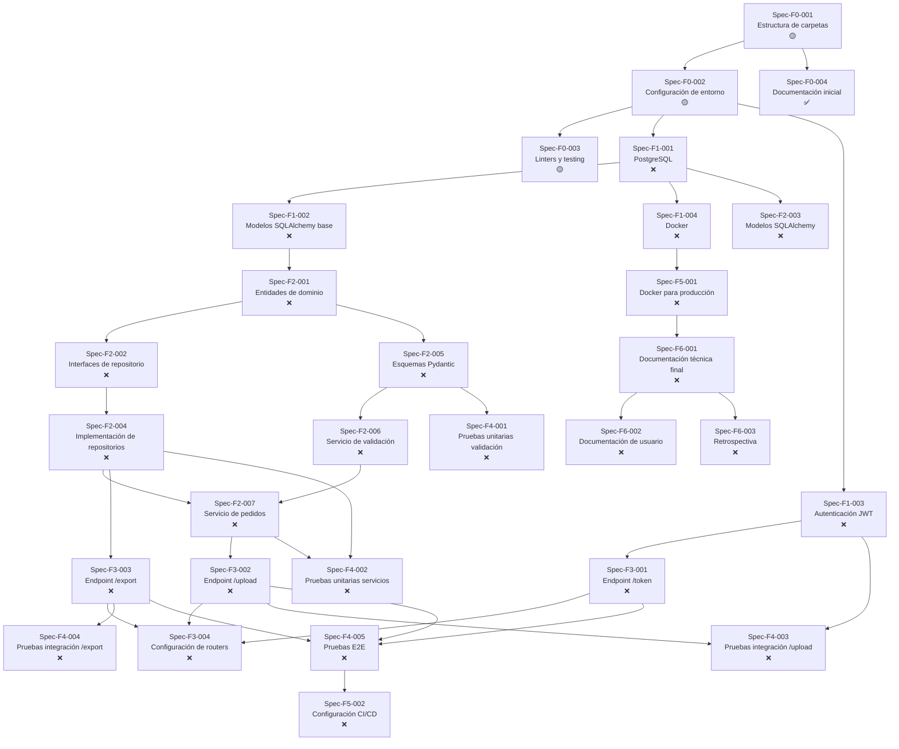

# 📋 WORKFLOW.md

**Proyecto:** API de Importación/Exportación Masiva con Validación Estricta
**Versión:** 1.0.0 | **Fecha:** 2026-05-25 | **Autor:** Fisherk2
**Estado:** En Planificación | **Metodología:** Spec-Driven Development (SDD)
**Repositorio:** https://github.com/Fisherk2/api-csv-bulk-import/

---

## 📍 Referencia Rápida

Para contexto del proyecto, stack técnico, arquitectura y convenciones, consultar [AGENTS.md](AGENTS.md) y sus documentos vinculados:

- [Architecture & Design](docs/ARCHITECTURE.md) — Patrones, diagramas, estructura de carpetas
- [Domain & Requirements](docs/DOMAIN.md) — Entidades, requisitos, límites del sistema
- [Code Style & Conventions](docs/CODE-STYLE.md) — Nomenclatura, SOLID, reglas de archivos
- [Testing Strategy](docs/TESTING.md) — Estrategia de pruebas, frameworks, ejemplos
- [Security & Error Handling](docs/SECURITY.md) — Validación, errores, rate limiting, secretos

---

## 🗺️ Roadmap de Implementación

### Metodología

*Spec-Driven Development* (SDD) con las siguientes fases:

1. **Preparación (F0):** Configuración del entorno y documentación inicial.
2. **Infraestructura (F1):** Base de datos, autenticación, y configuración base.
3. **Núcleo (F2):** Modelos de datos, repositorios, y lógica de negocio.
4. **Interfaces (F3):** Endpoints de la API.
5. **Pruebas (F4):** Validación de calidad y cobertura.
6. **Despliegue (F5):** Configuración para producción.
7. **Cierre (F6):** Documentación final y retrospectiva.

### 📅 Fases e Hitos

| Fase | Duración | Inicio | Fin | Estado | Hitos Clave |
|------|----------|--------|-----|--------|-------------|
| **F0: Preparación** | 1 día | 2026-05-26 | 2026-05-26 | 🔵 In Progress | Estructura de carpetas, `AGENTS.md`, `WORKFLOW.md` |
| **F1: Infraestructura** | 2 días | 2026-05-27 | 2026-05-28 | ❌ | PostgreSQL, Docker, autenticación JWT |
| **F2: Núcleo** | 3 días | 2026-05-29 | 2026-05-31 | ❌ | Modelos de datos, repositorios, servicios de validación |
| **F3: Interfaces** | 2 días | 2026-06-01 | 2026-06-02 | ❌ | Endpoints `/upload`, `/export`, `/token` |
| **F4: Pruebas** | 2 días | 2026-06-03 | 2026-06-04 | ❌ | Pruebas unitarias, integración, y E2E |
| **F5: Despliegue** | 1 día | 2026-06-05 | 2026-06-05 | ❌ | Docker para producción, CI/CD |
| **F6: Cierre** | 1 día | 2026-06-06 | 2026-06-06 | ❌ | Documentación final, retrospectiva |

---

## 📋 Specs y Seguimiento

### Fase 0: Preparación

> **📋 Spec detallado:** [specs/F0-PREPARACION.md](specs/F0-PREPARACION.md) — Assessment, directory tree, file contents, verification commands.

| ID | Nombre | Descripción | Prioridad | Archivos | Dependencias | Checklist | Estado |
|----|--------|-------------|-----------|----------|-------------|-----------|--------|
| Spec-F0-001 | Estructura de carpetas | Crear estructura de directorios según DDD | Alta | Nuevos: `app/`, `tests/`, `migrations/` | Ninguna | 0/1 | 🔵 |
| Spec-F0-002 | Configuración de entorno | `requirements.txt`, `pyproject.toml`, `.env.example`, `Makefile` | Alta | Modificados: 3, Nuevos: 1 | Spec-F0-001 | 0/4 | 🟡 |
| Spec-F0-003 | Linters y testing | Configurar `ruff`, `mypy`, `pytest` en `pyproject.toml` + `.pre-commit-config.yaml` | Alta | Nuevos: 1, Modificados: 1 | Spec-F0-002 | 0/2 | 🟡 |
| Spec-F0-004 | Documentación inicial | `AGENTS.md`, `WORKFLOW.md`, `README.md`, `docs/` | Alta | Modificados: 4 | Spec-F0-001 | 4/4 | ✅ |

**Notas F0:**
- `.gitignore` ya está completo (179 líneas) — no necesita cambios.
- `Dockerfile` y `docker-compose.yml` son placeholders — se completan en F1 (Spec-F1-004).
- `CONTRIBUTING.md` está vacío — se completa en F6 (Spec-F6-002).
- Spec-F0-003 consolidado: tool configs en `pyproject.toml` (no archivos separados), más `.pre-commit-config.yaml`.

### Fase 1: Infraestructura

| ID | Nombre | Descripción | Prioridad | Archivos | Dependencias | Checklist | Estado |
|----|--------|-------------|-----------|----------|-------------|-----------|--------|
| Spec-F1-001 | Configuración de PostgreSQL | SQLAlchemy + Alembic | Alta | Nuevos: 4 archivos | Spec-F0-002 | 0/4 | ❌ |
| Spec-F1-002 | Modelos SQLAlchemy base | `Base`, `UUIDType` | Alta | Nuevos: 1 archivo | Spec-F1-001 | 0/1 | ❌ |
| Spec-F1-003 | Autenticación JWT | `jwt_service.py`, `password_service.py`, `dependencies.py` | Alta | Nuevos: 3 archivos | Spec-F0-002 | 0/3 | ❌ |
| Spec-F1-004 | Configuración de Docker | `Dockerfile`, `docker-compose.yml`, `.dockerignore` | Media | Nuevos: 3 archivos | Spec-F1-001 | 0/3 | ❌ |

### Fase 2: Núcleo

| ID | Nombre | Descripción | Prioridad | Archivos | Dependencias | Checklist | Estado |
|----|--------|-------------|-----------|----------|-------------|-----------|--------|
| Spec-F2-001 | Entidades de dominio (DDD) | `Order`, `Product`, `Customer`, `User` | Alta | Nuevos: 4 archivos | Spec-F1-002 | 0/4 | ❌ |
| Spec-F2-002 | Interfaces de repositorio | Contratos para cada entidad | Alta | Nuevos: 3 archivos | Spec-F2-001 | 0/3 | ❌ |
| Spec-F2-003 | Modelos SQLAlchemy | Modelos ORM para cada entidad | Alta | Nuevos: 4 archivos | Spec-F1-001, Spec-F2-001 | 0/4 | ❌ |
| Spec-F2-004 | Implementación de repositorios | Repositorios con SQLAlchemy | Alta | Nuevos: 3 archivos | Spec-F2-002, Spec-F2-003 | 0/3 | ❌ |
| Spec-F2-005 | Esquemas Pydantic | Request/response schemas + RFC 7807 | Alta | Nuevos: 5 archivos | Spec-F2-001 | 0/5 | ❌ |
| Spec-F2-006 | Servicio de validación | `ValidationService` | Alta | Nuevos: 1 archivo | Spec-F2-005 | 0/1 | ❌ |
| Spec-F2-007 | Servicio de pedidos | `OrderService` | Alta | Nuevos: 1 archivo | Spec-F2-004, Spec-F2-006 | 0/1 | ❌ |

### Fase 3: Interfaces

| ID | Nombre | Descripción | Prioridad | Archivos | Dependencias | Checklist | Estado |
|----|--------|-------------|-----------|----------|-------------|-----------|--------|
| Spec-F3-001 | Endpoint `/token` | OAuth2 Password Flow | Alta | Nuevos: 1, Modificados: 1 | Spec-F1-003 | 0/1 | ❌ |
| Spec-F3-002 | Endpoint `/upload` | Importar datos CSV/JSON | Alta | Nuevos: 1, Modificados: 1 | Spec-F2-007, Spec-F1-003 | 0/1 | ❌ |
| Spec-F3-003 | Endpoint `/export` | Exportar datos CSV/JSON | Alta | Nuevos: 1, Modificados: 1 | Spec-F2-004 | 0/1 | ❌ |
| Spec-F3-004 | Configuración de routers | Incluir todos los endpoints | Alta | Modificados: 2 | Spec-F3-001, Spec-F3-002, Spec-F3-003 | 0/1 | ❌ |

### Fase 4: Pruebas

| ID | Nombre | Descripción | Prioridad | Archivos | Dependencias | Checklist | Estado |
|----|--------|-------------|-----------|----------|-------------|-----------|--------|
| Spec-F4-001 | Pruebas unitarias validación | `ValidationService` + Pydantic schemas | Alta | Nuevos: 1 | Spec-F2-005, Spec-F2-006 | 0/1 | ❌ |
| Spec-F4-002 | Pruebas unitarias servicios | `OrderService` + repositorios | Alta | Nuevos: 2 | Spec-F2-004, Spec-F2-007 | 0/2 | ❌ |
| Spec-F4-003 | Pruebas integración `/upload` | Endpoint + autenticación | Alta | Nuevos: 1 | Spec-F3-002, Spec-F1-003 | 0/1 | ❌ |
| Spec-F4-004 | Pruebas integración `/export` | Endpoint de exportación | Alta | Nuevos: 1 | Spec-F3-003 | 0/1 | ❌ |
| Spec-F4-005 | Pruebas E2E flujo completo | login → `/upload` → `/export` | Alta | Nuevos: 1 | Spec-F3-001, Spec-F3-002, Spec-F3-003 | 0/1 | ❌ |

### Fase 5: Despliegue

| ID | Nombre | Descripción | Prioridad | Archivos | Dependencias | Checklist | Estado |
|----|--------|-------------|-----------|----------|-------------|-----------|--------|
| Spec-F5-001 | Docker para producción | Optimizar Dockerfile + docker-compose.prod.yml | Media | Modificados: 2, Nuevos: 1 | Spec-F1-004 | 0/2 | ❌ |
| Spec-F5-002 | Configuración CI/CD | GitHub Actions para testing y deploy | Baja | Nuevos: 2 | Spec-F4-001, Spec-F4-005 | 0/2 | ❌ |

### Fase 6: Cierre

| ID | Nombre | Descripción | Prioridad | Archivos | Dependencias | Checklist | Estado |
|----|--------|-------------|-----------|----------|-------------|-----------|--------|
| Spec-F6-001 | Documentación técnica final | Actualizar `AGENTS.md`, `WORKFLOW.md`, `README.md` | Alta | Modificados: 3 | Spec-F5-001 | 0/3 | ❌ |
| Spec-F6-002 | Documentación de usuario | Guía de uso con `curl`, Postman | Media | Nuevos: 1 | Spec-F6-001 | 0/1 | ❌ |
| Spec-F6-003 | Retrospectiva | Lecciones aprendidas y mejoras futuras | Baja | Nuevos: 1 | Spec-F6-001 | 0/1 | ❌ |

---

## 🔗 Diagrama de Dependencia entre Specs

---

## 📜 Reglas de Flujo de Trabajo

1. **Orden de implementación:** No implementar un *spec* si sus dependencias no están en estado ✅ Completado. Actualizar estado y fechas al iniciar/completar cada uno.
2. **Revisión de código:** Cada *spec* debe ser revisado y aprobado antes de marcarlo como ✅. Usar checklists para validar criterios.
3. **Control de versiones:** Usar Git con mensajes descriptivos (ej: `feat: implement Spec-F2-001 (Order entity)`). Crear rama por *spec* (ej: `feat/Spec-F2-001`).
4. **Testing:** Cada *spec* debe incluir pruebas unitarias (si aplica). Ejecutar `pytest` antes de marcar como ✅.
5. **Documentación:** Actualizar `AGENTS.md` y `WORKFLOW.md` al completar cada fase. Incluir docstrings en todo código nuevo.