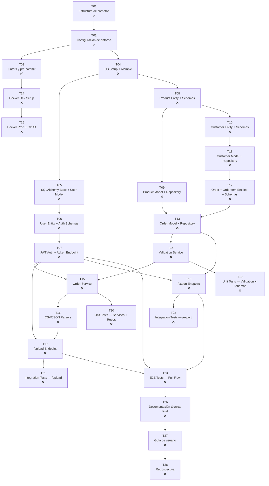

# 📋 WORKFLOW.md

**Proyecto:** API de Importación/Exportación Masiva con Validación Estricta
**Versión:** 2.0.0 | **Fecha:** 2026-05-25 | **Autor:** Fisherk2
**Estado:** En Implementación | **Metodología:** Spec-Driven Development (SDD) — Vertical Slices
**Repositorio:** https://github.com/Fisherk2/api-csv-bulk-import/

---

## 📍 Referencia Rápida

Para contexto del proyecto, stack técnico, arquitectura y convenciones, consultar [AGENTS.md](AGENTS.md) y sus documentos vinculados:

- [Architecture & Design](docs/ARCHITECTURE.md) — Patrones, diagramas, estructura de carpetas
- [Domain & Requirements](docs/DOMAIN.md) — Entidades, requisitos, límites del sistema
- [Code Style & Conventions](docs/CODE-STYLE.md) — Nomenclatura, SOLID, reglas de archivos
- [Testing Strategy](docs/TESTING.md) — Estrategia de pruebas, frameworks, ejemplos
- [Security & Error Handling](docs/SECURITY.md) — Validación, errores, rate limiting, secretos
- [Implementation Plan](tasks/plan.md) — Plan detallado con tareas verticales, criterios de aceptación y verificación
- [Task Checklist](tasks/todo.md) — Checklist de progreso por fase

---

## 🗺️ Roadmap de Implementación

### Metodología

*Spec-Driven Development* (SDD) con **vertical slices** — cada fase entrega funcionalidad completa y testeable de extremo a extremo, en lugar de capas horizontales.

> **Cambio vs. v1.0:** Las fases originales (F0–F6) eran horizontales (infra → dominio → interfaces → pruebas). Las nuevas fases (P1–P8) son verticales: cada una construye un camino completo desde la base de datos hasta el endpoint. Ver [tasks/plan.md](tasks/plan.md) para el mapeo detallado.

### 📅 Fases e Hitos (Vertical Slices)

| Fase | Duración | Inicio | Fin | Estado | Hitos Clave | Checkpoint |
|------|----------|--------|-----|--------|-------------|------------|
| **P1: Foundation** | 1 día | 2026-05-26 | 2026-05-25 | ✅ Completed | Directorios, configs, linters | ✅ Tools pass |
| **P2: Auth Slice** | 2 días | 2026-05-27 | 2026-05-28 | ✅ Completed | DB → User → JWT → `/token` + `GET /` health | ✅ Auth works |
| **P3: Product Slice** | 1 día | 2026-05-29 | 2026-05-29 | ❌ | Product entity → model → repo | — |
| **P4: Upload Slice** | 3 días | 2026-05-30 | 2026-06-01 | ❌ | Customer → Order → Validation → `/upload` | ✅ Upload works |
| **P5: Export Slice** | 1 día | 2026-06-02 | 2026-06-02 | ❌ | `/export` con JSON/CSV | ✅ Full flow works |
| **P6: Testing** | 2 días | 2026-06-03 | 2026-06-04 | ❌ | Unit → Integration → E2E (≥80%) | ✅ Coverage ≥80% |
| **P7: Deployment** | 1 día | 2026-06-05 | 2026-06-05 | ❌ | Docker prod + CI/CD | — |
| **P8: Closure** | 1 día | 2026-06-06 | 2026-06-06 | ❌ | Docs, user guide, retrospective | ✅ All done |

---

## 📋 Specs y Seguimiento (Vertical Slices)

### Fase P1: Foundation

> **Objetivo:** Entorno de desarrollo listo con directorios, configuración y linters.
> **Plan detallado:** [tasks/plan.md — Tasks 1-3](tasks/plan.md)

| Task | Spec Original | Nombre | Descripción | Prioridad | Archivos | Dependencias | Checklist | Estado |
|------|--------------|--------|-------------|-----------|----------|-------------|-----------|--------|
| T01 | Spec-F0-001 | Estructura de carpetas (DDD) | Crear `app/`, `tests/`, `migrations/` con `__init__.py` | Alta | Nuevos: ~25 dirs | Ninguna | 4/4 | ✅ |
| T02 | Spec-F0-002 | Configuración de entorno | `requirements.txt`, `pyproject.toml`, `.env.example`, `Makefile` | Alta | Modificados: 4 | T01 | 4/4 | ✅ |
| T03 | Spec-F0-003 | Linters y pre-commit | `.pre-commit-config.yaml` + configs en `pyproject.toml` | Alta | Nuevos: 1 | T02 | 4/4 | ✅ |

**Notas P1:**
- Spec-F0-004 (Documentación inicial) ya está ✅ — no se incluye como tarea.
- `.gitignore` ya está completo (179 líneas) — no necesita cambios.
- `Dockerfile` y `docker-compose.yml` son placeholders — se completan en P7 (T24).
- `CONTRIBUTING.md` está vacío — se completa en P8 (T28).

### ✅ Checkpoint P1: Foundation

- [x] Todos los directorios existen con `__init__.py`
- [x] `pip install -r requirements.txt` funciona (formato correcto; PEP 668 en sistema no afecta `requirements.txt`)
- [x] `ruff check .`, `mypy .`, `pytest --co` corren sin errores de config
- [x] `make help` muestra todos los targets
- [x] `app/core/` no tiene imports externos (verificado por tests AST)
- [x] **Revisión con humano completada** — 5 ejes: Correctness ✅, Readability ✅, Architecture ✅, Security ✅, Performance ✅

**Notas de cierre P1:**
- 33 tests passing, ruff zero issues, mypy zero issues.
- 8 commits en `feature/api-import-export`.
- P1 completado el 2026-05-25. P2 (Auth Slice) listo para definir specs.

---

### Fase P2: Auth Vertical Slice

> **Objetivo:** Un usuario puede autenticarse y obtener un JWT vía `POST /token`, y los endpoints protegidos pueden validar el token vía `get_current_user`. Incluye health check `GET /` y CORS.
> **Spec detallado:** [specs/P2-AUTH-SLICE.md](specs/P2-AUTH-SLICE.md) | **Plan detallado:** [tasks/plan.md — Tasks 4-7](tasks/plan.md)

**Decisiones arquitectónicas P2:**
- **AD-P2-01:** SQLAlchemy async con `asyncpg` (runtime) + `psycopg2-binary` (Alembic migrations)
- **AD-P2-02:** Test fixtures para crear usuarios de prueba (sin endpoint de registro en P2)
- **AD-P2-03:** Health check `GET /` incluido en P2
- **AD-P2-04:** CORS middleware con orígenes configurables vía `CORS_ORIGINS`

| Task | Spec Original | Nombre | Descripción | Prioridad | Archivos | Dependencias | Checklist | Estado |
|------|--------------|--------|-------------|-----------|----------|-------------|-----------|--------|
| T04 | Spec-F1-001 | DB Setup + Alembic (async) | `config.py`, `base.py`, `session.py` (async), Alembic init, `requirements.txt` update | Alta | Nuevos: 6-8 | T02 | 6/6 | ✅ |
| T05 | Spec-F1-002 + Spec-F2-003 (User) | SQLAlchemy Base + User Model | `UserModel` con UUID, migración `users` | Alta | Nuevos: 2-3 | T04 | 4/4 | ✅ |
| T06 | Spec-F2-001 (User) + Spec-F2-005 (Auth schemas) | User Entity + Auth Schemas | `User` entity, `TokenSchema`, `UserCreateSchema`, `ProblemDetailSchema` | Alta | Nuevos: 4-5 | T01, T02 | 6/6 | ✅ |
| T07 | Spec-F1-003 + Spec-F3-001 | JWT Auth + `/token` + `GET /` + CORS | `jwt_service.py`, `password_service.py`, `dependencies.py`, `/token`, `GET /`, `main.py` con CORS | Alta | Nuevos: 6-8 | T05, T06 | 7/7 | ✅ |

### ✅ Checkpoint P2: Auth Vertical Slice

- [x] `POST /token` devuelve JWT para credenciales válidas, 401 para inválidas
- [x] `get_current_user` dependency valida tokens JWT
- [x] `GET /` devuelve `{"status": "ok", "version": "1.0.0"}`
- [x] Swagger UI en `/docs` muestra `/token` y `GET /`
- [x] CORS middleware configurado con orígenes configurables
- [x] `ruff check .` y `mypy .` pasan sin errores
- [x] Todos los tests P2 pasan (unit + integration)
- [x] `app/core/` no tiene imports externos
- [x] **Revisión con humano completada** — 5 ejes: Correctness ✅, Readability ✅, Architecture ✅, Security ✅, Performance ✅

**Notas de cierre P2:**
- 77 tests passing, coverage 80.88%, ruff zero issues, mypy zero issues.
- 7 commits en `feature/api-import-export` (d51f990 → 508f4a5).
- P2 completado el 2026-05-28. P3 (Product Slice) lista para definir specs.
- **Decisiones técnicas:** SQLAlchemy async con `asyncpg` + `psycopg2` para Alembic; bcrypt directo (passlib incompatible con bcrypt 5.0); test fixtures con SQLite in-memory; `func.now()` reemplazado por `datetime.now(timezone.utc)` para compatibilidad SQLite en tests.

---

### Fase P3: Product Vertical Slice

> **Objetivo:** Entidad Product con repositorio — el dominio más simple para validar el patrón DDD.
> **Estado:** 🟡 Lista para Specs — escribir `specs/P3-PRODUCT-SLICE.md` con tasks T08-T09.
> **Plan detallado:** [tasks/plan.md — Tasks 8-9](tasks/plan.md)

| Task | Spec Original | Nombre | Descripción | Prioridad | Archivos | Dependencias | Checklist | Estado |
|------|--------------|--------|-------------|-----------|----------|-------------|-----------|--------|
| T08 | Spec-F2-001 (Product) + Spec-F2-005 (Product schemas) | Product Entity + Schemas | `Product` entity, `ProductCreateSchema`, `ProductResponseSchema` | Alta | Nuevos: 2-4 | T01 | 0/4 | ❌ |
| T09 | Spec-F2-003 (Product) + Spec-F2-002/004 (Product repo) | Product Model + Repository | `ProductModel`, `IProductRepository`, `ProductRepository`, migración | Alta | Nuevos: 5-6 | T04, T08 | 0/5 | ❌ |

---

### Fase P4: Customer + Order Upload Slice

> **Objetivo:** Un usuario autenticado puede hacer `POST /upload` con CSV/JSON y recibir 200/207/422.
> **Plan detallado:** [tasks/plan.md — Tasks 10-17](tasks/plan.md)

| Task | Spec Original | Nombre | Descripción | Prioridad | Archivos | Dependencias | Checklist | Estado |
|------|--------------|--------|-------------|-----------|----------|-------------|-----------|--------|
| T10 | Spec-F2-001 (Customer) + Spec-F2-005 (Customer schemas) | Customer Entity + Schemas | `Customer` entity, `CustomerCreateSchema`, `CustomerResponseSchema` | Alta | Nuevos: 2-4 | T01 | 0/4 | ❌ |
| T11 | Spec-F2-003 (Customer) + Spec-F2-002/004 (Customer repo) | Customer Model + Repository | `CustomerModel`, `ICustomerRepository`, `CustomerRepository`, migración | Alta | Nuevos: 4-5 | T04, T10 | 0/5 | ❌ |
| T12 | Spec-F2-001 (Order) + Spec-F2-005 (Order schemas) | Order + OrderItem Entities + Schemas | `Order`, `OrderItem`, `BatchUploadRequestSchema`, `BatchUploadResponseSchema` | Alta | Nuevos: 3-4 | T01 | 0/6 | ❌ |
| T13 | Spec-F2-003 (Order) + Spec-F2-002/004 (Order repo) | Order Model + Repository | `OrderModel`, `OrderItemModel`, `IOrderRepository`, `OrderRepository`, migración | Alta | Nuevos: 4-5 | T04, T09, T11, T12 | 0/5 | ❌ |
| T14 | Spec-F2-006 | Validation Service | `ValidationService.validate_batch()` con RFC 7807 | Alta | Nuevos: 1-2 | T06, T12 | 0/3 | ❌ |
| T15 | Spec-F2-007 | Order Service | `OrderService.upload_orders()` orquestando validación + persistencia | Alta | Nuevos: 1-2 | T13, T14 | 0/3 | ❌ |
| T16 | *Nuevo* | CSV/JSON Parsers | `csv_parser.py`, `json_parser.py`, `file_utils.py` | Alta | Nuevos: 3-4 | T01 | 0/3 | ❌ |
| T17 | Spec-F3-002 + Spec-F3-004 (partial) | `/upload` Endpoint | `POST /upload` con auth, validación, procesamiento parcial (200/207/422) | Alta | Nuevos: 2-3 | T07, T15, T16 | 0/8 | ❌ |

**Notas P4:**
- T16 (CSV/JSON Parsers) es nuevo — no existía en las specs originales, pero es esencial para `/upload`.
- T17 incluye la configuración de routers (Spec-F3-004 parcial) porque se necesita para que el endpoint funcione.

### ✅ Checkpoint P4: Upload Vertical Slice

- [ ] `POST /upload` con JSON válido → 200
- [ ] `POST /upload` con mixto válido/inválido → 207 con errores RFC 7807
- [ ] `POST /upload` con todo inválido → 422
- [ ] Request sin autenticación → 401
- [ ] `ruff check .` y `mypy .` pasan sin errores
- [ ] **Revisión con humano antes de proceder**

---

### Fase P5: Export Vertical Slice

> **Objetivo:** Un usuario autenticado puede hacer `GET /export` y recibir datos en JSON o CSV.
> **Plan detallado:** [tasks/plan.md — Task 18](tasks/plan.md)

| Task | Spec Original | Nombre | Descripción | Prioridad | Archivos | Dependencias | Checklist | Estado |
|------|--------------|--------|-------------|-----------|----------|-------------|-----------|--------|
| T18 | Spec-F3-003 + Spec-F3-004 (partial) | `/export` Endpoint | `GET /export` con negociación de formato JSON/CSV, paginación (`skip`/`limit`), auth requerida | Alta | Nuevos: 2-3 | T07, T13 | 0/8 | ❌ |

### ✅ Checkpoint P5: Full Upload → Export Flow

- [ ] Flujo E2E: `POST /token` → `POST /upload` → `GET /export` funciona
- [ ] Integridad de datos: datos subidos coinciden con datos exportados
- [ ] Paginación funciona: `GET /export?skip=10&limit=50` retorna la página correcta
- [ ] `ruff check .` y `mypy .` pasan sin errores
- [ ] **Revisión con humano antes de proceder**

---

### Fase P6: Testing

> **Objetivo:** Cobertura ≥ 80%, todas las pruebas pasando.
> **Plan detallado:** [tasks/plan.md — Tasks 19-23](tasks/plan.md)

| Task | Spec Original | Nombre | Descripción | Prioridad | Archivos | Dependencias | Checklist | Estado |
|------|--------------|--------|-------------|-----------|----------|-------------|-----------|--------|
| T19 | Spec-F4-001 | Unit Tests — Validation + Schemas | `test_validation_service.py`, `test_schemas.py` | Alta | Nuevos: 2-3 | T14, T06, T08, T10, T12 | 0/5 | ❌ |
| T20 | Spec-F4-002 | Unit Tests — Services + Repos | `test_order_service.py`, `test_repositories.py` | Alta | Nuevos: 2-3 | T15, T09, T11, T13 | 0/5 | ❌ |
| T21 | Spec-F4-003 | Integration Tests — `/upload` | `test_upload_endpoint.py` | Alta | Nuevos: 1-2 | T17, T07 | 0/6 | ❌ |
| T22 | Spec-F4-004 | Integration Tests — `/export` | `test_export_endpoint.py` | Alta | Nuevos: 1 | T18 | 0/4 | ❌ |
| T23 | Spec-F4-005 | E2E Tests — Full Flow | `test_full_flow.py` (login → upload → export) | Alta | Nuevos: 1 | T07, T17, T18 | 0/6 | ❌ |

### ✅ Checkpoint P6: Testing Complete

- [ ] `pytest` — todas las pruebas pasan
- [ ] `pytest --cov=app` — cobertura ≥ 80%
- [ ] `ruff check .` — cero errores
- [ ] `mypy .` — cero errores de tipos
- [ ] **Revisión con humano antes de proceder**

---

### Fase P7: Deployment

> **Objetivo:** Docker para producción y CI/CD configurado.
> **Plan detallado:** [tasks/plan.md — Tasks 24-25](tasks/plan.md)

| Task | Spec Original | Nombre | Descripción | Prioridad | Archivos | Dependencias | Checklist | Estado |
|------|--------------|--------|-------------|-----------|----------|-------------|-----------|--------|
| T24 | Spec-F1-004 | Docker Dev Setup | Multi-stage `Dockerfile`, `docker-compose.yml` (PostgreSQL + API) | Media | Nuevos: 3 | T03, T17 | 0/6 | ❌ |
| T25 | Spec-F5-001 + Spec-F5-002 | Docker Prod + CI/CD | `docker-compose.prod.yml`, `.github/workflows/ci.yml` | Media | Nuevos: 2 | T24, T23 | 0/5 | ❌ |

---

### Fase P8: Closure

> **Objetivo:** Documentación final, guía de usuario, retrospectiva.
> **Plan detallado:** [tasks/plan.md — Tasks 26-28](tasks/plan.md)

| Task | Spec Original | Nombre | Descripción | Prioridad | Archivos | Dependencias | Checklist | Estado |
|------|--------------|--------|-------------|-----------|----------|-------------|-----------|--------|
| T26 | Spec-F6-001 | Documentación técnica final | Actualizar `README.md`, `AGENTS.md`, `WORKFLOW.md` | Alta | Modificados: 3 | T23 | 0/3 | ❌ |
| T27 | Spec-F6-002 | Guía de usuario | `USER_GUIDE.md` con ejemplos `curl` para todos los endpoints | Media | Nuevos: 1 | T26 | 0/3 | ❌ |
| T28 | Spec-F6-003 | Retrospectiva | Lecciones aprendidas, `CONTRIBUTING.md`, resolver preguntas abiertas | Baja | Nuevos: 1-2 | T27 | 0/3 | ❌ |

---

## 🔗 Diagrama de Dependencia entre Tasks (Vertical Slices)

---

## 🔄 Mapeo: Tasks → Specs Originales

La siguiente tabla muestra cómo cada Task del plan vertical mapea a los Specs originales (F0–F6):

| Task | Spec(s) Original(es) | Descripción |
|------|----------------------|-------------|
| T01 | Spec-F0-001 | Estructura de carpetas DDD |
| T02 | Spec-F0-002 | Configuración de entorno |
| T03 | Spec-F0-003 | Linters y pre-commit |
| T04 | Spec-F1-001 | Configuración de PostgreSQL (SQLAlchemy + Alembic) |
| T05 | Spec-F1-002 + Spec-F2-003 (User) | SQLAlchemy Base + User Model |
| T06 | Spec-F2-001 (User) + Spec-F2-005 (Auth schemas) | User Entity + Auth Schemas + RFC 7807 |
| T07 | Spec-F1-003 + Spec-F3-001 | JWT Auth + /token Endpoint |
| T08 | Spec-F2-001 (Product) + Spec-F2-005 (Product schemas) | Product Entity + Schemas |
| T09 | Spec-F2-003 (Product) + Spec-F2-002/004 (Product repo) | Product Model + Repository |
| T10 | Spec-F2-001 (Customer) + Spec-F2-005 (Customer schemas) | Customer Entity + Schemas |
| T11 | Spec-F2-003 (Customer) + Spec-F2-002/004 (Customer repo) | Customer Model + Repository |
| T12 | Spec-F2-001 (Order) + Spec-F2-005 (Order schemas) | Order + OrderItem Entities + Schemas |
| T13 | Spec-F2-003 (Order) + Spec-F2-002/004 (Order repo) | Order Model + Repository |
| T14 | Spec-F2-006 | Validation Service |
| T15 | Spec-F2-007 | Order Service |
| T16 | *Nuevo* | CSV/JSON Parsers (no en specs originales) |
| T17 | Spec-F3-002 + Spec-F3-004 (partial) | /upload Endpoint + routers |
| T18 | Spec-F3-003 + Spec-F3-004 (partial) | /export Endpoint + routers |
| T19 | Spec-F4-001 | Unit Tests — Validation + Schemas |
| T20 | Spec-F4-002 | Unit Tests — Services + Repos |
| T21 | Spec-F4-003 | Integration Tests — /upload |
| T22 | Spec-F4-004 | Integration Tests — /export |
| T23 | Spec-F4-005 | E2E Tests — Full Flow |
| T24 | Spec-F1-004 | Docker Dev Setup |
| T25 | Spec-F5-001 + Spec-F5-002 | Docker Prod + CI/CD |
| T26 | Spec-F6-001 | Documentación técnica final |
| T27 | Spec-F6-002 | Guía de usuario |
| T28 | Spec-F6-003 | Retrospectiva |

---

## 📜 Reglas de Flujo de Trabajo

1. **Orden de implementación:** No implementar un *task* si sus dependencias no están en estado ✅ Completado. Actualizar estado y fechas al iniciar/completar cada uno.
2. **Revisión de código:** Cada *task* debe ser revisado y aprobado antes de marcarlo como ✅. Usar checklists para validar criterios. Ver [tasks/plan.md](tasks/plan.md) para criterios de aceptación detallados.
3. **Control de versiones:** Usar Git con mensajes descriptivos (ej: `feat: implement T08 (Product entity + schemas)`). Crear rama por *task* (ej: `feat/T08-product-entity`).
4. **Testing:** Ejecutar `pytest` antes de marcar un task como ✅. Los tasks de testing (T19–T23) requieren cobertura ≥ 80%.
5. **Documentación:** Actualizar `AGENTS.md` y `WORKFLOW.md` al completar cada fase. Incluir docstrings en todo código nuevo.
6. **Checkpoints:** No proceder a la siguiente fase sin pasar el checkpoint correspondiente. Los checkpoints requieren revisión con humano.
7. **Vertical slices:** Cada fase entrega funcionalidad completa y testeable de extremo a extremo. No avanzar a P4 sin que P2 (auth) funcione end-to-end.

---

## ✅ Preguntas Resueltas (desde SPEC.md)

> Todas las preguntas abiertas del SPEC.md han sido resueltas el 2026-05-25. No quedan preguntas pendientes.

| # | Pregunta | Decisión | Impacto en Plan |
|---|----------|----------|-----------------|
| 1 | ¿Debe `/export` soportar filtros? | **MVP: sin filtros** — sin filtros por fecha/estado en v1 | T18 implementa export básico; filtros son trabajo futuro |
| 2 | ¿Tamaño máximo de batch para `/upload`? | **1000 filas** — validado en `BatchUploadRequestSchema` | Reflejado en `.env.example` como `MAX_BATCH_SIZE=1000` |
| 3 | ¿Debe `/upload` soportar file upload? | **JSON body + multipart** — ambos formatos soportados | T16 implementa ambos parsers; T17 acepta ambos |
| 4 | ¿Debe `/export` soportar paginación? | **Paginación desde v1** — `skip`/`limit` con defaults | T18 implementa paginación con `skip=0` y `limit=100` por defecto |
| 5 | ¿Tiempo de expiración del JWT? | **30 minutos** — configurable via env var | Reflejado en `.env.example` como `ACCESS_TOKEN_EXPIRE_MINUTES=30` |