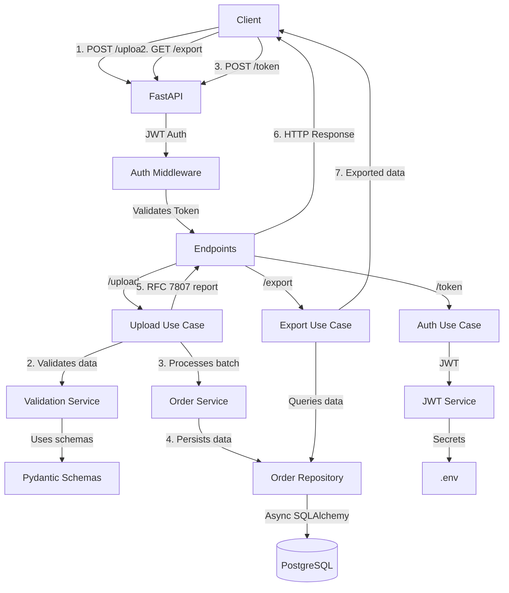

# Architecture & Design

**Project:** API de Importación/Exportación Masiva con Validación Estricta

---

## Architectural Patterns

| Pattern | Application | Benefit |
|---------|-------------|---------|
| **Domain-Driven Design** | Organization by domains (`orders/`, `products/`, `customers/`) | Clear separation of concerns, high cohesion |
| **Contract-First** | Pydantic schemas defined **before** endpoints | Consistent validation, automatic OpenAPI documentation |
| **Fail-Fast** | Data validation **before** batch processing | Prevents inconsistent DB states |
| **Repository Pattern** | Abstraction layer for data access (e.g., `OrderRepository`) | Decouples business logic from persistence |
| **Dependency Injection** | Injection of repositories and services into use cases | Facilitates testing and mocking |
| **Unit of Work** | Batch transaction handling (pre-validation + `INSERT ... ON CONFLICT`) | Consistency and partial processing |

---

## Technical Justifications

| Decision | Alternatives Considered | Justification |
|----------|------------------------|---------------|
| **DDD over Clean Architecture** | Clean Architecture, Layered Simple | DDD organizes code by **domain**, more intuitive for relational data |
| **JWT for authentication** | API Key, OAuth2 | JWT is **standard**, easy with FastAPI, demonstrates security knowledge |
| **Partial processing (207)** | All-or-nothing (422), Aggregated errors | Allows client to **correct only problematic rows**, better UX |
| **RFC 7807 for errors** | Simple format, Custom detailed format | **Standardized**, interoperable, demonstrates good API design practices |
| **Batch transactions** | Single transaction, Per-row transactions | Balance between **consistency** and **partial processing** |
| **Pydantic for validation** | Marshmallow, manual | **Native FastAPI integration**, static typing, declarative validation |
| **PostgreSQL** | SQLite, MySQL | **Native JSON support**, advanced transactions, scalability |
| **Async SQLAlchemy** | Synchronous SQLAlchemy | FastAPI is async-native; async DB operations prevent blocking the event loop. Alembic migrations remain synchronous. |

---

## Component & Data Flow Diagram



### `/upload` Flow Detail

1. **Authentication:** Client sends JWT token in `Authorization: Bearer <token>` header.
2. **Parsing:** FastAPI detects format (CSV/JSON) and converts to Python object.
3. **Validation:** `ValidationService` validates each row/object against Pydantic schemas.
4. **Processing:**
   - If errors exist, generate RFC 7807 error reports.
   - If no errors, `OrderService` prepares batch for persistence.
5. **Persistence:** `OrderRepository` inserts valid data into PostgreSQL with `INSERT ... ON CONFLICT DO NOTHING`.
6. **Response:**
   - **200 OK** — entire batch valid.
   - **207 Multi-Status** — partial errors with RFC 7807 report.
   - **422 Unprocessable Entity** — all rows invalid.

---

## Folder Structure (DDD)

```
api-import-export/
├── app/
│   ├── __init__.py
│   ├── main.py                  # FastAPI config and main routes
│   ├── config.py                # Environment variables and configuration
│   ├── dependencies.py          # Dependency injection (get_db, get_current_user)
│   │
│   ├── core/                    # Domain (pure business logic)
│   │   ├── __init__.py
│   │   ├── entities/            # Domain entities (no SQLAlchemy)
│   │   │   ├── order.py
│   │   │   ├── product.py
│   │   │   ├── customer.py
│   │   │   └── user.py
│   │   ├── repositories/        # Repository interfaces (contracts)
│   │   │   ├── order_repository.py
│   │   │   ├── product_repository.py
│   │   │   └── customer_repository.py
│   │   └── services/            # Domain services (business logic)
│   │       ├── validation_service.py
│   │       └── order_service.py
│   │
│   ├── infrastructure/          # Implementation details
│   │   ├── __init__.py
│   │   ├── database/            # DB config and SQLAlchemy models
│   │   │   ├── base.py          # SQLAlchemy DeclarativeBase (async-compatible)
│   │   │   ├── models/          # SQLAlchemy models
│   │   │   │   ├── order.py
│   │   │   │   ├── product.py
│   │   │   │   ├── customer.py
│   │   │   │   └── user.py
│   │   │   └── session.py       # Async engine + session factory + get_db
│   │   ├── repositories/        # Repository implementations
│   │   │   ├── order_repository.py
│   │   │   ├── product_repository.py
│   │   │   └── customer_repository.py
│   │   ├── auth/                # Authentication
│   │   │   ├── jwt_service.py
│   │   │   ├── password_service.py
│   │   │   └── dependencies.py
│   │   └── api/                 # Endpoints and routes
│   │       ├── __init__.py
│   │       ├── endpoints/
│   │       │   ├── upload.py
│   │       │   ├── export.py
│   │       │   └── auth.py
│   │       └── routers.py
│   │
│   ├── schemas/                 # Pydantic schemas (request/response)
│   │   ├── __init__.py
│   │   ├── order.py
│   │   ├── product.py
│   │   ├── customer.py
│   │   ├── user.py
│   │   └── error.py             # RFC 7807 error schemas
│   │
│   └── utils/                   # Utilities
│       ├── __init__.py
│       ├── csv_parser.py
│       ├── json_parser.py
│       └── file_utils.py
│
├── tests/
│   ├── __init__.py
│   ├── conftest.py
│   ├── unit/
│   ├── integration/
│   └── e2e/
│
├── migrations/                  # Alembic migrations
│   └── versions/
│
├── .env.example
├── .gitignore
├── requirements.txt
├── pyproject.toml
└── README.md
```

---

## Design Patterns

| Pattern | Application | Benefit |
|---------|-------------|---------|
| **Repository** | `OrderRepository`, `ProductRepository` (data access abstraction) | Decouples business logic from persistence |
| **Service Layer** | `OrderService`, `ValidationService` (business logic) | Centralizes business logic, promotes reuse |
| **Dependency Injection** | Injection of repositories and services into use cases | Facilitates testing (mocking) and flexibility |
| **Unit of Work** | Batch transaction handling in `OrderService` | Guarantees consistency in complex operations |
| **Factory** | `PydanticSchemaFactory` (dynamic schema creation if MVP extends) | Flexibility in object creation |
| **Adapter** | `CSVParser`, `JSONParser` (input normalization) | Handles multiple input formats with a common interface |
| **Async Session** | `AsyncSession` with `asyncpg` driver, sync `psycopg2` for Alembic | Non-blocking DB operations in FastAPI; Alembic uses synchronous driver |