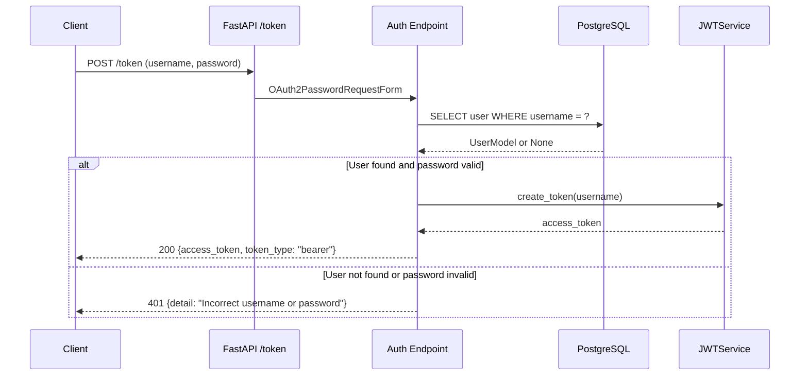
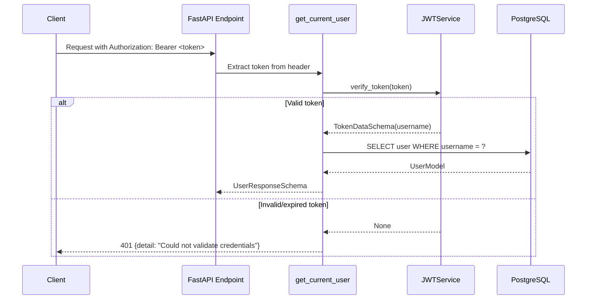
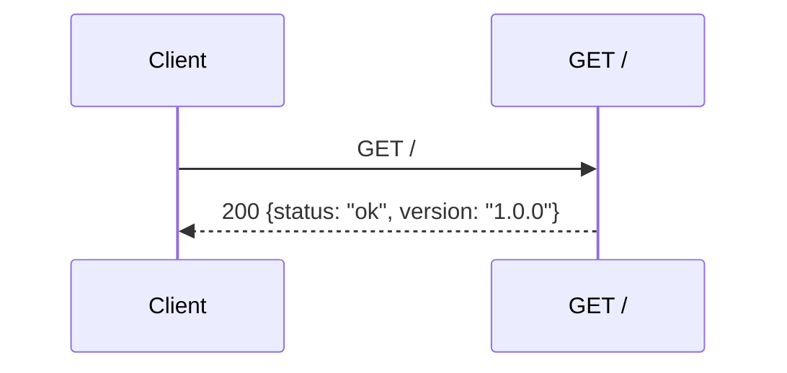

# P2: Auth Vertical Slice — Implementation Spec

**Phase:** P2 — Auth Vertical Slice
**Status:** 🟡 Ready for Implementation
**Depends on:** P1 (Foundation) ✅ Completed
**Blocks:** P3 (Product Slice), P4 (Upload Slice), P5 (Export Slice)

---

## Objective

Deliver a **complete, testable authentication vertical slice**: a user can obtain a JWT token via `POST /token`, and protected endpoints can validate that token via the `get_current_user` dependency. This slice spans from the database layer to the API layer, following DDD architecture.

**Target user:** Developer evaluating backend architecture skills (portfolio project).

**Success criteria:**
1. `POST /token` returns a JWT for valid credentials, 401 for invalid credentials
2. `get_current_user` dependency validates JWT tokens and returns user data
3. `GET /` health check endpoint returns API status
4. Swagger UI at `/docs` shows all endpoints with proper schemas
5. `ruff check .` and `mypy .` pass with zero errors
6. All P2 tests pass with meaningful coverage
7. Domain layer (`app/core/`) has zero external dependencies

---

## Architectural Decisions

### AD-P2-01: Async SQLAlchemy

| Decision | Rationale |
|----------|-----------|
| Use **async SQLAlchemy** with `asyncpg` driver | FastAPI is async-native; async DB operations prevent blocking the event loop under load. Matches idiomatic FastAPI patterns. |

**Impact on existing files:**
- `requirements.txt`: Add `asyncpg>=0.29.0`, `aiosqlite>=0.20.0`; keep `psycopg2-binary` for Alembic (synchronous migrations)
- `.env.example`: Change `DATABASE_URL` to async format (`postgresql+asyncpg://...`), add `SYNC_DATABASE_URL` for Alembic
- `app/infrastructure/database/session.py`: Use `create_async_engine` and `async_sessionmaker`
- `app/infrastructure/database/base.py`: Use `DeclarativeBase` (SQLAlchemy 2.x style)
- All repository methods will use `async`/`await` patterns
- Alembic `env.py` uses synchronous `psycopg2` for migrations (standard practice)

### AD-P2-02: Test Fixtures for User Seeding

| Decision | Rationale |
|----------|-----------|
| Use **pytest fixtures** to create test users directly in the DB | No registration endpoint needed in P2. Fixtures are simple, deterministic, and reset between test sessions. A seed script can be added later for manual/Docker testing. |

### AD-P2-03: Health Check Endpoint

| Decision | Rationale |
|----------|-----------|
| Include `GET /` health check endpoint in P2 | Required for Docker health checks, monitoring, and quick API verification. Minimal implementation effort. |

### AD-P2-04: CORS Middleware

| Decision | Rationale |
|----------|-----------|
| Include CORS middleware in `main.py` with configurable origins | Standard practice for FastAPI APIs. Needed for Swagger UI and future frontends. Origins configurable via `CORS_ORIGINS` env var. |

---

## Tech Stack Changes

### New Dependencies

| Package | Version | Purpose |
|---------|---------|---------|
| `asyncpg` | >=0.29.0,<1.0.0 | Async PostgreSQL driver for SQLAlchemy |
| `aiosqlite` | >=0.20.0,<1.0.0 | Async SQLite driver for testing |
| `greenlet` | >=3.0.0,<4.0.0 | Required by SQLAlchemy async (already a transitive dep) |

### Updated Dependencies

| Package | Change | Reason |
|---------|--------|--------|
| `DATABASE_URL` format | `postgresql://` → `postgresql+asyncpg://` | Async driver connection string |
| New `SYNC_DATABASE_URL` | `postgresql://` (psycopg2 format) | Alembic migrations run synchronously |
| New `CORS_ORIGINS` env var | Comma-separated list of allowed origins | CORS configuration |

---

## Commands

```bash
# Install dependencies
pip install -r requirements.txt

# Run development server (async)
uvicorn app.main:app --reload --host 0.0.0.0 --port 8000

# Run database migrations (synchronous Alembic)
alembic upgrade head

# Run all tests
pytest

# Run tests with coverage
pytest --cov=app --cov-report=term-missing

# Lint
ruff check .

# Type check
mypy .

# Format
ruff format .
```

---

## Project Structure — P2 New Files

```
app/
├── config.py                              # NEW — Settings via pydantic-settings
├── main.py                                # NEW — FastAPI app factory, CORS, routers
├── dependencies.py                        # NEW — DI helpers (get_db override placeholder)
│
├── core/
│   └── entities/
│       └── user.py                        # NEW — User domain entity (pure Python)
│
├── infrastructure/
│   ├── database/
│   │   ├── base.py                        # NEW — SQLAlchemy DeclarativeBase + UUID type
│   │   ├── session.py                      # NEW — Async engine + session factory + get_db
│   │   └── models/
│   │       └── user.py                    # NEW — UserModel (SQLAlchemy)
│   ├── auth/
│   │   ├── jwt_service.py                 # NEW — JWT creation and verification
│   │   ├── password_service.py            # NEW — bcrypt hash/verify
│   │   └── dependencies.py                # NEW — get_current_user FastAPI dependency
│   └── api/
│       ├── endpoints/
│       │   └── auth.py                    # NEW — POST /token endpoint
│       └── routers.py                     # NEW — APIRouter aggregation
│
├── schemas/
│   ├── user.py                            # NEW — TokenSchema, UserCreateSchema, UserResponseSchema
│   └── error.py                           # NEW — ProblemDetailSchema (RFC 7807)

migrations/
├── env.py                                 # NEW — Alembic env (sync, uses SYNC_DATABASE_URL)
├── alembic.ini                            # NEW — Alembic configuration
├── script.mako                            # NEW — Migration template
└── versions/
    └── xxxx_add_users_table.py            # AUTO-GENERATED — Initial migration

tests/
├── conftest.py                            # UPDATE — Add async test fixtures, test DB, test client
├── unit/
│   ├── test_config.py                     # NEW — Settings validation tests
│   ├── test_user_entity.py                # NEW — User entity tests
│   ├── test_user_schemas.py               # NEW — Pydantic schema validation tests
│   ├── test_jwt_service.py                # NEW — JWT creation/verification tests
│   └── test_password_service.py           # NEW — Password hash/verify tests
└── integration/
    └── test_auth_endpoint.py              # NEW — POST /token integration tests
```

---

## Code Style — P2 Patterns

### Async Session Pattern

```python
# app/infrastructure/database/session.py
from sqlalchemy.ext.asyncio import create_async_engine, async_sessionmaker, AsyncSession
from app.config import settings

engine = create_async_engine(settings.DATABASE_URL, echo=settings.DEBUG)
AsyncSessionLocal = async_sessionmaker(engine, class_=AsyncSession, expire_on_commit=False)

async def get_db() -> AsyncSession:
    """Dependency that provides an async database session."""
    async with AsyncSessionLocal() as session:
        try:
            yield session
            await session.commit()
        except Exception:
            await session.rollback()
            raise
```

### Domain Entity Pattern (Pure Python — No External Imports)

```python
# app/core/entities/user.py
"""User domain entity — pure business logic, no framework dependencies."""
from dataclasses import dataclass, field
from datetime import datetime
from uuid import UUID, uuid4

@dataclass
class User:
    """User domain entity representing an authenticated user."""
    id: UUID = field(default_factory=uuid4)
    username: str = ""
    hashed_password: str = ""
    is_active: bool = True
    created_at: datetime = field(default_factory=datetime.utcnow)
```

### Pydantic Schema Pattern

```python
# app/schemas/user.py
"""Pydantic schemas for user authentication and response."""
from datetime import datetime
from uuid import UUID
from pydantic import BaseModel, Field

class TokenSchema(BaseModel):
    """JWT token response schema."""
    access_token: str
    token_type: str = "bearer"

class UserCreateSchema(BaseModel):
    """Schema for creating/authenticating a user."""
    username: str = Field(min_length=3, max_length=50)
    password: str = Field(min_length=8, max_length=50)

class UserResponseSchema(BaseModel):
    """Schema for user data in API responses."""
    id: UUID
    username: str
    is_active: bool
    created_at: datetime

    model_config = {"from_attributes": True}
```

### RFC 7807 Error Schema

```python
# app/schemas/error.py
"""RFC 7807 Problem Details schema for standardized error reporting."""
from typing import Optional
from pydantic import BaseModel

class ProblemDetailSchema(BaseModel):
    """RFC 7807 Problem Details response."""
    type: str = "about:blank"
    title: str = "An error occurred"
    status: int = 400
    detail: Optional[str] = None
    instance: Optional[str] = None
```

### Auth Dependency Pattern

```python
# app/infrastructure/auth/dependencies.py
"""FastAPI dependencies for authentication."""
from fastapi import Depends, HTTPException, status
from fastapi.security import OAuth2PasswordBearer
from sqlalchemy.ext.asyncio import AsyncSession

from app.infrastructure.database.session import get_db
from app.infrastructure.auth.jwt_service import JWTService
from app.schemas.user import UserResponseSchema

oauth2_scheme = OAuth2PasswordBearer(tokenUrl="/token")

async def get_current_user(
    token: str = Depends(oauth2_scheme),
    db: AsyncSession = Depends(get_db),
) -> UserResponseSchema:
    """Validate JWT token and return the authenticated user."""
    credentials_exception = HTTPException(
        status_code=status.HTTP_401_UNAUTHORIZED,
        detail="Could not validate credentials",
        headers={"WWW-Authenticate": "Bearer"},
    )
    token_data = JWTService.verify_token(token)
    if token_data is None:
        raise credentials_exception
    # ... fetch user from DB, validate is_active
    return user_response
```

---

## Testing Strategy — P2

### Unit Tests

| Test File | What It Tests | Coverage Target |
|-----------|---------------|-----------------|
| `test_config.py` | Settings loads env vars, defaults, validation | 90% |
| `test_user_entity.py` | User entity creation, defaults, immutability | 90% |
| `test_user_schemas.py` | Pydantic validation (min/max length, types, RFC 7807) | 90% |
| `test_jwt_service.py` | Token creation, verification, expiration, invalid tokens | 95% |
| `test_password_service.py` | Hash, verify, wrong password, empty password | 95% |

### Integration Tests

| Test File | What It Tests | Coverage Target |
|-----------|---------------|-----------------|
| `test_auth_endpoint.py` | POST /token (valid creds, invalid creds, missing fields), GET / (health check) | 80% |

### Test Fixtures (conftest.py)

```python
# tests/conftest.py — Key fixtures for P2
import pytest
from sqlalchemy.ext.asyncio import create_async_engine, async_sessionmaker, AsyncSession
from httpx import AsyncClient, ASGITransport

from app.infrastructure.database.base import Base
from app.main import app
from app.infrastructure.database.session import get_db

# Async SQLite in-memory for testing
TEST_DATABASE_URL = "sqlite+aiosqlite://"

@pytest.fixture(scope="session")
async def test_db_engine():
    engine = create_async_engine(TEST_DATABASE_URL, echo=False)
    async with engine.begin() as conn:
        await conn.run_sync(Base.metadata.create_all)
    yield engine
    async with engine.begin() as conn:
        await conn.run_sync(Base.metadata.drop_all)
    await engine.dispose()

@pytest.fixture(scope="function")
async def test_db_session(test_db_engine):
    async_session = async_sessionmaker(test_db_engine, expire_on_commit=False)
    async with async_session() as session:
        yield session
        await session.rollback()

@pytest.fixture(scope="function")
async def client(test_db_session):
    async def override_get_db():
        yield test_db_session
    app.dependency_overrides[get_db] = override_get_db
    async with AsyncClient(transport=ASGITransport(app=app), base_url="http://test") as ac:
        yield ac
    app.dependency_overrides.clear()

@pytest.fixture(scope="function")
async def test_user(test_db_session):
    """Create a test user in the database and return user data."""
    # ... create user with hashed password, return credentials
```

---

## Boundaries

### Always
- Use `async`/`await` for all database operations and endpoint handlers
- Use `pydantic-settings` for all configuration (never hardcode values)
- Use `UUID` as primary key type for all entities
- Use `AsyncSession` for all SQLAlchemy operations
- Validate all inputs with Pydantic schemas before processing
- Include docstrings in Google format for all new modules, classes, and functions
- Run `pytest`, `ruff check .`, and `mypy .` before committing
- Keep `app/core/` free of external imports (no SQLAlchemy, FastAPI, HTTP)

### Ask First
- Changing `DATABASE_URL` format or connection pool settings
- Adding new dependencies to `requirements.txt`
- Modifying Alembic configuration
- Changing JWT token format or expiration logic
- Adding new env vars to `Settings`

### Never
- Hardcode secrets or credentials in source code
- Use synchronous SQLAlchemy sessions in async endpoints
- Import SQLAlchemy or FastAPI in `app/core/` modules
- Commit failing tests without approval
- Use `print()` for debugging (use structured logging)
- Skip input validation in any endpoint

---

## Success Criteria

| # | Criterion | How to Verify |
|---|-----------|---------------|
| 1 | `POST /token` returns JWT for valid credentials | Integration test: valid username/password → 200 + `access_token` |
| 2 | `POST /token` returns 401 for invalid credentials | Integration test: wrong password → 401 |
| 3 | `POST /token` returns 422 for missing fields | Integration test: empty body → 422 |
| 4 | `get_current_user` validates JWT and returns user | Unit test: valid token → UserResponseSchema |
| 5 | `get_current_user` rejects expired/invalid tokens | Unit test: expired token → 401 |
| 6 | `GET /` returns health check response | Integration test: `GET /` → 200 `{"status": "ok"}` |
| 7 | Swagger UI at `/docs` shows `/token` and `GET /` | Manual: open `/docs` in browser |
| 8 | `app/core/` has zero external imports | `grep -r "from sqlalchemy\|from fastapi" app/core/` → empty |
| 9 | `ruff check .` passes with zero errors | `ruff check .` |
| 10 | `mypy .` passes with zero type errors | `mypy .` |
| 11 | All P2 tests pass | `pytest tests/unit/ tests/integration/ -v` |
| 12 | Alembic migration creates `users` table | `alembic upgrade head` → `users` table exists |

---

## Task Breakdown

### Task 04: Database Setup + Alembic

**Description:** Configure async PostgreSQL connection via SQLAlchemy 2.x, create the declarative base, async session factory, and initialize Alembic for migrations. Create `app/config.py` with `pydantic-settings` to load all env vars.

**Acceptance criteria:**
- [ ] `app/config.py` defines `Settings` class with all env vars (`DATABASE_URL`, `SYNC_DATABASE_URL`, `SECRET_KEY`, `ALGORITHM`, `ACCESS_TOKEN_EXPIRE_MINUTES`, `MAX_BATCH_SIZE`, `MAX_FILE_SIZE_MB`, `RATE_LIMIT_PER_MINUTE`, `CORS_ORIGINS`, `DEBUG`, `HOST`, `PORT`)
- [ ] `app/infrastructure/database/base.py` defines `Base` using `DeclarativeBase` (SQLAlchemy 2.x style) and `UUIDType` for primary keys
- [ ] `app/infrastructure/database/session.py` provides `get_db()` async dependency and `engine`/`AsyncSessionLocal` configuration
- [ ] `migrations/env.py` is configured to import `Base.metadata` and use `SYNC_DATABASE_URL` (synchronous, for Alembic)
- [ ] `migrations/alembic.ini` points to the correct migrations directory
- [ ] `migrations/script.mako` is the standard Alembic template
- [ ] `requirements.txt` updated with `asyncpg`, `aiosqlite`, `greenlet`

**Verification:**
- [ ] `python -c "from app.config import Settings; s = Settings(); print(s.DATABASE_URL)"` — prints async URL
- [ ] `python -c "from app.infrastructure.database.base import Base; print(Base)"` — imports successfully
- [ ] `python -c "from app.infrastructure.database.session import get_db; print(get_db)"` — imports successfully
- [ ] `alembic upgrade head` — runs without errors (requires PostgreSQL or SQLite for test)

**Dependencies:** T02 (config files, requirements)

**Files likely touched:**
- `app/config.py` (new)
- `app/dependencies.py` (new — DI helpers)
- `app/infrastructure/database/base.py` (new)
- `app/infrastructure/database/session.py` (new)
- `migrations/env.py` (new)
- `migrations/alembic.ini` (new)
- `migrations/script.mako` (new)
- `requirements.txt` (update — add asyncpg, aiosqlite, greenlet)
- `.env.example` (update — add SYNC_DATABASE_URL, CORS_ORIGINS)

**Estimated scope:** Medium (6-8 files)

---

### Task 05: SQLAlchemy Base + User Model

**Description:** Create the SQLAlchemy `UserModel` in `app/infrastructure/database/models/user.py` with fields: `id` (UUID), `username` (unique), `hashed_password`, `is_active`, `created_at`. Create the initial Alembic migration for the `users` table.

**Acceptance criteria:**
- [ ] `UserModel` inherits from `Base` with `__tablename__ = "users"`
- [ ] Fields: `id` (UUID primary key, server_default=uuid4), `username` (String, unique, indexed, not nullable), `hashed_password` (String, not nullable), `is_active` (Boolean, default=True), `created_at` (DateTime, server_default=func.now())
- [ ] `UserModel` has `__repr__` method returning `f"User(id={self.id}, username={self.username})"`
- [ ] `alembic revision --autogenerate -m "add_users_table"` generates a migration creating the `users` table
- [ ] `alembic upgrade head` applies the migration successfully

**Verification:**
- [ ] `python -c "from app.infrastructure.database.models.user import UserModel; print(UserModel.__tablename__)"` — prints "users"
- [ ] Migration file exists in `migrations/versions/`
- [ ] `alembic upgrade head` — succeeds

**Dependencies:** T04 (DB setup, Base, session)

**Files likely touched:**
- `app/infrastructure/database/models/user.py` (new)
- `app/infrastructure/database/models/__init__.py` (update exports)
- `migrations/versions/xxxx_add_users_table.py` (auto-generated)

**Estimated scope:** Small (2-3 files)

---

### Task 06: User Entity + Auth Schemas

**Description:** Create the `User` domain entity in `app/core/entities/user.py` (pure Python dataclass, no SQLAlchemy imports) and Pydantic schemas for authentication: `TokenSchema`, `TokenDataSchema`, `UserCreateSchema`, `UserResponseSchema` in `app/schemas/user.py`. Also create `app/schemas/error.py` with RFC 7807 `ProblemDetailSchema`.

**Acceptance criteria:**
- [ ] `User` entity has: `id` (UUID), `username` (str), `hashed_password` (str), `is_active` (bool), `created_at` (datetime) — no SQLAlchemy imports
- [ ] `TokenSchema` has: `access_token` (str), `token_type` (str, default "bearer")
- [ ] `TokenDataSchema` has: `username` (str)
- [ ] `UserCreateSchema` has: `username` (str, min_length=3, max_length=50), `password` (str, min_length=8, max_length=50)
- [ ] `UserResponseSchema` has: `id` (UUID), `username` (str), `is_active` (bool), `created_at` (datetime), with `model_config = {"from_attributes": True}`
- [ ] `ProblemDetailSchema` follows RFC 7807: `type` (str, default "about:blank"), `title` (str), `status` (int), `detail` (Optional[str]), `instance` (Optional[str])
- [ ] `app/core/entities/user.py` has ZERO imports from `sqlalchemy`, `fastapi`, or `http`

**Verification:**
- [ ] `python -c "from app.core.entities.user import User; print(User)"` — imports successfully
- [ ] `python -c "from app.schemas.user import TokenSchema, UserCreateSchema; print(TokenSchema, UserCreateSchema)"` — imports successfully
- [ ] `python -c "from app.schemas.error import ProblemDetailSchema; print(ProblemDetailSchema)"` — imports successfully
- [ ] `grep -r "from sqlalchemy\|from fastapi\|import http" app/core/` — returns nothing

**Dependencies:** T01 (directory structure), T02 (pydantic in requirements)

**Files likely touched:**
- `app/core/entities/user.py` (new)
- `app/core/entities/__init__.py` (update exports)
- `app/schemas/user.py` (new)
- `app/schemas/error.py` (new)
- `app/schemas/__init__.py` (update exports)

**Estimated scope:** Medium (4-5 files)

---

### Task 07: JWT Auth + /token Endpoint + Health Check

**Description:** Implement `jwt_service.py` (create/verify tokens), `password_service.py` (hash/verify passwords), and `dependencies.py` (get_current_user dependency) in `app/infrastructure/auth/`. Create the `/token` endpoint in `app/infrastructure/api/endpoints/auth.py` using FastAPI's `OAuth2PasswordRequestForm`. Create `GET /` health check. Wire up the router in `app/infrastructure/api/routers.py` and create `app/main.py` with the FastAPI app factory including CORS middleware.

**Acceptance criteria:**
- [ ] `JWTService.create_token(username: str) -> str` creates a JWT with configurable expiration
- [ ] `JWTService.verify_token(token: str) -> TokenDataSchema | None` validates and decodes a JWT
- [ ] `PasswordService.hash_password(password: str) -> str` hashes with bcrypt
- [ ] `PasswordService.verify_password(plain_password: str, hashed_password: str) -> bool` verifies against bcrypt
- [ ] `get_current_user(token: str = Depends(oauth2_scheme), db: AsyncSession = Depends(get_db)) -> UserResponseSchema` dependency validates JWT and returns user
- [ ] `POST /token` accepts `OAuth2PasswordRequestForm` and returns `TokenSchema` on success, 401 on failure
- [ ] `GET /` returns `{"status": "ok", "version": "1.0.0"}` health check
- [ ] `app/main.py` creates the FastAPI app with CORS middleware, routers, and startup/shutdown events
- [ ] All auth-related env vars (`SECRET_KEY`, `ALGORITHM`, `ACCESS_TOKEN_EXPIRE_MINUTES`) are loaded from `Settings`
- [ ] CORS origins are configurable via `CORS_ORIGINS` env var

**Verification:**
- [ ] `python -c "from app.infrastructure.auth.jwt_service import JWTService; print(JWTService)"` — imports successfully
- [ ] `python -c "from app.infrastructure.auth.password_service import PasswordService; print(PasswordService)"` — imports successfully
- [ ] `uvicorn app.main:app &` then `curl -X POST http://localhost:8000/token -d "username=test&password=test"` — returns 401 (no user in DB yet, but endpoint exists)
- [ ] `curl http://localhost:8000/` — returns `{"status": "ok", "version": "1.0.0"}`
- [ ] `curl http://localhost:8000/docs` — Swagger UI loads with `/token` and `GET /` endpoints visible

**Dependencies:** T05 (User model), T06 (User entity, auth schemas)

**Files likely touched:**
- `app/infrastructure/auth/jwt_service.py` (new)
- `app/infrastructure/auth/password_service.py` (new)
- `app/infrastructure/auth/dependencies.py` (new)
- `app/infrastructure/auth/__init__.py` (update exports)
- `app/infrastructure/api/endpoints/auth.py` (new)
- `app/infrastructure/api/endpoints/__init__.py` (update exports)
- `app/infrastructure/api/routers.py` (new)
- `app/main.py` (new)

**Estimated scope:** Large (6-8 files) — consider splitting if needed

---

## Sequence Diagrams

### POST /token Flow



### get_current_user Dependency Flow



### Health Check Flow



---

## Data Model — Users Table

```sql
CREATE TABLE users (
    id UUID PRIMARY KEY DEFAULT gen_random_uuid(),
    username VARCHAR(50) NOT NULL UNIQUE,
    hashed_password VARCHAR(255) NOT NULL,
    is_active BOOLEAN NOT NULL DEFAULT TRUE,
    created_at TIMESTAMP WITH TIME ZONE NOT NULL DEFAULT NOW()
);

CREATE INDEX ix_users_username ON users(username);
```

---

## API Endpoints — P2

### POST /token

**Request:**
```
POST /token
Content-Type: application/x-www-form-urlencoded

username=testuser&password=securepassword123
```

**Response (200 OK):**
```json
{
    "access_token": "eyJhbGciOiJIUzI1NiIs...",
    "token_type": "bearer"
}
```

**Response (401 Unauthorized):**
```json
{
    "detail": "Incorrect username or password"
}
```

**Response (422 Validation Error):**
```json
{
    "detail": [
        {
            "type": "missing",
            "loc": ["body", "username"],
            "msg": "Field required",
            "input": null
        }
    ]
}
```

### GET /

**Response (200 OK):**
```json
{
    "status": "ok",
    "version": "1.0.0"
}
```

---

## Risks and Mitigations

| Risk | Impact | Mitigation |
|------|--------|------------|
| Async SQLAlchemy setup complexity | Medium | Use SQLAlchemy 2.x async patterns; keep Alembic synchronous |
| `asyncpg` connection issues in Docker | Medium | Use `psycopg2-binary` for Alembic migrations (sync), `asyncpg` for app runtime |
| JWT token expiration edge cases | Low | Configurable via `ACCESS_TOKEN_EXPIRE_MINUTES`; test with short expiration |
| bcrypt hashing performance | Low | `passlib[bcrypt]` is well-tested; use `faker` for test data |
| Alembic async compatibility | Medium | Alembic `env.py` uses synchronous `psycopg2` via `SYNC_DATABASE_URL` |
| Test fixture complexity with async | Medium | Use `pytest-asyncio` with `@pytest.mark.asyncio` decorator; `httpx.AsyncClient` for integration tests |

---

## Open Questions — RESOLVED

| # | Question | Decision | Impact |
|---|----------|----------|--------|
| 1 | Async vs Sync SQLAlchemy? | **Async** — `asyncpg` for runtime, `psycopg2-binary` for Alembic | `requirements.txt` updated; `session.py` uses `create_async_engine` |
| 2 | How to create test users? | **Test fixtures** — `conftest.py` creates users directly in DB | No `/users` endpoint needed in P2 |
| 3 | Include health check? | **Yes** — `GET /` returns `{"status": "ok", "version": "1.0.0"}` | New endpoint in `main.py` |
| 4 | Include CORS? | **Yes** — configurable via `CORS_ORIGINS` env var | `CORSMiddleware` in `main.py` |

---

## Checkpoint: P2 Auth Vertical Slice ✅

Before proceeding to P3, verify:

- [ ] `POST /token` returns JWT for valid credentials, 401 for invalid
- [ ] `get_current_user` dependency validates JWT tokens
- [ ] `GET /` returns health check response
- [ ] Swagger UI at `/docs` shows `/token` and `GET /` endpoints
- [ ] `ruff check .` and `mypy .` pass with zero errors
- [ ] All P2 unit and integration tests pass
- [ ] `app/core/` has zero external imports
- [ ] **Review with human before proceeding to P3**