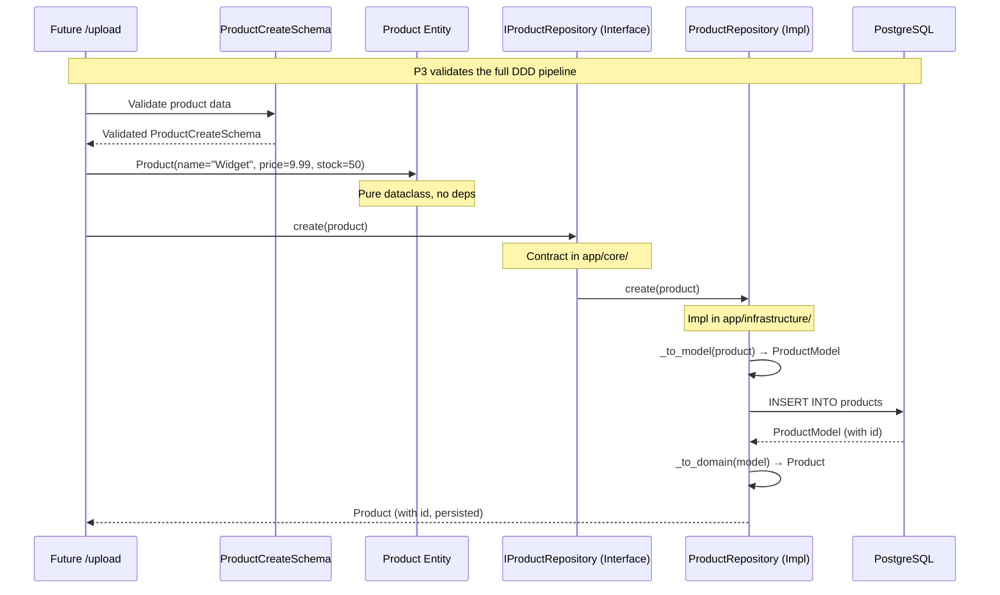
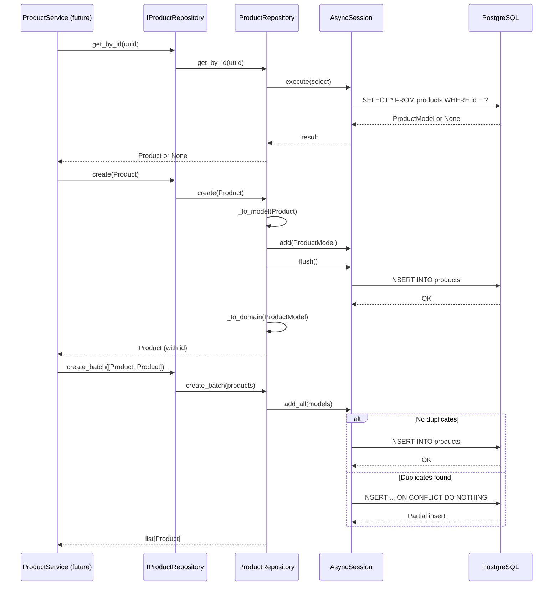

# P3: Product Vertical Slice — Implementation Spec

**Phase:** P3 — Product Vertical Slice
**Status:** 🟡 Ready for Specs
**Depends on:** P1 (Foundation) ✅, P2 (Auth Slice) ✅
**Blocks:** P4 (Upload Slice), P5 (Export Slice)

---

## Objective

Deliver a **complete Product domain vertical slice**: the `Product` entity, its Pydantic schemas, SQLAlchemy model, repository interface and implementation, and database migration. This is the simplest domain in the system — intentionally chosen to validate the full DDD pattern (entity → schema → model → repository → migration) before building the more complex Customer and Order domains.

**Target user:** Developer evaluating backend architecture skills (portfolio project).

**Success criteria:**
1. `Product` domain entity defined as a pure Python dataclass with zero framework dependencies
2. `ProductCreateSchema` and `ProductResponseSchema` validate all product fields (name, price, stock)
3. `ProductModel` maps to a `products` table with proper column types and constraints
4. `IProductRepository` interface defines the contract for product data access
5. `ProductRepository` implements the interface using async SQLAlchemy
6. Alembic migration creates the `products` table cleanly
7. `ruff check .` and `mypy .` pass with zero errors
8. Domain layer (`app/core/`) has zero external dependencies

---

## Architectural Decisions

### AD-P3-01: Product as Simplest Domain — Full DDD Pattern Validator

| Decision | Rationale |
|----------|-----------|
| Product is intentionally the **simplest domain** (3 fields + id) | Validates the complete DDD entity → schema → model → interface → repository → migration pipeline before more complex domains (Order, Customer). Catches any architectural issues early with minimal rework cost. |

**What this validates:**
- Domain entity pattern (`@dataclass`, no framework deps)
- Pydantic schema pattern (`BaseModel`, validators, `from_attributes`)
- SQLAlchemy model pattern (`Mapped`, `mapped_column`, `__tablename__`)
- Repository interface pattern (abstract protocol/ABC in `core/`)
- Repository implementation pattern (async SQLAlchemy in `infrastructure/`)
- Migration autogeneration pattern (Alembic with async engine)
- Package `__init__.py` export pattern

### AD-P3-02: Repository Interface via Abstract Base Class (ABC)

| Decision | Rationale |
|----------|-----------|
| Use `abc.ABC` with `@abstractmethod` for repository interfaces | Python-native, type-checkable, forces implementation of all methods. Simpler than `Protocol` for this use case and provides better error messages at instantiation time. |

### AD-P3-03: Batch Insert via `INSERT ... ON CONFLICT DO NOTHING`

| Decision | Rationale |
|----------|-----------|
| Use PostgreSQL-native `INSERT ... ON CONFLICT DO NOTHING` for `create_batch` | Consistent with the partial processing requirement (P4). Products are identified by unique `name` + `price` combination; duplicates are silently skipped. Matches the pattern planned for Customer and Order repositories. |

---

## Tech Stack Changes

### No New Dependencies

P3 uses only dependencies already installed in P2. No changes to `requirements.txt` or `.env.example`.

| Existing Dependency | Used For |
|---------------------|----------|
| `sqlalchemy>=2.0` | `ProductModel` ORM model |
| `pydantic>=2.0` | `ProductCreateSchema`, `ProductResponseSchema` |
| `alembic>=1.13` | Migration autogeneration |
| `asyncpg>=0.29.0` | Async PostgreSQL (runtime) |
| `aiosqlite>=0.20.0` | Async SQLite (testing) |

---

## Commands

```bash
# Run database migrations (creates products table)
alembic upgrade head

# Generate new migration (if ProductModel changes)
alembic revision --autogenerate -m "description_of_change"

# Run all tests
pytest

# Run tests with coverage
pytest --cov=app --cov-report=term-missing

# Lint
ruff check .

# Type check
mypy .

# Format
ruff format .
```

---

## Project Structure — P3 New Files

```
app/
├── core/
│   ├── entities/
│   │   ├── __init__.py                   # UPDATE — export Product
│   │   └── product.py                    # NEW — Product domain entity
│   └── repositories/
│       ├── __init__.py                   # UPDATE — export IProductRepository
│       └── product_repository.py         # NEW — IProductRepository interface
│
├── infrastructure/
│   ├── database/
│   │   └── models/
│   │       ├── __init__.py               # UPDATE — export ProductModel
│   │       └── product.py                # NEW — ProductModel (SQLAlchemy)
│   └── repositories/
│       ├── __init__.py                   # UPDATE — export ProductRepository
│       └── product_repository.py         # NEW — ProductRepository implementation
│
├── schemas/
│   ├── __init__.py                       # UPDATE — export product schemas
│   └── product.py                        # NEW — ProductCreateSchema, ProductResponseSchema

migrations/
└── versions/
    └── xxxx_add_products_table.py        # AUTO-GENERATED — Products migration
```

---

## Code Style — P3 Patterns

### Domain Entity Pattern (Product)

```python
# app/core/entities/product.py
"""Product domain entity — pure business logic, no framework dependencies.

Represents a sellable product with pricing and stock tracking.
This is a DDD entity, not a database model.
"""

from __future__ import annotations

from dataclasses import dataclass, field
from uuid import UUID, uuid4


@dataclass
class Product:
    """Domain entity representing a product available for sale.

    Equality is based on identity (id), not attributes.
    Products are uniquely identified by their UUID, while the
    (name, price) combination serves as a business key for
    batch import deduplication.
    """

    name: str
    price: float
    stock: int
    id: UUID = field(default_factory=uuid4)
```

### Pydantic Schema Pattern (Product)

```python
# app/schemas/product.py
"""Pydantic schemas for product validation and API responses.

Defines request/response shapes for product data in upload/export flows.
"""

from __future__ import annotations

from uuid import UUID

from pydantic import BaseModel, Field, field_validator


class ProductCreateSchema(BaseModel):
    """Schema for creating a product via batch upload.

    Validates name length, price range, and stock quantity.
    """

    name: str = Field(min_length=1, max_length=100)
    price: float = Field(gt=0, le=1_000_000)
    stock: int = Field(ge=0)

    @field_validator("name")
    @classmethod
    def strip_whitespace(cls, value: str) -> str:
        """Strip leading/trailing whitespace from product name."""
        return value.strip()


class ProductResponseSchema(BaseModel):
    """Schema for product data in API responses.

    Includes the auto-generated UUID for client-side tracking.
    """

    id: UUID
    name: str
    price: float
    stock: int

    model_config = {"from_attributes": True}
```

### SQLAlchemy Model Pattern (Product)

```python
# app/infrastructure/database/models/product.py
"""SQLAlchemy Product model for database persistence.

Maps to the 'products' table with UUID primary key, indexed name,
numeric price, and stock quantity with timestamp tracking.
"""

from __future__ import annotations

import uuid
from datetime import UTC, datetime

from sqlalchemy import DateTime, Float, Integer, String
from sqlalchemy.orm import Mapped, mapped_column

from app.infrastructure.database.base import Base


class ProductModel(Base):
    """SQLAlchemy model for the products table."""

    __tablename__ = "products"

    id: Mapped[uuid.UUID] = mapped_column(
        primary_key=True,
        default=uuid.uuid4,
    )

    name: Mapped[str] = mapped_column(
        String(100),
        index=True,
        nullable=False,
    )

    price: Mapped[float] = mapped_column(
        Float,
        nullable=False,
    )

    stock: Mapped[int] = mapped_column(
        Integer,
        default=0,
        nullable=False,
    )

    created_at: Mapped[datetime] = mapped_column(
        DateTime(timezone=True),
        default=lambda: datetime.now(UTC),
        nullable=False,
    )

    updated_at: Mapped[datetime] = mapped_column(
        DateTime(timezone=True),
        default=lambda: datetime.now(UTC),
        onupdate=lambda: datetime.now(UTC),
        nullable=False,
    )

    def __repr__(self) -> str:
        """Human-readable representation."""
        return f"ProductModel(id={self.id!r}, name={self.name!r})"
```

### Repository Interface Pattern (Product)

```python
# app/core/repositories/product_repository.py
"""IProductRepository interface — contract for product data access.

Defines the abstraction that domain services depend on.
Implementations live in app/infrastructure/repositories/.
"""

from __future__ import annotations

from abc import ABC, abstractmethod
from uuid import UUID

from app.core.entities.product import Product


class IProductRepository(ABC):
    """Repository interface for Product aggregate."""

    @abstractmethod
    async def get_by_id(self, product_id: UUID) -> Product | None:
        """Retrieve a product by its UUID. Returns None if not found."""
        ...

    @abstractmethod
    async def get_all(
        self, skip: int = 0, limit: int = 100
    ) -> list[Product]:
        """Retrieve all products with pagination."""
        ...

    @abstractmethod
    async def create(self, product: Product) -> Product:
        """Persist a new product. Returns the created product with id."""
        ...

    @abstractmethod
    async def create_batch(self, products: list[Product]) -> list[Product]:
        """Insert multiple products using INSERT ... ON CONFLICT DO NOTHING.

        Silently skips duplicates. Returns the list of successfully
        inserted products.
        """
        ...

    @abstractmethod
    async def get_by_ids(self, product_ids: list[UUID]) -> list[Product]:
        """Retrieve multiple products by their UUIDs."""
        ...
```

### Repository Implementation Pattern (Product)

```python
# app/infrastructure/repositories/product_repository.py
"""SQLAlchemy implementation of IProductRepository.

Maps domain Product entities to ProductModel ORM objects and vice versa.
Uses async SQLAlchemy sessions for non-blocking database operations.
"""

from __future__ import annotations

from uuid import UUID

from sqlalchemy import text
from sqlalchemy.ext.asyncio import AsyncSession
from sqlalchemy.future import select

from app.core.entities.product import Product
from app.core.repositories.product_repository import IProductRepository
from app.infrastructure.database.models.product import ProductModel


class ProductRepository(IProductRepository):
    """SQLAlchemy-backed product repository."""

    def __init__(self, session: AsyncSession) -> None:
        self._session = session

    async def get_by_id(self, product_id: UUID) -> Product | None:
        """Retrieve a product by UUID."""
        result = await self._session.execute(
            select(ProductModel).where(ProductModel.id == product_id)
        )
        model = result.scalar_one_or_none()
        return self._to_domain(model) if model else None

    async def get_all(
        self, skip: int = 0, limit: int = 100
    ) -> list[Product]:
        """Retrieve all products with pagination."""
        result = await self._session.execute(
            select(ProductModel).offset(skip).limit(limit)
        )
        return [self._to_domain(row) for row in result.scalars().all()]

    async def create(self, product: Product) -> Product:
        """Persist a new product."""
        model = self._to_model(product)
        self._session.add(model)
        await self._session.flush()
        return self._to_domain(model)

    async def create_batch(
        self, products: list[Product]
    ) -> list[Product]:
        """Insert multiple products, skipping duplicates."""
        models = [self._to_model(p) for p in products]
        self._session.add_all(models)
        try:
            await self._session.flush()
        except Exception:
            # Fallback to individual inserts with ON CONFLICT DO NOTHING
            for model in models:
                await self._session.execute(
                    text(
                        "INSERT INTO products (id, name, price, stock, "
                        "created_at, updated_at) "
                        "VALUES (:id, :name, :price, :stock, "
                        ":created_at, :updated_at) "
                        "ON CONFLICT DO NOTHING"
                    ),
                    {
                        "id": model.id,
                        "name": model.name,
                        "price": model.price,
                        "stock": model.stock,
                        "created_at": model.created_at,
                        "updated_at": model.updated_at,
                    },
                )
        return [self._to_domain(m) for m in models]

    async def get_by_ids(
        self, product_ids: list[UUID]
    ) -> list[Product]:
        """Retrieve multiple products by UUIDs."""
        result = await self._session.execute(
            select(ProductModel).where(
                ProductModel.id.in_(product_ids)
            )
        )
        return [self._to_domain(row) for row in result.scalars().all()]

    def _to_domain(self, model: ProductModel) -> Product:
        """Convert a ProductModel ORM object to a Product domain entity."""
        return Product(
            id=model.id,
            name=model.name,
            price=model.price,
            stock=model.stock,
        )

    def _to_model(self, product: Product) -> ProductModel:
        """Convert a Product domain entity to a ProductModel ORM object."""
        return ProductModel(
            id=product.id,
            name=product.name,
            price=product.price,
            stock=product.stock,
        )
```

---

## Testing Strategy — P3

Since P3 is a foundational domain layer (no endpoints), testing focuses on **unit tests** for the entity, schemas, and repository.

### Unit Tests

| Test File | What It Tests | Coverage Target |
|-----------|---------------|-----------------|
| `tests/unit/test_product_entity.py` | Product entity creation, defaults, immutability | 90% |
| `tests/unit/test_product_schemas.py` | Pydantic validation (min/max length, price range, stock constraints, whitespace stripping) | 95% |
| `tests/unit/test_product_repository.py` | Repository CRUD, batch insert, pagination, domain↔model mapping | 90% |

### Test Fixtures (extend conftest.py)

```python
# tests/conftest.py — Additional fixtures for P3

@pytest.fixture(scope="function")
async def sample_product() -> Product:
    """Create a sample Product domain entity for testing."""
    return Product(
        name="Test Widget",
        price=19.99,
        stock=100,
    )


@pytest.fixture(scope="function")
async def product_repository(test_db_session) -> ProductRepository:
    """Create a ProductRepository backed by the test DB session."""
    return ProductRepository(session=test_db_session)
```

### Test Examples

```python
# tests/unit/test_product_entity.py
import pytest
from app.core.entities.product import Product


def test_product_creation():
    """Product entity should be created with required fields."""
    product = Product(name="Widget", price=9.99, stock=50)
    assert product.name == "Widget"
    assert product.price == 9.99
    assert product.stock == 50
    assert product.id is not None


def test_product_equality_by_id():
    """Product equality should be based on identity (id)."""
    p1 = Product(name="Widget", price=9.99, stock=50)
    p2 = Product(name="Widget", price=9.99, stock=50)
    assert p1 != p2  # Different ids
```


```python
# tests/unit/test_product_schemas.py
from pydantic import ValidationError
import pytest
from app.schemas.product import ProductCreateSchema


def test_valid_product_schema():
    """Valid product data should pass schema validation."""
    schema = ProductCreateSchema(name="Widget", price=9.99, stock=50)
    assert schema.name == "Widget"
    assert schema.price == 9.99
    assert schema.stock == 50


def test_product_name_whitespace_stripping():
    """Product name should be stripped of whitespace."""
    schema = ProductCreateSchema(
        name="  Widget  ", price=9.99, stock=50
    )
    assert schema.name == "Widget"


def test_product_price_must_be_positive():
    """Product price must be greater than 0."""
    with pytest.raises(ValidationError):
        ProductCreateSchema(name="Widget", price=0, stock=50)
```

---

## Boundaries

### Always
- Use `@dataclass` for domain entities in `app/core/entities/`
- Use `abc.ABC` with `@abstractmethod` for repository interfaces in `app/core/repositories/`
- Repository implementations in `app/infrastructure/repositories/` must use async SQLAlchemy
- Repository implementations must accept `AsyncSession` via constructor injection
- All Pydantic schemas for product data go in `app/schemas/product.py`
- Include `from_attributes = True` in all response schemas
- Use `@field_validator` for custom field validation (e.g., whitespace stripping)
- Use `INSERT ... ON CONFLICT DO NOTHING` strategy for batch inserts
- Export all public symbols via `__init__.py` with `__all__`
- Run `pytest`, `ruff check .`, and `mypy .` before committing
- Keep `app/core/` free of external imports (no SQLAlchemy, FastAPI, HTTP)

### Ask First
- Adding new fields to the Product entity
- Changing the repository interface method signatures
- Modifying the batch insert strategy (ON CONFLICT behavior)
- Adding new dependencies for Product operations
- Using a different entity pattern (e.g., `NamedTuple` instead of `@dataclass`)

### Never
- Import SQLAlchemy or FastAPI in `app/core/` modules
- Use synchronous SQLAlchemy sessions in repository implementations
- Skip `__init__.py` exports for new modules
- Use raw SQL in domain entities or repository interfaces
- Commit without running Alembic migration for model changes

---

## Success Criteria

| # | Criterion | How to Verify |
|---|-----------|---------------|
| 1 | `Product` domain entity is a dataclass with zero framework deps | `grep -r "from sqlalchemy\|from fastapi" app/core/entities/product.py` → empty |
| 2 | `ProductCreateSchema` validates name (1-100 chars), price (>0, ≤1M), stock (≥0) | Unit test: valid data passes, invalid data raises `ValidationError` |
| 3 | `ProductCreateSchema.name` strips whitespace | Unit test: `"  Widget  "` → `"Widget"` |
| 4 | `ProductResponseSchema` has all fields + UUID | Unit test: schema includes `id`, `name`, `price`, `stock` |
| 5 | `ProductModel` maps to `products` table with correct columns | Migration creates table with `id`, `name`, `price`, `stock`, `created_at`, `updated_at` |
| 6 | `ProductModel.name` is indexed | Migration includes `ix_products_name` index |
| 7 | `IProductRepository` defines all 5 methods | Type check: `ProductRepository` implements all abstract methods |
| 8 | `ProductRepository` uses async SQLAlchemy | Inspection: `async def` methods using `AsyncSession` |
| 9 | `create_batch` handles duplicates gracefully | Unit test: insert duplicate → no error, returns correct count |
| 10 | Alembic migration creates `products` table cleanly | `alembic upgrade head` → table exists; `alembic downgrade -1` → table removed |
| 11 | `ruff check .` passes with zero errors | `ruff check .` |
| 12 | `mypy .` passes with zero type errors | `mypy .` |
| 13 | All P3 tests pass | `pytest tests/unit/ -v` |

---

## Task Breakdown

### Task 08: Product Entity + Schemas

**Description:** Create the `Product` domain entity in `app/core/entities/product.py` and Pydantic schemas in `app/schemas/product.py`: `ProductCreateSchema`, `ProductResponseSchema`.

**Acceptance criteria:**
- [ ] `Product` entity has: `id` (UUID, auto-generated), `name` (str), `price` (float), `stock` (int) — no SQLAlchemy/FastAPI imports
- [ ] `Product` is a `@dataclass` with `field(default_factory=uuid4)` for `id`
- [ ] `ProductCreateSchema` validates: `name` (str, min_length=1, max_length=100), `price` (float, gt=0, le=1_000_000), `stock` (int, ge=0)
- [ ] `ProductCreateSchema` has `@field_validator("name")` that strips whitespace
- [ ] `ProductResponseSchema` includes all fields plus `id` (UUID) with `model_config = {"from_attributes": True}`
- [ ] All public symbols exported via `__init__.py` with `__all__`

**Verification:**
- [ ] `python -c "from app.core.entities.product import Product; print(Product)"` — imports successfully
- [ ] `python -c "from app.schemas.product import ProductCreateSchema; p = ProductCreateSchema(name='Test', price=10.0, stock=5); print(p)"` — validates correctly
- [ ] `python -c "from app.schemas.product import ProductCreateSchema; ProductCreateSchema(name='', price=10.0, stock=5)"` — raises ValidationError (empty name)
- [ ] `python -c "from app.schemas.product import ProductCreateSchema; ProductCreateSchema(name='Test', price=-1, stock=5)"` — raises ValidationError (negative price)

**Dependencies:** T01 (directory structure), T02 (pydantic in requirements)

**Files likely touched:**
- `app/core/entities/product.py` (new)
- `app/core/entities/__init__.py` (update — export Product)
- `app/schemas/product.py` (new)
- `app/schemas/__init__.py` (update — export product schemas)

**Estimated scope:** Small (2-4 files)

---

### Task 09: Product Model + Repository

**Description:** Create `ProductModel` in `app/infrastructure/database/models/product.py`, the `IProductRepository` interface in `app/core/repositories/product_repository.py`, and `ProductRepository` implementation in `app/infrastructure/repositories/product_repository.py`. Generate Alembic migration for the `products` table.

**Acceptance criteria:**
- [ ] `ProductModel` has: `id` (UUID PK), `name` (String(100), indexed), `price` (Float), `stock` (Integer, default=0), `created_at` (DateTime with timezone), `updated_at` (DateTime with timezone, onupdate)
- [ ] `ProductModel` uses `Mapped` and `mapped_column` (SQLAlchemy 2.x style)
- [ ] `IProductRepository` defines: `get_by_id`, `get_all`, `create`, `create_batch`, `get_by_ids`
- [ ] `IProductRepository` uses `abc.ABC` with `@abstractmethod`
- [ ] `ProductRepository` implements `IProductRepository` accepting `AsyncSession` in constructor
- [ ] `create_batch` uses `INSERT ... ON CONFLICT DO NOTHING` for partial processing
- [ ] Repository methods convert between domain `Product` and `ProductModel` via `_to_domain()` / `_to_model()`
- [ ] Alembic migration for `products` table is generated and applies cleanly
- [ ] Migration includes index on `name` column

**Verification:**
- [ ] `python -c "from app.infrastructure.database.models.product import ProductModel; print(ProductModel.__tablename__)"` — prints "products"
- [ ] `python -c "from app.core.repositories.product_repository import IProductRepository; print(IProductRepository)"` — interface imports
- [ ] `python -c "from app.infrastructure.repositories.product_repository import ProductRepository; print(ProductRepository)"` — implementation imports
- [ ] `pytest tests/unit/test_product_repository.py -v` — all repository tests pass
- [ ] `alembic upgrade head` — applies migration
- [ ] `python -c "from sqlalchemy import inspect; ..."` — table `products` exists with all columns

**Dependencies:** T04 (DB setup), T05 (Base), T08 (Product entity)

**Files likely touched:**
- `app/infrastructure/database/models/product.py` (new)
- `app/core/repositories/product_repository.py` (new)
- `app/infrastructure/repositories/product_repository.py` (new)
- `app/infrastructure/database/models/__init__.py` (update — export ProductModel)
- `app/core/repositories/__init__.py` (update — export IProductRepository)
- `app/infrastructure/repositories/__init__.py` (update — export ProductRepository)
- `migrations/versions/xxxx_add_products_table.py` (auto-generated)

**Estimated scope:** Medium (5-7 files)

---

## Sequence Diagrams

### Product Domain — Full DDD Pattern Flow



### Product Repository CRUD Flow



---

## Data Model — Products Table

```sql
CREATE TABLE products (
    id UUID PRIMARY KEY DEFAULT gen_random_uuid(),
    name VARCHAR(100) NOT NULL,
    price DOUBLE PRECISION NOT NULL,
    stock INTEGER NOT NULL DEFAULT 0,
    created_at TIMESTAMP WITH TIME ZONE NOT NULL DEFAULT NOW(),
    updated_at TIMESTAMP WITH TIME ZONE NOT NULL DEFAULT NOW()
);

CREATE INDEX ix_products_name ON products(name);
```

### Column Details

| Column | Type | Constraints | Notes |
|--------|------|-------------|-------|
| `id` | UUID | PK, default `gen_random_uuid()` | Auto-generated unique identifier |
| `name` | VARCHAR(100) | NOT NULL, indexed | Product display name |
| `price` | DOUBLE PRECISION | NOT NULL | Product unit price; validated > 0 |
| `stock` | INTEGER | NOT NULL, DEFAULT 0 | Available quantity; validated ≥ 0 |
| `created_at` | TIMESTAMPTZ | NOT NULL, DEFAULT NOW() | Row creation timestamp |
| `updated_at` | TIMESTAMPTZ | NOT NULL, DEFAULT NOW() | Row last-update timestamp |

---

## Risks and Mitigations

| Risk | Impact | Mitigation |
|------|--------|------------|
| Migration conflicts with existing users table | Low | Product is first entity after user; no FK dependencies |
| Float precision for price | Low | `Float` is acceptable for MVP; use `Numeric(precision=10, scale=2)` if precision issues arise |
| Repository `create_batch` exception handling | Medium | Test both paths (bulk insert succeeds / falls back to individual ON CONFLICT) |
| Alembic autogenerate misses ProductModel changes | Low | Always review migration output before applying |
| Inconsistent entity↔model mapping | Medium | Keep `_to_domain` / `_to_model` methods together in repository; test round-trip conversion |

---

## Open Questions — RESOLVED

All decisions for P3 are covered by the architectural decisions above. No open questions remain.

| # | Question | Decision | Impact |
|---|----------|----------|--------|
| 1 | Entity pattern: dataclass or NamedTuple? | **`@dataclass`** — consistent with User entity in P2 | Entity uses `field(default_factory=uuid4)` |
| 2 | Repository interface: ABC or Protocol? | **`abc.ABC`** — type-checkable, forces implementation | Interface uses `@abstractmethod` |
| 3 | Price column type: Float or Numeric? | **`Float`** — MVP simplicity; upgrade to `Numeric` if needed | Float in model; float in schema |
| 4 | Batch insert strategy for duplicates? | **`ON CONFLICT DO NOTHING`** — consistent with P4 plan | `create_batch` uses ON CONFLICT |
| 5 | Include `updated_at` in ProductModel? | **Yes** — standard for all entities | Model has `created_at` + `updated_at` with `onupdate` |

---

## Checkpoint: P3 Product Vertical Slice ✅

Before proceeding to P4 (Upload Slice), verify:

- [ ] `Product` domain entity is a `@dataclass` in `app/core/` with zero external imports
- [ ] `ProductCreateSchema` validates name, price, stock with proper constraints and whitespace stripping
- [ ] `ProductResponseSchema` includes UUID with `from_attributes=True`
- [ ] `ProductModel` maps to `products` table with all columns and index on `name`
- [ ] `IProductRepository` interface defines all 5 CRUD methods using ABC
- [ ] `ProductRepository` implements all methods with async SQLAlchemy
- [ ] Repository converts between domain entities and ORM models
- [ ] `create_batch` handles duplicates gracefully (ON CONFLICT DO NOTHING)
- [ ] Alembic migration creates/drops `products` table cleanly
- [ ] All `__init__.py` files export public symbols
- [ ] `ruff check .` and `mypy .` pass with zero errors
- [ ] All P3 unit tests pass
- [ ] `app/core/` has zero external imports
- [ ] **Review with human before proceeding to P4**
