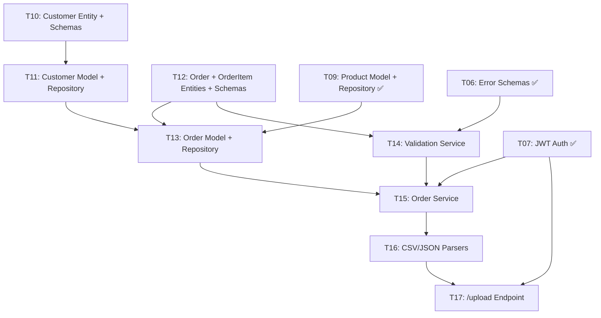
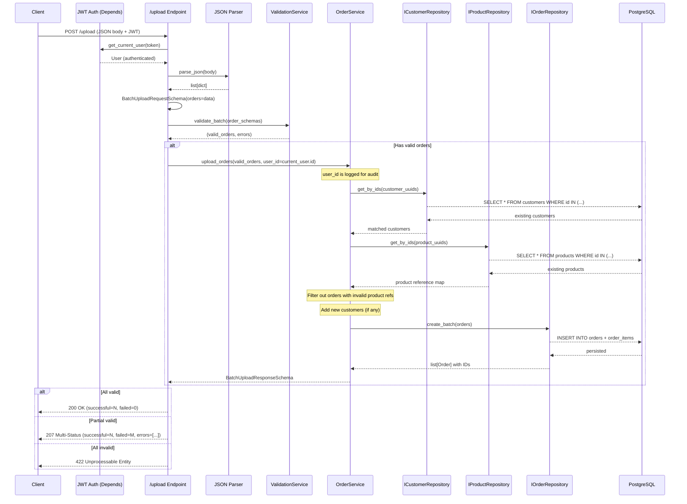
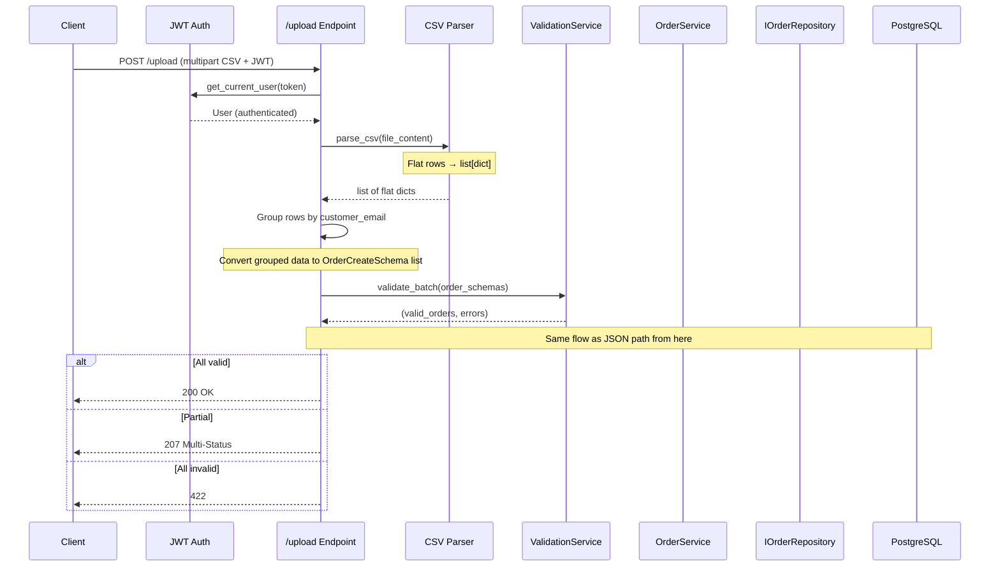
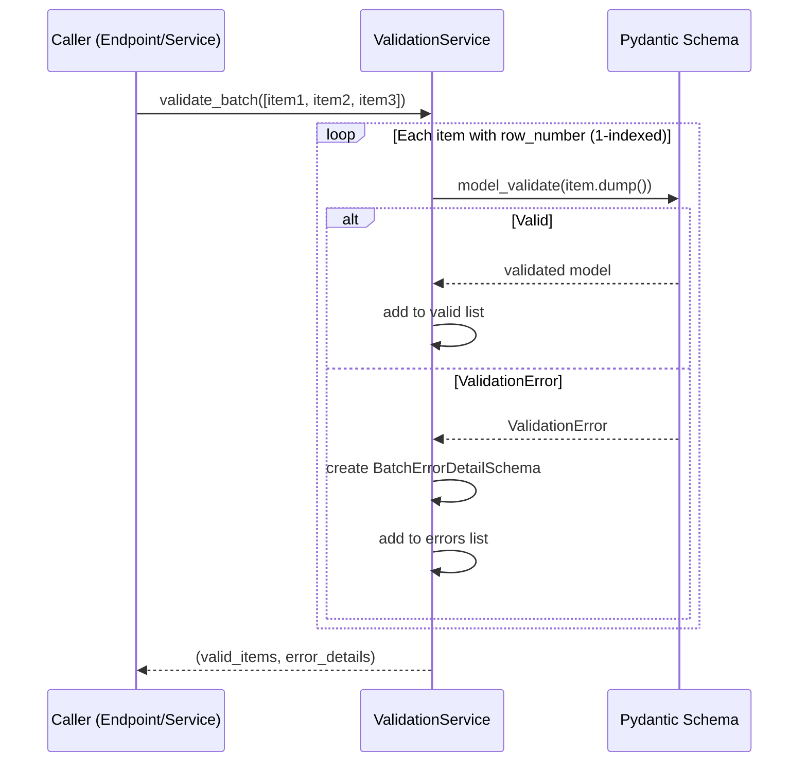

# P4: Customer + Order Upload Vertical Slice — Implementation Spec

**Phase:** P4 — Upload Slice
**Status:** 🟡 Ready for Specs
**Depends on:** P1 (Foundation) ✅, P2 (Auth Slice) ✅, P3 (Product Slice) ✅
**Blocks:** P5 (Export Slice), P6 (Testing)

---

## Objective

Deliver a complete **batch data upload vertical slice**: the `Customer` and `Order`/`OrderItem` domain entities, their Pydantic schemas, SQLAlchemy models, repository interfaces and implementations, a pure-domain `ValidationService`, an `OrderService` orchestrator, CSV/JSON parsers, and the `POST /upload` endpoint.

**Target user:** Developer evaluating backend architecture skills (portfolio project).

**Success criteria:**
1. Authenticated user can `POST /upload` with valid JSON → **200 OK**
2. Authenticated user can `POST /upload` with mixed valid/invalid → **207 Multi-Status** with RFC 7807 error details
3. Authenticated user can `POST /upload` with all invalid → **422 Unprocessable Entity**
4. Authenticated user can `POST /upload` with CSV (multipart) → **200/207/422**
5. Unauthenticated request → **401 Unauthorized**
6. Batch exceeding `MAX_BATCH_SIZE` (1000 rows) → **413 Payload Too Large**
7. All error responses follow RFC 7807 `ProblemDetailSchema`
8. `ruff check .` and `mypy .` pass with zero errors
9. Domain layer (`app/core/`) has zero external dependencies

---

## Architectural Decisions

### AD-P4-01: Customer Deduplication by Email

| Decision | Rationale |
|----------|-----------|
| Customers are deduplicated by email (`unique` constraint on `CustomerModel.email`). Existing customers are matched by email and their UUID is reused. | Business rule: one customer per email address. Avoids duplicate customer records during batch import. |

### AD-P4-02: Order + OrderItem as a Single Aggregate

| Decision | Rationale |
|----------|-----------|
| `Order` (header) and `OrderItem` (lines) form a single aggregate — both created in the same transaction. `IOrderRepository` handles both. | An order without items is invalid. Single transaction guarantees consistency. Repository is per aggregate (`IOrderRepository`), not per table. |

### AD-P4-03: CSV → Normalized Pipeline

| Decision | Rationale |
|----------|-----------|
| CSV rows are flat (one row per order item). Parsing groups by `customer_email` into orders with multiple items. Both CSV and JSON converge to the same Pydantic schemas. | Single unified processing pipeline. CSV and JSON diverge only at the parser layer; everything downstream is schema-agnostic. |

### AD-P4-04: ValidationService — Pure Domain Service

| Decision | Rationale |
|----------|-----------|
| `ValidationService.validate_batch()` receives `list[BaseModel]`, returns `tuple[list[BaseModel], list[BatchErrorDetailSchema]]`. Zero external imports. | Pure domain logic — no DB, HTTP, or framework coupling. Testable without infrastructure. |

### AD-P4-05: OrderService — Orchestrator with Repository DI

| Decision | Rationale |
|----------|-----------|
| `OrderService` depends on `IOrderRepository`, `ICustomerRepository`, `IProductRepository` interfaces only. | Dependency Inversion Principle. Pure application service — orchestration only, no concrete infrastructure imports. |

### AD-P4-06: Foreign Key Validation via Batch Lookup

| Decision | Rationale |
|----------|-----------|
| `product_id` references validated by fetching all referenced UUIDs via a single `get_by_ids()` query. Products not found are reported as RFC 7807 validation errors. | Single query per batch avoids N+1. Clear error reporting per missing product. |

### AD-P4-07: Batch Response Status Codes

| Scenario | HTTP Status | Response Body |
|----------|-------------|---------------|
| All rows valid | **200 OK** | `BatchUploadResponseSchema` with `errors: []` |
| Some valid, some invalid | **207 Multi-Status** | `BatchUploadResponseSchema` with `errors` list |
| All rows invalid | **422 Unprocessable Entity** | `ProblemDetailSchema` summarized + errors |
| Unauthenticated | **401 Unauthorized** | Standard 401 |
| Batch > 1000 rows | **413 Payload Too Large** | `ProblemDetailSchema` |
| Invalid format / parse error | **400 Bad Request** | `ProblemDetailSchema` |

### AD-P4-08: No Rate Limiting in P4

| Decision | Rationale |
|----------|-----------|
| Rate limiting (`slowapi` already in requirements) deferred to P7 (Deployment). | Infrastructure concern, not application logic. Focus in P4 is correctness. |

---

## Tech Stack Changes

### No New Dependencies

All required dependencies for P4 are already installed from P1–P3:

| Existing Dependency | Used For |
|---------------------|----------|
| `pydantic[email]>=2.0` | `EmailStr` in `CustomerCreateSchema` |
| `sqlalchemy>=2.0` | `CustomerModel`, `OrderModel`, `OrderItemModel` |
| `alembic>=1.13` | Migration autogeneration |
| `python-multipart>=0.0.9` | CSV file upload via multipart form |
| `asyncpg>=0.29.0` | Async PostgreSQL (runtime) |
| `aiosqlite>=0.20.0` | Async SQLite (testing) |

---

## Commands

```bash
# Run database migrations (creates customers, orders, order_items tables)
alembic upgrade head

# Generate new migration (if models change)
alembic revision --autogenerate -m "description_of_change"

# Run all tests
pytest

# Run tests with coverage
pytest --cov=app --cov-report=term-missing

# Lint
ruff check .

# Type check
mypy .

# Format
ruff format .
```

---

## Project Structure — P4 New Files

```
app/
├── core/
│   ├── entities/
│   │   ├── __init__.py                   # UPDATE — export Customer, Order, OrderItem
│   │   ├── customer.py                   # NEW — Customer domain entity
│   │   └── order.py                      # NEW — Order + OrderItem domain entities
│   │
│   ├── repositories/
│   │   ├── __init__.py                   # UPDATE — export ICustomerRepository, IOrderRepository
│   │   ├── customer_repository.py        # NEW — ICustomerRepository interface
│   │   └── order_repository.py           # NEW — IOrderRepository interface
│   │
│   └── services/
│       ├── __init__.py                   # UPDATE — export ValidationService, OrderService
│       ├── validation_service.py         # NEW — ValidationService (pure domain)
│       └── order_service.py              # NEW — OrderService (orchestrator)
│
├── infrastructure/
│   ├── database/
│   │   └── models/
│   │       ├── __init__.py               # UPDATE — export CustomerModel, OrderModel, OrderItemModel
│   │       ├── customer.py               # NEW — CustomerModel (SQLAlchemy)
│   │       └── order.py                  # NEW — OrderModel + OrderItemModel (SQLAlchemy)
│   │
│   └── repositories/
│       ├── __init__.py                   # UPDATE — export CustomerRepository, OrderRepository
│       ├── customer_repository.py        # NEW — CustomerRepository implementation
│       └── order_repository.py           # NEW — OrderRepository implementation
│
├── schemas/
│   ├── __init__.py                       # UPDATE — export customer + order schemas
│   ├── customer.py                       # NEW — CustomerCreateSchema, CustomerResponseSchema
│   └── order.py                          # NEW — OrderCreateSchema, OrderItemCreateSchema, 
│                                         #       OrderResponseSchema, BatchUploadRequestSchema,
│                                         #       BatchUploadResponseSchema, BatchErrorDetailSchema
│
├── utils/
│   ├── __init__.py                       # UPDATE — export csv_parser, json_parser, file_utils
│   ├── csv_parser.py                     # NEW — CSV parsing (flat row → grouped orders)
│   ├── json_parser.py                    # NEW — JSON body normalization
│   └── file_utils.py                     # NEW — File size validation

migrations/
└── versions/
    └── xxxx_add_customers_orders_tables.py  # AUTO-GENERATED — Customers + Orders migration
```

---

## Code Style — P4 Patterns

### Customer Domain Entity

```python
# app/core/entities/customer.py
"""Customer domain entity — pure business logic, no framework dependencies.

Represents a customer with name and email contact information.
This is a DDD entity, not a database model.
"""

from __future__ import annotations

from dataclasses import dataclass, field
from uuid import UUID, uuid4


@dataclass
class Customer:
    """Domain entity representing a customer.

    Equality is based on identity (id), not attributes.
    Customers are uniquely identified by their UUID, while the
    email serves as a business key for batch import deduplication.
    """

    name: str
    email: str
    id: UUID = field(default_factory=uuid4)
```

### Order + OrderItem Domain Entities

```python
# app/core/entities/order.py
"""Order and OrderItem domain entities — pure business logic, no framework.

Represents a customer order with one or more line items.
Order and OrderItem form a single aggregate — Order is the aggregate root.
"""

from __future__ import annotations

from dataclasses import dataclass, field
from datetime import UTC, datetime
from uuid import UUID, uuid4


@dataclass
class OrderItem:
    """Domain entity representing a single line item within an order.

    References a product by ID with quantity purchased and unit price.
    Always belongs to exactly one Order aggregate.
    """

    product_id: UUID
    quantity: int
    price: float
    id: UUID = field(default_factory=uuid4)


@dataclass
class Order:
    """Domain entity representing a customer order (aggregate root).

    An Order has a status lifecycle and contains one or more OrderItems.
    The Order is the aggregate root — items are accessed only through it.
    """

    customer_id: UUID
    status: str = "pending"
    items: list[OrderItem] = field(default_factory=list)
    created_at: datetime = field(default_factory=lambda: datetime.now(UTC))
    id: UUID = field(default_factory=uuid4)
```

### Customer Pydantic Schemas

```python
# app/schemas/customer.py
"""Pydantic schemas for customer validation and API responses."""

from __future__ import annotations

from uuid import UUID

from pydantic import BaseModel, EmailStr, Field, field_validator


class CustomerCreateSchema(BaseModel):
    """Schema for creating a customer via batch upload.

    Validates name length and email format.
    """

    name: str = Field(min_length=1, max_length=100)
    email: EmailStr

    @field_validator("name")
    @classmethod
    def strip_whitespace(cls, value: str) -> str:
        """Strip leading/trailing whitespace from customer name."""
        return value.strip()


class CustomerResponseSchema(BaseModel):
    """Schema for customer data in API responses."""

    id: UUID
    name: str
    email: str

    model_config = {"from_attributes": True}
```

### Order / Batch Upload Pydantic Schemas

```python
# app/schemas/order.py
"""Pydantic schemas for order validation, batch upload, and API responses.

Defines the complete batch upload contract including request/response
shapes and RFC 7807 error details.
"""

from __future__ import annotations

from uuid import UUID

from pydantic import BaseModel, Field


class OrderItemCreateSchema(BaseModel):
    """Schema for creating a single order item via batch upload.

    Validates product reference, quantity range, and unit price.
    """

    product_id: UUID
    quantity: int = Field(gt=0, le=1000)
    price: float = Field(gt=0, le=1_000_000)


class OrderCreateSchema(BaseModel):
    """Schema for creating an order with nested items via batch upload."""

    customer_id: UUID
    items: list[OrderItemCreateSchema] = Field(min_length=1)


class OrderResponseSchema(BaseModel):
    """Schema for order data in API responses."""

    id: UUID
    customer_id: UUID
    status: str
    items: list[OrderItemResponseSchema]
    created_at: str

    model_config = {"from_attributes": True}


class OrderItemResponseSchema(BaseModel):
    """Schema for order item data in API responses."""

    id: UUID
    product_id: UUID
    quantity: int
    price: float

    model_config = {"from_attributes": True}


class BatchUploadRequestSchema(BaseModel):
    """Schema for the batch upload request body (JSON path).

    Validates batch size against MAX_BATCH_SIZE.
    """

    orders: list[OrderCreateSchema] = Field(
        min_length=1,
        max_length=1000,
    )


class BatchErrorDetailSchema(BaseModel):
    """RFC 7807 Problem Details with row_number for batch processing.

    Extends ProblemDetailSchema with an integer row_number to identify
    which specific row in the batch failed validation.
    """

    type: str = "about:blank"
    title: str
    status: int = 422
    detail: str | None = None
    instance: str | None = None
    row_number: int


class BatchUploadResponseSchema(BaseModel):
    """Schema for the batch upload response.

    Reports total rows processed, successful inserts, failures,
    and detailed errors per invalid row.
    """

    total: int
    successful: int
    failed: int
    errors: list[BatchErrorDetailSchema] = Field(default_factory=list)
```

### Customer SQLAlchemy Model

```python
# app/infrastructure/database/models/customer.py
"""SQLAlchemy Customer model for database persistence.

Maps to the 'customers' table with UUID primary key,
unique email, indexed name, and timestamp tracking.
"""

from __future__ import annotations

import uuid
from datetime import UTC, datetime

from sqlalchemy import DateTime, String
from sqlalchemy.orm import Mapped, mapped_column

from app.infrastructure.database.base import Base


class CustomerModel(Base):
    """SQLAlchemy model for the customers table."""

    __tablename__ = "customers"

    id: Mapped[uuid.UUID] = mapped_column(
        primary_key=True,
        default=uuid.uuid4,
    )

    name: Mapped[str] = mapped_column(
        String(100),
        index=True,
        nullable=False,
    )

    email: Mapped[str] = mapped_column(
        String(255),
        unique=True,
        index=True,
        nullable=False,
    )

    created_at: Mapped[datetime] = mapped_column(
        DateTime(timezone=True),
        default=lambda: datetime.now(UTC),
        nullable=False,
    )

    updated_at: Mapped[datetime] = mapped_column(
        DateTime(timezone=True),
        default=lambda: datetime.now(UTC),
        onupdate=lambda: datetime.now(UTC),
        nullable=False,
    )

    def __repr__(self) -> str:
        """Human-readable representation."""
        return f"CustomerModel(id={self.id!r}, email={self.email!r})"
```

### Order + OrderItem SQLAlchemy Models

```python
# app/infrastructure/database/models/order.py
"""SQLAlchemy Order and OrderItem models for database persistence.

Orders and order_items form a one-to-many relationship.
Order is the aggregate root with FK references to customers and products.
"""

from __future__ import annotations

import uuid
from datetime import UTC, datetime

from sqlalchemy import DateTime, Float, ForeignKey, Integer, String
from sqlalchemy.orm import Mapped, mapped_column, relationship

from app.infrastructure.database.base import Base


class OrderModel(Base):
    """SQLAlchemy model for the orders table."""

    __tablename__ = "orders"

    id: Mapped[uuid.UUID] = mapped_column(
        primary_key=True,
        default=uuid.uuid4,
    )

    customer_id: Mapped[uuid.UUID] = mapped_column(
        ForeignKey("customers.id"),
        nullable=False,
        index=True,
    )

    status: Mapped[str] = mapped_column(
        String(20),
        default="pending",
        nullable=False,
    )

    created_at: Mapped[datetime] = mapped_column(
        DateTime(timezone=True),
        default=lambda: datetime.now(UTC),
        nullable=False,
    )

    updated_at: Mapped[datetime] = mapped_column(
        DateTime(timezone=True),
        default=lambda: datetime.now(UTC),
        onupdate=lambda: datetime.now(UTC),
        nullable=False,
    )

    items: Mapped[list[OrderItemModel]] = relationship(
        back_populates="order",
        cascade="all, delete-orphan",
    )

    def __repr__(self) -> str:
        return f"OrderModel(id={self.id!r}, customer_id={self.customer_id!r})"


class OrderItemModel(Base):
    """SQLAlchemy model for the order_items table."""

    __tablename__ = "order_items"

    id: Mapped[uuid.UUID] = mapped_column(
        primary_key=True,
        default=uuid.uuid4,
    )

    order_id: Mapped[uuid.UUID] = mapped_column(
        ForeignKey("orders.id"),
        nullable=False,
        index=True,
    )

    product_id: Mapped[uuid.UUID] = mapped_column(
        ForeignKey("products.id"),
        nullable=False,
        index=True,
    )

    quantity: Mapped[int] = mapped_column(
        Integer,
        nullable=False,
    )

    price: Mapped[float] = mapped_column(
        Float,
        nullable=False,
    )

    created_at: Mapped[datetime] = mapped_column(
        DateTime(timezone=True),
        default=lambda: datetime.now(UTC),
        nullable=False,
    )

    order: Mapped[OrderModel] = relationship(back_populates="items")

    def __repr__(self) -> str:
        return (
            f"OrderItemModel(id={self.id!r}, "
            f"order_id={self.order_id!r}, "
            f"product_id={self.product_id!r})"
        )
```

### Customer Repository Interface

```python
# app/core/repositories/customer_repository.py
"""ICustomerRepository interface — contract for customer data access."""

from __future__ import annotations

from abc import ABC, abstractmethod
from uuid import UUID

from app.core.entities.customer import Customer


class ICustomerRepository(ABC):
    """Repository interface for Customer aggregate."""

    @abstractmethod
    async def get_by_id(self, customer_id: UUID) -> Customer | None:
        """Retrieve a customer by UUID."""
        ...

    @abstractmethod
    async def get_by_email(self, email: str) -> Customer | None:
        """Retrieve a customer by email (business key)."""
        ...

    @abstractmethod
    async def get_all(
        self, skip: int = 0, limit: int = 100
    ) -> list[Customer]:
        """Retrieve all customers with pagination."""
        ...

    @abstractmethod
    async def create(self, customer: Customer) -> Customer:
        """Persist a new customer."""
        ...

    @abstractmethod
    async def create_batch(
        self, customers: list[Customer]
    ) -> list[Customer]:
        """Insert multiple customers, skipping duplicates by email.
        
        Uses INSERT ... ON CONFLICT (email) DO NOTHING.
        """
        ...

    @abstractmethod
    async def get_by_ids(
        self, customer_ids: list[UUID]
    ) -> list[Customer]:
        """Retrieve multiple customers by UUIDs."""
        ...
```

### Order Repository Interface

```python
# app/core/repositories/order_repository.py
"""IOrderRepository interface — contract for order data access."""

from __future__ import annotations

from abc import ABC, abstractmethod
from uuid import UUID

from app.core.entities.order import Order


class IOrderRepository(ABC):
    """Repository interface for Order aggregate (Order + OrderItems)."""

    @abstractmethod
    async def get_by_id(self, order_id: UUID) -> Order | None:
        """Retrieve an order by UUID, including its items."""
        ...

    @abstractmethod
    async def get_by_customer(
        self, customer_id: UUID, skip: int = 0, limit: int = 100
    ) -> list[Order]:
        """Retrieve orders for a specific customer with pagination."""
        ...

    @abstractmethod
    async def get_all(
        self, skip: int = 0, limit: int = 100
    ) -> list[Order]:
        """Retrieve all orders with pagination, including items."""
        ...

    @abstractmethod
    async def create(
        self, order: Order, customer_id: UUID | None = None
    ) -> Order:
        """Persist a new order with its items in a single transaction."""
        ...

    @abstractmethod
    async def create_batch(self, orders: list[Order]) -> list[Order]:
        """Insert multiple orders with items in a single transaction.
        
        Uses INSERT ... ON CONFLICT (id) DO NOTHING for partial processing.
        """
        ...
```

### ValidationService

```python
# app/core/services/validation_service.py
"""ValidationService — pure domain service for batch validation.

Validates a list of Pydantic models and returns tuples of
(valid_items, error_details) for partial processing support.
ZERO external dependencies — no DB, HTTP, or framework imports.
"""

from __future__ import annotations

from pydantic import BaseModel, ValidationError

from app.schemas.order import BatchErrorDetailSchema


class ValidationService:
    """Domain service for batch data validation.

    Validates each item in a batch independently. Valid items
    are collected; invalid items produce RFC 7807 error details
    with row_number for client-side identification.
    """

    @staticmethod
    def validate_batch(
        items: list[BaseModel],
    ) -> tuple[list[BaseModel], list[BatchErrorDetailSchema]]:
        """Validate a batch of items.

        Args:
            items: List of Pydantic models to validate.

        Returns:
            Tuple of (valid_items, error_details).
        """
        valid: list[BaseModel] = []
        errors: list[BatchErrorDetailSchema] = []

        for row_number, item in enumerate(items, start=1):
            try:
                # Trigger full Pydantic validation
                validated = item.model_validate(item.model_dump())
                valid.append(validated)
            except ValidationError as exc:
                errors.append(
                    BatchErrorDetailSchema(
                        type="about:blank",
                        title="Validation Error",
                        status=422,
                        detail=str(exc),
                        row_number=row_number,
                    )
                )

        return valid, errors
```

### CSV Parser (Flat Row → Grouped Orders)

```python
# app/utils/csv_parser.py
"""CSV parser for flat order-item rows.

CSV format (one row per order item):
    customer_name, customer_email, product_id, quantity, price

Rows with the same customer_email are grouped into a single order
with multiple items during post-processing.
"""

from __future__ import annotations

import csv
import io
from typing import Any


def parse_csv(content: str) -> list[dict[str, Any]]:
    """Parse CSV content into a list of dictionaries.

    Args:
        content: Raw CSV string with header row.

    Returns:
        List of dictionaries, one per CSV row.

    Raises:
        ValueError: If CSV is empty, has no header, or is malformed.
    """
    reader = csv.DictReader(io.StringIO(content))

    if not reader.fieldnames:
        raise ValueError("CSV file has no header row")

    rows: list[dict[str, Any]] = []
    for row_number, row in enumerate(reader, start=1):
        # Validate row has content
        if not any(value.strip() for value in row.values()):
            raise ValueError(
                f"Row {row_number} is empty or contains only whitespace"
            )
        rows.append(row)

    if not rows:
        raise ValueError("CSV file contains no data rows")

    return rows
```

### JSON Parser

```python
# app/utils/json_parser.py
"""JSON parser for batch upload body.

Normalizes JSON input into a list of dictionaries compatible
with Pydantic schema validation.
"""

from __future__ import annotations

import json
from typing import Any


def parse_json(content: str | dict[str, Any]) -> list[dict[str, Any]]:
    """Parse JSON content into a list of dictionaries.

    Args:
        content: JSON string or already-parsed dict.

    Returns:
        List of order dictionaries from the 'orders' key.

    Raises:
        ValueError: If JSON is malformed, missing 'orders' key,
                    or orders is not a list.
    """
    if isinstance(content, str):
        try:
            data = json.loads(content)
        except json.JSONDecodeError as exc:
            raise ValueError(f"Invalid JSON: {exc}") from exc
    else:
        data = content

    if not isinstance(data, dict):
        raise ValueError("JSON body must be an object")

    if "orders" not in data:
        raise ValueError("JSON body must contain 'orders' key")

    orders = data["orders"]
    if not isinstance(orders, list):
        raise ValueError("'orders' must be a list")

    return orders
```

### File Utils

```python
# app/utils/file_utils.py
"""File utility functions for size validation and content checking."""

from __future__ import annotations


def validate_file_size(size: int, max_mb: int = 10) -> bool:
    """Validate that file size does not exceed the maximum.

    Args:
        size: File size in bytes.
        max_mb: Maximum allowed file size in megabytes (default: 10).

    Returns:
        True if file size is within limit, False otherwise.
    """
    return size <= max_mb * 1024 * 1024
```

---

## Testing Strategy — P4

P4 spans domain entities, services, parsers, and an HTTP endpoint. Testing covers all levels.

### Unit Tests

| Test File | What It Tests | Coverage Target |
|-----------|---------------|-----------------|
| `tests/unit/test_customer_entity.py` | Customer entity creation, equality by id | 90% |
| `tests/unit/test_order_entity.py` | Order + OrderItem creation, aggregate structure | 90% |
| `tests/unit/test_customer_schemas.py` | CustomerCreateSchema validation (name, EmailStr) | 95% |
| `tests/unit/test_order_schemas.py` | Order schemas, batch request/response, error detail format | 95% |
| `tests/unit/test_validation_service.py` | ValidationService.validate_batch (valid, partial, all-invalid) | 95% |
| `tests/unit/test_order_service.py` | OrderService.upload_orders with mocked repositories | 90% |
| `tests/unit/test_csv_parser.py` | CSV parsing, grouping, edge cases | 90% |
| `tests/unit/test_json_parser.py` | JSON parsing, format validation | 90% |

### Integration Tests

| Test File | What It Tests | Coverage Target |
|-----------|---------------|-----------------|
| `tests/integration/test_upload_endpoint.py` | Full request/response cycle for `/upload` | 80% |

### Test Fixtures (add to conftest.py)

```python
@pytest.fixture(scope="function")
async def sample_customer() -> Customer:
    """Create a sample Customer domain entity."""
    return Customer(name="John Doe", email="john@example.com")


@pytest.fixture(scope="function")
async def sample_order(sample_product) -> Order:
    """Create a sample Order with one item."""
    return Order(
        customer_id=uuid4(),
        items=[
            OrderItem(
                product_id=sample_product.id,
                quantity=2,
                price=19.99,
            )
        ],
    )


@pytest.fixture(scope="function")
async def customer_repository(test_db_session) -> CustomerRepository:
    """Create a CustomerRepository backed by test DB."""
    return CustomerRepository(session=test_db_session)


@pytest.fixture(scope="function")
async def order_repository(test_db_session) -> OrderRepository:
    """Create an OrderRepository backed by test DB."""
    return OrderRepository(session=test_db_session)
```

---

## Boundaries

### Always
- Use `@dataclass` for domain entities (`Customer`, `Order`, `OrderItem`) in `app/core/entities/`
- Use `abc.ABC` with `@abstractmethod` for repository interfaces in `app/core/repositories/`
- Customer deduplication by email (`ON CONFLICT (email) DO NOTHING`)
- Order + OrderItems persisted in a single transaction
- CSV parsed one row per order-item, grouped by customer_email into orders
- All Pydantic schemas for P4 data go in `app/schemas/customer.py` and `app/schemas/order.py`
- Include `from_attributes = True` in all response schemas
- Use `@field_validator` for custom field validation (e.g., whitespace stripping on names)
- The `/upload` endpoint accepts both JSON body and multipart CSV
- Error responses follow RFC 7807 `ProblemDetailSchema`
- Return 200 (all valid), 207 (partial), 422 (all invalid)
- Export all public symbols via `__init__.py` with `__all__`
- Run `pytest`, `ruff check .`, and `mypy .` before committing
- Keep `app/core/` free of external imports (no SQLAlchemy, FastAPI, HTTP)

### Ask First
- Adding new fields to Customer, Order, or OrderItem entities
- Changing the deduplication strategy (email vs. composite key)
- Changing the batch insert strategy (ON CONFLICT behavior)
- Adding new dependencies for upload operations
- Changing the CSV format specification
- Changing the aggregate boundary (Order + OrderItems as separate repos)
- Adding status transitions or workflow to orders
- Modifying the HTTP status code logic for batch responses

### Never
- Import SQLAlchemy or FastAPI in `app/core/` modules
- Use synchronous SQLAlchemy sessions in repository implementations
- Skip `__init__.py` exports for new modules
- Use raw SQL in domain entities or repository interfaces
- Commit without running Alembic migration for model changes
- Allow batch uploads without JWT authentication
- Return sensitive data (e.g., hashed passwords) in error responses
- Skip foreign key validation (product_id must exist in products table)

---

## Success Criteria

| # | Criterion | How to Verify |
|---|-----------|---------------|
| 1 | `POST /upload` with valid JSON → 200 | Integration test: upload 5 valid orders, assert 200 with `successful=5, failed=0` |
| 2 | `POST /upload` with mixed valid/invalid → 207 | Integration test: upload 5 valid + 3 invalid orders, assert 207 with 3 errors |
| 3 | `POST /upload` all invalid → 422 | Integration test: upload 5 invalid orders, assert 422 with all errors |
| 4 | `POST /upload` without auth → 401 | Integration test: no token, assert 401 |
| 5 | `POST /upload` with valid CSV (multipart) → 200 | Integration test: upload CSV with 5 valid orders, assert 200 |
| 6 | Batch > 1000 rows → 413 | Integration test: upload 1001 orders, assert 413 |
| 7 | `Customer` entity is a `@dataclass` with zero framework deps | `grep -r "from sqlalchemy\|from fastapi" app/core/entities/customer.py` → empty |
| 8 | `CustomerCreateSchema` validates name (1-100) and email (EmailStr) | Unit test: valid data passes, invalid email raises `ValidationError` |
| 9 | `CustomerModel.email` is unique + indexed | Migration creates unique index on email |
| 10 | `Order` + `OrderItem` entities are `@dataclass` with zero framework deps | `grep -r "from sqlalchemy\|from fastapi" app/core/entities/order.py` → empty |
| 11 | `OrderModel` has FK to `customers.id`; `OrderItemModel` has FK to `orders.id` and `products.id` | Migration creates FK constraints |
| 12 | `IOrderRepository` includes `get_by_customer` for per-customer queries | Unit test: query orders by customer ID returns correct orders |
| 13 | `IOrderRepository` creates order + items in one transaction | Integration test: create order with items → both persist on success, both rollback on failure |
| 14 | `ValidationService.validate_batch()` returns (valid, errors) tuple | Unit test: 5 valid + 3 invalid → 5 valid, 3 errors with row_numbers |
| 15 | `ValidationService.validate_batch()` has zero external imports | `grep -r "from sqlalchemy\|from fastapi\|import http" app/core/services/validation_service.py` → empty |
| 16 | `OrderService.upload_orders` accepts `user_id` for audit | Unit test: verify logger receives user_id during upload |
| 17 | CSV parser groups rows by customer_email into orders | Unit test: 4 rows (2 customers) → 2 orders, first with 3 items, second with 1 |
| 18 | All migrations apply and rollback cleanly | `alembic upgrade head` → tables exist; `alembic downgrade -1` → tables removed |
| 19 | `ruff check .` passes with zero errors | `ruff check .` |
| 20 | `mypy .` passes with zero type errors | `mypy .` |
| 21 | All P4 tests pass | `pytest -v` |

---

## Task Breakdown

### Dependency Flow for P4



---

### Task 10: Customer Entity + Schemas

**Description:** Create the `Customer` domain entity in `app/core/entities/customer.py` and Pydantic schemas in `app/schemas/customer.py`: `CustomerCreateSchema`, `CustomerResponseSchema`.

**Acceptance criteria:**
- [ ] `Customer` entity has: `id` (UUID, auto-generated), `name` (str), `email` (str) — no SQLAlchemy/FastAPI imports
- [ ] `Customer` is a `@dataclass` with `field(default_factory=uuid4)` for `id`
- [ ] `CustomerCreateSchema` validates: `name` (str, min_length=1, max_length=100), `email` (EmailStr)
- [ ] `CustomerCreateSchema` has `@field_validator("name")` that strips whitespace
- [ ] `CustomerResponseSchema` includes all fields plus `id` (UUID) with `model_config = {"from_attributes": True}`
- [ ] All public symbols exported via `__init__.py` with `__all__`

**Verification:**
- [ ] `python -c "from app.core.entities.customer import Customer; print(Customer)"` — imports successfully
- [ ] `python -c "from app.schemas.customer import CustomerCreateSchema; c = CustomerCreateSchema(name='John', email='john@example.com'); print(c)"` — validates correctly
- [ ] `python -c "from app.schemas.customer import CustomerCreateSchema; CustomerCreateSchema(name='', email='john@example.com')"` — raises ValidationError (empty name)
- [ ] `python -c "from app.schemas.customer import CustomerCreateSchema; CustomerCreateSchema(name='John', email='invalid')"` — raises ValidationError (invalid email)

**Dependencies:** T01 (directory structure), T02 (pydantic[email] in requirements)

**Files likely touched:**
- `app/core/entities/customer.py` (new)
- `app/core/entities/__init__.py` (update — export Customer)
- `app/schemas/customer.py` (new)
- `app/schemas/__init__.py` (update — export customer schemas)

**Estimated scope:** Small (2-4 files)

---

### Task 11: Customer Model + Repository

**Description:** Create `CustomerModel` in `app/infrastructure/database/models/customer.py`, the `ICustomerRepository` interface in `app/core/repositories/customer_repository.py`, and `CustomerRepository` implementation in `app/infrastructure/repositories/customer_repository.py`. Generate Alembic migration for the `customers` table.

**Acceptance criteria:**
- [ ] `CustomerModel` has: `id` (UUID PK), `name` (String(100), indexed), `email` (String(255), unique, indexed), `created_at` (DateTime with timezone), `updated_at` (DateTime with timezone, onupdate)
- [ ] `CustomerModel` uses `Mapped` and `mapped_column` (SQLAlchemy 2.x style)
- [ ] `ICustomerRepository` defines: `get_by_id`, `get_by_email`, `get_all`, `create`, `create_batch`, `get_by_ids`
- [ ] `ICustomerRepository` uses `abc.ABC` with `@abstractmethod`
- [ ] `CustomerRepository` implements `ICustomerRepository` accepting `AsyncSession` in constructor
- [ ] `create_batch` uses `INSERT ... ON CONFLICT (email) DO NOTHING` for customer deduplication by email
- [ ] `get_by_email` enables email-based lookup for order upload customer matching
- [ ] Repository methods convert between domain `Customer` and `CustomerModel` via `_to_domain()` / `_to_model()`
- [ ] Alembic migration for `customers` table is generated and applies cleanly
- [ ] Migration includes unique index on `email` column and regular index on `name`

**Verification:**
- [ ] `python -c "from app.infrastructure.database.models.customer import CustomerModel; print(CustomerModel.__tablename__)"` — prints "customers"
- [ ] `python -c "from app.core.repositories.customer_repository import ICustomerRepository; print(ICustomerRepository)"` — interface imports
- [ ] `python -c "from app.infrastructure.repositories.customer_repository import CustomerRepository; print(CustomerRepository)"` — implementation imports
- [ ] `pytest tests/unit/test_customer_repository.py -v` — all repository tests pass
- [ ] `alembic upgrade head` — applies migration
- [ ] Table `customers` exists with unique constraint on `email`

**Dependencies:** T04 (DB setup), T10 (Customer entity)

**Files likely touched:**
- `app/infrastructure/database/models/customer.py` (new)
- `app/core/repositories/customer_repository.py` (new)
- `app/infrastructure/repositories/customer_repository.py` (new)
- `app/infrastructure/database/models/__init__.py` (update — export CustomerModel)
- `app/core/repositories/__init__.py` (update — export ICustomerRepository)
- `app/infrastructure/repositories/__init__.py` (update — export CustomerRepository)
- `migrations/versions/xxxx_add_customers_table.py` (auto-generated)

**Estimated scope:** Medium (5-6 files)

---

### Task 12: Order + OrderItem Entities + Schemas

**Description:** Create `Order` and `OrderItem` domain entities in `app/core/entities/order.py` and Pydantic schemas in `app/schemas/order.py`: `OrderItemCreateSchema`, `OrderCreateSchema`, `OrderResponseSchema`, `OrderItemResponseSchema`, `BatchUploadRequestSchema`, `BatchUploadResponseSchema`, `BatchErrorDetailSchema`.

**Acceptance criteria:**
- [ ] `Order` entity has: `id` (UUID), `customer_id` (UUID), `status` (str, default="pending"), `items` (list[OrderItem]), `created_at` (datetime) — no SQLAlchemy/FastAPI imports
- [ ] `OrderItem` entity has: `id` (UUID), `product_id` (UUID), `quantity` (int), `price` (float) — no SQLAlchemy/FastAPI imports
- [ ] `OrderCreateSchema` validates: `customer_id` (UUID), `items` (list[OrderItemCreateSchema], min_length=1)
- [ ] `OrderItemCreateSchema` validates: `product_id` (UUID), `quantity` (int, gt=0, le=1000), `price` (float, gt=0, le=1_000_000)
- [ ] `BatchUploadRequestSchema` validates: `orders` (list[OrderCreateSchema], min_length=1, max_length=1000)
- [ ] `BatchUploadResponseSchema` includes: `total` (int), `successful` (int), `failed` (int), `errors` (list[BatchErrorDetailSchema])
- [ ] `BatchErrorDetailSchema` extends RFC 7807: `type`, `title`, `status`, `detail`, `instance`, plus `row_number` (int)
- [ ] All entities are `@dataclass` with appropriate `field(default_factory=...)` for auto-generated IDs
- [ ] All schemas use `model_config = {"from_attributes": True}` for response types
- [ ] All public symbols exported via `__init__.py` with `__all__`

**Verification:**
- [ ] `python -c "from app.core.entities.order import Order, OrderItem; print(Order, OrderItem)"` — imports successfully
- [ ] `python -c "from app.schemas.order import BatchUploadRequestSchema; batch = BatchUploadRequestSchema(orders=[...]); print(batch)"` — validates batch
- [ ] `python -c "from app.schemas.order import BatchUploadRequestSchema; BatchUploadRequestSchema(orders=[])"` — raises ValidationError (empty)
- [ ] `python -c "from app.schemas.order import BatchUploadRequestSchema; BatchUploadRequestSchema(orders=[...]*1001)"` — raises ValidationError (exceeds max)

**Dependencies:** T01 (directory structure)

**Files likely touched:**
- `app/core/entities/order.py` (new)
- `app/schemas/order.py` (new)
- `app/core/entities/__init__.py` (update — export Order, OrderItem)
- `app/schemas/__init__.py` (update — export order schemas)

**Estimated scope:** Medium (3-4 files)

---

### Task 13: Order Model + Repository

**Description:** Create `OrderModel` and `OrderItemModel` in `app/infrastructure/database/models/order.py`, the `IOrderRepository` interface in `app/core/repositories/order_repository.py`, and `OrderRepository` implementation in `app/infrastructure/repositories/order_repository.py`. Generate Alembic migration for `orders` and `order_items` tables.

**Acceptance criteria:**
- [ ] `OrderModel` has: `id` (UUID PK), `customer_id` (UUID FK → customers.id, indexed), `status` (String(20), default="pending"), `created_at` (DateTime with timezone), `updated_at` (DateTime with timezone, onupdate)
- [ ] `OrderModel` has `relationship("items")` to OrderItemModel with cascade="all, delete-orphan"
- [ ] `OrderItemModel` has: `id` (UUID PK), `order_id` (UUID FK → orders.id, indexed), `product_id` (UUID FK → products.id, indexed), `quantity` (Integer), `price` (Float), `created_at` (DateTime with timezone)
- [ ] `OrderItemModel` has `relationship("order")` back_populates to OrderModel.items
- [ ] Both models use `Mapped` and `mapped_column` (SQLAlchemy 2.x style)
- [ ] `IOrderRepository` defines: `get_by_id`, `get_by_customer`, `get_all`, `create`, `create_batch`
- [ ] `IOrderRepository` uses `abc.ABC` with `@abstractmethod`
- [ ] `OrderRepository` implements `IOrderRepository` accepting `AsyncSession` in constructor
- [ ] `create()` persists both order header and items in one transaction (flush)
- [ ] `create_batch()` persists multiple orders with items using dialect-aware `ON CONFLICT (id) DO NOTHING`
- [ ] Repository converts between domain `Order`/`OrderItem` and ORM models
- [ ] Alembic migration creates `orders` and `order_items` tables with FK constraints
- [ ] Migration includes indexes on all FK columns (customer_id, order_id, product_id)

**Verification:**
- [ ] `python -c "from app.infrastructure.database.models.order import OrderModel, OrderItemModel; print(OrderModel.__tablename__, OrderItemModel.__tablename__)"` — prints "orders", "order_items"
- [ ] `python -c "from app.core.repositories.order_repository import IOrderRepository; print(IOrderRepository)"` — interface imports
- [ ] `python -c "from app.infrastructure.repositories.order_repository import OrderRepository; print(OrderRepository)"` — implementation imports
- [ ] `pytest tests/unit/test_order_repository.py -v` — all repository tests pass
- [ ] `alembic upgrade head` — applies migration with FK constraints
- [ ] Tables `orders` and `order_items` exist with proper relationships

**Dependencies:** T04 (DB setup), T09 (Product model for FK), T11 (Customer model for FK), T12 (Order entity + schemas)

**Files likely touched:**
- `app/infrastructure/database/models/order.py` (new)
- `app/core/repositories/order_repository.py` (new)
- `app/infrastructure/repositories/order_repository.py` (new)
- `app/infrastructure/database/models/__init__.py` (update — export OrderModel, OrderItemModel)
- `app/core/repositories/__init__.py` (update — export IOrderRepository)
- `app/infrastructure/repositories/__init__.py` (update — export OrderRepository)
- `migrations/versions/xxxx_add_orders_order_items_tables.py` (auto-generated)

**Estimated scope:** Large (5-7 files)

---

### Task 14: Validation Service

**Description:** Create `ValidationService` in `app/core/services/validation_service.py`. This service validates a list of Pydantic schemas and returns a tuple of (valid_items, errors_with_row_numbers). Each error follows RFC 7807 format. This is a pure domain service with NO external dependencies.

**Acceptance criteria:**
- [ ] `ValidationService.validate_batch(items: list[BaseModel]) -> tuple[list[BaseModel], list[BatchErrorDetailSchema]]` validates each item independently
- [ ] Valid items collected into success list; invalid items produce RFC 7807 error details with `row_number` (1-indexed)
- [ ] `ValidationService` has ZERO imports from `sqlalchemy`, `fastapi`, or `http`
- [ ] Handles Pydantic `ValidationError` and converts to RFC 7807 format with descriptive `detail`
- [ ] Returns `(valid_items, errors)` — valid items succeed even when others fail (partial processing)

**Verification:**
- [ ] `python -c "from app.core.services.validation_service import ValidationService; print(ValidationService)"` — imports successfully
- [ ] `grep -r "from sqlalchemy\|from fastapi\|import http" app/core/services/validation_service.py` — returns nothing
- [ ] Unit test: validate batch with 5 valid + 3 invalid items → 5 valid returned, 3 errors with correct row_numbers

**Dependencies:** T06 (error schemas), T12 (order schemas)

**Files likely touched:**
- `app/core/services/validation_service.py` (new)
- `app/core/services/__init__.py` (update — export ValidationService)

**Estimated scope:** Small (1-2 files)

---

### Task 15: Order Service

**Description:** Create `OrderService` in `app/core/services/order_service.py`. This service orchestrates the upload flow: validate batch → separate valid/invalid → resolve customers (find by email or create) → validate product references → persist valid orders → return batch result. The `user_id` parameter is used for audit/logging purposes only (authenticated JWT user who performed the upload).

**Acceptance criteria:**
- [ ] `OrderService.upload_orders(orders_data: list[OrderCreateSchema], user_id: UUID) -> BatchUploadResponseSchema` orchestrates the full upload flow
- [ ] Resolves customers: for each unique `customer_id` in valid orders, looks up by UUID or email
- [ ] Validates product references: collects all `product_id` values, queries `IProductRepository.get_by_ids()` once, reports missing products as validation errors
- [ ] Uses `IOrderRepository.create_batch` for persistence of fully-valid orders
- [ ] Returns `BatchUploadResponseSchema` with `total`, `successful`, `failed`, `errors`
- [ ] Depends on repository interfaces (not implementations) — follows DIP
- [ ] `OrderService` has ZERO imports from `sqlalchemy` or `fastapi`

**Verification:**
- [ ] `python -c "from app.core.services.order_service import OrderService; print(OrderService)"` — imports successfully
- [ ] `grep -r "from sqlalchemy\|from fastapi" app/core/services/order_service.py` — returns nothing
- [ ] Unit test with mocked repositories: upload 5 valid + 3 invalid → 5 created, 3 errors reported
- [ ] Unit test: upload with missing product_id → error reported, valid orders still succeed
- [ ] Unit test: `user_id` is logged/recorded during upload (verify via spy/mock on logger)

**Dependencies:** T13 (Order repository interface), T14 (Validation service), T07 (JWT auth — for user context)

**Files likely touched:**
- `app/core/services/order_service.py` (new)
- `app/core/services/__init__.py` (update — export OrderService)

**Estimated scope:** Medium (1-2 files)

---

### Task 16: CSV/JSON Parsers

**Description:** Create `csv_parser.py` and `json_parser.py` in `app/utils/`. These parsers normalize CSV and JSON input into a common format (list of dicts) that can be validated by Pydantic schemas. Also create `file_utils.py` for file size validation.

**CSV format (one row per order item):**
```csv
customer_name,customer_email,product_id,quantity,price
John Doe,john@example.com,<product-uuid-1>,2,19.99
John Doe,john@example.com,<product-uuid-2>,1,9.99
Jane Smith,jane@example.com,<product-uuid-1>,5,19.99
```

The parser groups rows by `customer_email` into orders:
- Row 1 + 2 → same customer → one order with 2 items
- Row 3 → different customer → second order with 1 item

**Acceptance criteria:**
- [ ] `parse_csv(content: str) -> list[dict]` parses CSV with DictReader, returns one dict per row
- [ ] `parse_json(content: str | dict) -> list[dict]` normalizes JSON body into list of order dicts
- [ ] `validate_file_size(size: int, max_mb: int = 10) -> bool` validates file size
- [ ] CSV parser raises `ValueError` with descriptive message on empty/malformed input
- [ ] JSON parser raises `ValueError` with descriptive message on invalid format
- [ ] Parsers handle UTF-8 encoding
- [ ] All parser functions are stateless (no side effects)

**Verification:**
- [ ] `python -c "from app.utils.csv_parser import parse_csv; print(parse_csv)"` — imports successfully
- [ ] `python -c "from app.utils.json_parser import parse_json; print(parse_json)"` — imports successfully
- [ ] `python -c "from app.utils.file_utils import validate_file_size; print(validate_file_size)"` — imports successfully
- [ ] Unit test: parse valid 3-row CSV → list of 3 dicts
- [ ] Unit test: parse empty CSV → raises ValueError
- [ ] Unit test: parse valid JSON with 2 orders → list of 2 dicts
- [ ] Unit test: parse JSON without 'orders' key → raises ValueError

**Dependencies:** T01 (directory structure)

**Files likely touched:**
- `app/utils/csv_parser.py` (new)
- `app/utils/json_parser.py` (new)
- `app/utils/file_utils.py` (new)
- `app/utils/__init__.py` (update — export all utils)

**Estimated scope:** Small (3-4 files)

---

### Task 17: /upload Endpoint

**Description:** Create the `POST /upload` endpoint in `app/infrastructure/api/endpoints/upload.py`. Accept CSV (multipart) or JSON (body), parse, validate, process via `OrderService`, and return appropriate HTTP status codes (200, 207, 422). Wire into the API router and main app. Requires JWT authentication.

**Endpoint contracts:**

```
POST /upload
Content-Type: application/json
Authorization: Bearer <token>

Body: { "orders": [{ "customer_id": "...", "items": [...] }] }
→ 200: { "total": 5, "successful": 5, "failed": 0, "errors": [] }
→ 207: { "total": 8, "successful": 5, "failed": 3, "errors": [...] }
→ 422: { "type": "about:blank", "title": "All rows invalid", ... }
→ 413: { "type": "about:blank", "title": "Batch size exceeded", ... }
```

```
POST /upload
Content-Type: multipart/form-data
Authorization: Bearer <token>

Form field "file" (CSV upload)
→ Same status codes as JSON path
```

**Acceptance criteria:**
- [ ] `POST /upload` accepts `application/json` body with `BatchUploadRequestSchema`
- [ ] `POST /upload` accepts `multipart/form-data` with CSV file (field name: "file")
- [ ] Returns 200 when all rows are valid
- [ ] Returns 207 (Multi-Status) when some rows are invalid (partial processing)
- [ ] Returns 422 when all rows are invalid
- [ ] Returns 401 when no JWT token is provided
- [ ] Returns 413 when batch size exceeds `MAX_BATCH_SIZE`
- [ ] Returns 400 when format is invalid (unparseable CSV, malformed JSON)
- [ ] Error responses follow RFC 7807 `ProblemDetailSchema`
- [ ] CSV path uses `UploadFile` from FastAPI for file handling
- [ ] CSV path groups rows by customer_email into orders before validation
- [ ] Endpoint is wired into `routers.py` and `main.py`

**Verification:**
- [ ] `curl -X POST http://localhost:8000/upload -H "Authorization: Bearer <token>" -H "Content-Type: application/json" -d '{"orders": [...]}'` — returns 200/207/422
- [ ] `curl -X POST http://localhost:8000/upload -H "Authorization: Bearer <token>" -F "file=@orders.csv"` — returns 200/207/422
- [ ] `curl -X POST http://localhost:8000/upload` (no auth) — returns 401
- [ ] Swagger UI shows `/upload` endpoint with proper schema

**Dependencies:** T07 (JWT auth), T15 (Order service), T16 (parsers)

**Files likely touched:**
- `app/infrastructure/api/endpoints/upload.py` (new)
- `app/infrastructure/api/routers.py` (update — add upload router)
- `app/main.py` (update — no change needed if routers.py handles it)

**Estimated scope:** Medium (2-3 files)

---

## Sequence Diagrams

### Full Upload Flow (JSON Path)



### CSV Upload Flow



### Validation Service Flow



---

## Data Model

### Customers Table

```sql
CREATE TABLE customers (
    id UUID PRIMARY KEY DEFAULT gen_random_uuid(),
    name VARCHAR(100) NOT NULL,
    email VARCHAR(255) NOT NULL,
    created_at TIMESTAMP WITH TIME ZONE NOT NULL DEFAULT NOW(),
    updated_at TIMESTAMP WITH TIME ZONE NOT NULL DEFAULT NOW()
);

CREATE UNIQUE INDEX ix_customers_email ON customers(email);
CREATE INDEX ix_customers_name ON customers(name);
```

### Orders Table

```sql
CREATE TABLE orders (
    id UUID PRIMARY KEY DEFAULT gen_random_uuid(),
    customer_id UUID NOT NULL REFERENCES customers(id),
    status VARCHAR(20) NOT NULL DEFAULT 'pending',
    created_at TIMESTAMP WITH TIME ZONE NOT NULL DEFAULT NOW(),
    updated_at TIMESTAMP WITH TIME ZONE NOT NULL DEFAULT NOW()
);

CREATE INDEX ix_orders_customer_id ON orders(customer_id);
```

### Order Items Table

```sql
CREATE TABLE order_items (
    id UUID PRIMARY KEY DEFAULT gen_random_uuid(),
    order_id UUID NOT NULL REFERENCES orders(id),
    product_id UUID NOT NULL REFERENCES products(id),
    quantity INTEGER NOT NULL,
    price DOUBLE PRECISION NOT NULL,
    created_at TIMESTAMP WITH TIME ZONE NOT NULL DEFAULT NOW()
);

CREATE INDEX ix_order_items_order_id ON order_items(order_id);
CREATE INDEX ix_order_items_product_id ON order_items(product_id);
```

### Column Details

#### Customers

| Column | Type | Constraints | Notes |
|--------|------|-------------|-------|
| `id` | UUID | PK, default `gen_random_uuid()` | Auto-generated unique identifier |
| `name` | VARCHAR(100) | NOT NULL, indexed | Customer display name |
| `email` | VARCHAR(255) | NOT NULL, **unique**, indexed | Customer email (business key for dedup) |
| `created_at` | TIMESTAMPTZ | NOT NULL, DEFAULT NOW() | Row creation timestamp |
| `updated_at` | TIMESTAMPTZ | NOT NULL, DEFAULT NOW() | Row last-update timestamp |

#### Orders

| Column | Type | Constraints | Notes |
|--------|------|-------------|-------|
| `id` | UUID | PK, default `gen_random_uuid()` | Auto-generated unique identifier |
| `customer_id` | UUID | FK → customers.id, NOT NULL, indexed | Customer who placed the order |
| `status` | VARCHAR(20) | NOT NULL, DEFAULT 'pending' | Order status (MVP: 'pending' only) |
| `created_at` | TIMESTAMPTZ | NOT NULL, DEFAULT NOW() | Row creation timestamp |
| `updated_at` | TIMESTAMPTZ | NOT NULL, DEFAULT NOW() | Row last-update timestamp |

#### Order Items

| Column | Type | Constraints | Notes |
|--------|------|-------------|-------|
| `id` | UUID | PK, default `gen_random_uuid()` | Auto-generated unique identifier |
| `order_id` | UUID | FK → orders.id, NOT NULL, indexed | Parent order |
| `product_id` | UUID | FK → products.id, NOT NULL, indexed | Product ordered |
| `quantity` | INTEGER | NOT NULL | Quantity ordered (validated > 0, ≤ 1000) |
| `price` | DOUBLE PRECISION | NOT NULL | Unit price at time of order |
| `created_at` | TIMESTAMPTZ | NOT NULL, DEFAULT NOW() | Row creation timestamp |

---

## Risks and Mitigations

| Risk | Impact | Mitigation |
|------|--------|------------|
| Foreign key constraints fail (customer_id, product_id not found) | High | Validate all references before inserting; report specific missing IDs |
| CSV encoding issues (non-UTF-8 files) | Medium | Default to UTF-8; catch `UnicodeDecodeError` and return 400 |
| CSV grouping logic incorrect (complex edge cases) | Medium | Comprehensive unit tests for grouping by email |
| Transaction rollback on batch partial failure | High | Use `ON CONFLICT DO NOTHING` per row; don't rollback entire batch |
| Performance with 1000-row batches | Medium | Single `get_by_ids()` query for products; batch insert with ON CONFLICT |
| Circular import between OrderService and repositories | Medium | Keep repository interfaces in `core/`, service depends on interfaces only |
| Alembic migration order (FKs require customers + products first) | Low | T13 migration must run after T11 and T09 migrations |
| Large CSV file upload timeout | Low | Enforce `MAX_FILE_SIZE_MB=10` in file_utils; validate before processing |

---

## Open Questions — RESOLVED

| # | Question | Decision | Impact |
|---|----------|----------|--------|
| 1 | Customer deduplication key? | **Email** — unique constraint on `CustomerModel.email` | `create_batch` uses `ON CONFLICT (email) DO NOTHING` |
| 2 | Order status values in MVP? | **Only "pending"** — no status transitions | String column with default; no enum in MVP |
| 3 | CSV format structure? | **One row per order item** — flat: `customer_name, customer_email, product_id, quantity, price` | Parser groups by email; T16 implements grouping |
| 4 | Auto-create missing customers? | **Yes** — lookup by email, create if not found | OrderService handles customer resolution |
| 5 | Foreign key validation strategy? | **Batch lookup** — single `get_by_ids()` for all product references | One query per batch, not one per row |
| 6 | New dependencies needed? | **None** — `pydantic[email]` and `python-multipart` already in requirements | No changes to requirements.txt |

---

## Checkpoint: P4 Upload Vertical Slice

Before proceeding to P5 (Export Slice), verify:

- [ ] `POST /upload` with valid JSON → 200
- [ ] `POST /upload` with mixed valid/invalid → 207 with RFC 7807 errors
- [ ] `POST /upload` with all invalid → 422
- [ ] `POST /upload` with valid CSV (multipart) → 200
- [ ] Request without authentication → 401
- [ ] Batch exceeding 1000 rows → 413
- [ ] `Customer` entity is `@dataclass` in `app/core/` with zero external imports
- [ ] `CustomerCreateSchema` validates name and email with whitespace stripping
- [ ] `CustomerModel.email` is unique + indexed
- [ ] `Order` + `OrderItem` entities are `@dataclass` with zero external imports
- [ ] `OrderCreateSchema` validates nested items with proper constraints
- [ ] `BatchUploadRequestSchema` enforces max 1000 orders
- [ ] `BatchUploadResponseSchema` reports total/successful/failed/errors
- [ ] `BatchErrorDetailSchema` includes RFC 7807 fields + row_number
- [ ] `OrderModel` has FK to customers.id; `OrderItemModel` has FK to orders.id and products.id
- [ ] `ICustomerRepository` defines get_by_email for email-based lookup
- [ ] `IOrderRepository` persists order + items in single transaction
- [ ] `ValidationService.validate_batch()` returns (valid, errors) tuple with row_numbers
- [ ] `ValidationService` has ZERO external imports
- [ ] `OrderService` orchestrates validation → customer resolution → product validation → persistence
- [ ] `OrderService` has ZERO external imports (depends on interfaces only)
- [ ] CSV parser groups rows by customer_email into orders
- [ ] JSON parser normalizes body into list of orders
- [ ] All Alembic migrations apply and rollback cleanly
- [ ] `ruff check .` and `mypy .` pass with zero errors
- [ ] All P4 unit tests pass
- [ ] `app/core/` has zero external imports
- [ ] **Review with human before proceeding to P5**
