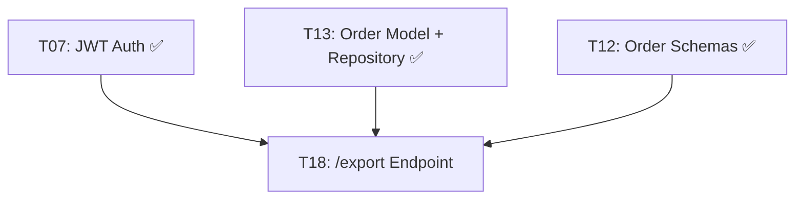
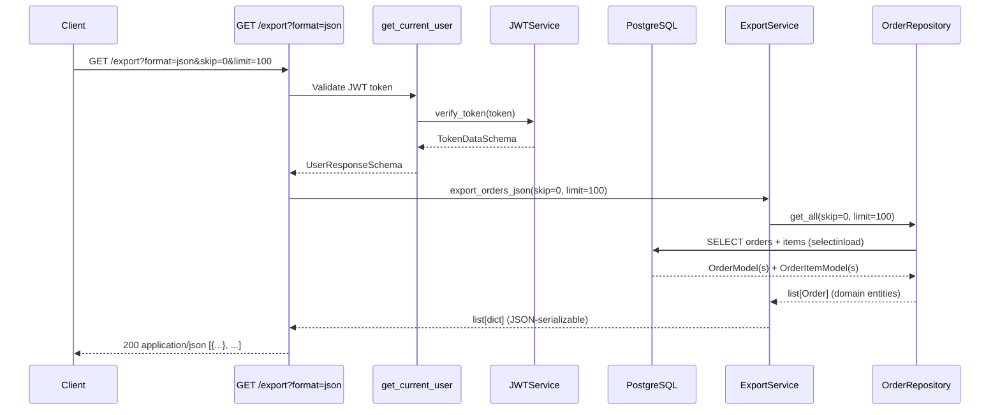
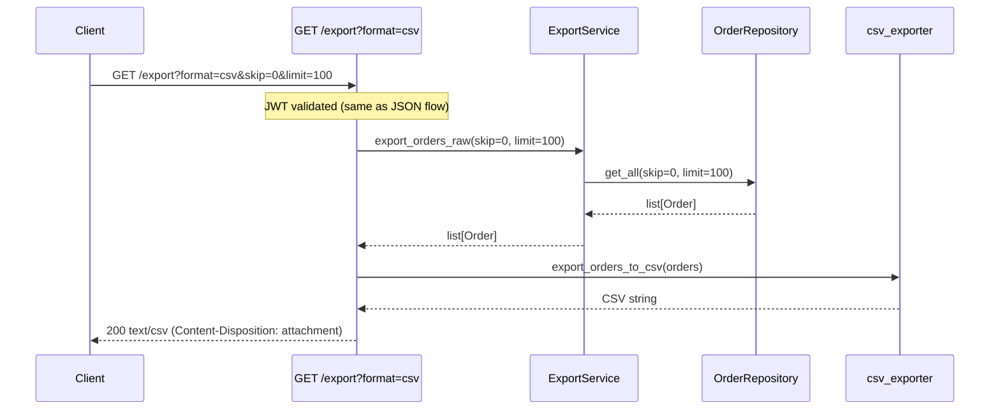

# P5: Export Vertical Slice — Implementation Spec

**Phase:** P5 — Export Slice
**Status:** 🟡 Ready for Specs
**Depends on:** P1 (Foundation) ✅, P2 (Auth Slice) ✅, P3 (Product Slice) ✅, P4 (Upload Slice) ✅
**Blocks:** P6 (Testing)

---

## Objective

Deliver a complete **data export vertical slice**: an authenticated user can call `GET /export` and receive order data in JSON or CSV format with pagination support. Builds entirely on existing repositories, schemas, and auth — no new domain entities or database changes.

**Target user:** Developer evaluating backend architecture skills (portfolio project).

**Success criteria:**
1. Authenticated user can `GET /export?format=json` → **200 OK** with JSON array of orders
2. Authenticated user can `GET /export?format=csv` → **200 OK** with raw CSV download
3. `GET /export?skip=10&limit=50` returns correct paginated results
4. Unauthenticated request → **401 Unauthorized**
5. Invalid format parameter → **400 Bad Request**
6. Empty result set → **200 OK** with `[]` (JSON) or header-only CSV
7. `ruff check .` and `mypy .` pass with zero errors
8. Domain layer (`app/core/`) has zero external dependencies
9. E2E flow works: `POST /token` → `POST /upload` → `GET /export` returns uploaded data

---

## Architectural Decisions

### AD-P5-01: Format Selection via Query Parameter

| Decision | Rationale |
|----------|-----------|
| `GET /export?format=json` (default) or `GET /export?format=csv`. Reject any other value with 400. | Explicit, testable, visible in Swagger UI. Simpler than `Accept` header negotiation for an MVP. |

### AD-P5-02: ExportService as Application Service

| Decision | Rationale |
|----------|-----------|
| An `ExportService` in `app/core/services/` orchestrates export. Depends on `IOrderRepository` interface only (DIP). Contains zero HTTP/framework imports. | Follows existing P4 pattern (`OrderService`). Keeps export logic testable without HTTP. Endpoint handles HTTP concerns (content-type, headers). |

### AD-P5-03: Flat CSV — One Row per Order Item

| Decision | Rationale |
|----------|-----------|
| CSV exports one row per order item, repeating order header fields. Columns: `order_id, customer_id, product_id, quantity, price, status, created_at`. | Mirrors the upload CSV format (which had one row per position). Flat structure is the most portable CSV shape — importable by any tool, no nested parsing needed. |

### AD-P5-04: Raw Data Stream — No Envelope Wrapper

| Decision | Rationale |
|----------|-----------|
| JSON path returns a raw `list[OrderResponseSchema]`. CSV path returns raw CSV with header row. No envelope (`{ data: ..., total: ... }`). | Simpler. Consumers can just iterate. Pagination metadata is inferred from `skip`/`limit` query params the client sent. |

### AD-P5-05: No Total Count in MVP

| Decision | Rationale |
|----------|-----------|
| Do NOT perform a `COUNT(*)` query or include `X-Total-Count` header. | Counting all rows is an extra DB query that may not scale. MVP is a portfolio demo — simple export with pagination is sufficient. Add count in a later iteration if needed. |

### AD-P5-06: Single Endpoint — No Sub-resources

| Decision | Rationale |
|----------|-----------|
| `GET /export` returns orders only. No `/export/customers` or `/export/products` sub-resources. | WORKFLOW.md specifies exactly one task (T18) for export. Order export is the most valuable and exercise-complete data set. |

### AD-P5-07: No Filters in MVP

| Decision | Rationale |
|----------|-----------|
| No date range, status, or customer filters. Export returns all orders for all customers. | WORKFLOW.md Q#1: "MVP: basic export only — no filters in v1." |

### AD-P5-08: CSV Serializer as Utility Module

| Decision | Rationale |
|----------|-----------|
| CSV serialization lives in `app/utils/csv_exporter.py` as a pure utility function. Takes domain entities, returns strings. | Follows existing pattern (`csv_parser.py` for upload). Separates format concern from business logic. Testable in isolation. |

---

## Tech Stack Changes

### No New Dependencies

All required dependencies for P5 are already installed from P1–P4:

| Existing Dependency | Used For |
|---------------------|----------|
| `fastapi>=0.115` | `GET /export` endpoint, query params, response streaming |
| `sqlalchemy>=2.0` | Async `get_all()` query with `selectinload(OrderModel.items)` |
| `pydantic>=2.0` | `OrderResponseSchema` serialization for JSON path |
| Python `csv` (stdlib) | CSV export formatting |
| Python `io` (stdlib) | In-memory CSV string buffer |

---

## Commands

```bash
# Run all tests
pytest

# Run tests with coverage
pytest --cov=app --cov-report=term-missing

# Run only P5-related tests
pytest tests/unit/test_export_service.py tests/unit/test_csv_exporter.py tests/integration/test_export_endpoint.py -v

# Lint
ruff check .

# Type check
mypy .
```

---

## Project Structure — P5 New Files

```
app/
├── core/
│   └── services/
│       ├── __init__.py                   # UPDATE — export ExportService
│       └── export_service.py             # NEW — ExportService (orchestrator)
│
├── infrastructure/
│   └── api/
│       ├── routers.py                    # UPDATE — include export router
│       └── endpoints/
│           ├── __init__.py               # UPDATE — export router
│           └── export.py                 # NEW — GET /export endpoint
│
└── utils/
    ├── __init__.py                       # UPDATE — export csv_exporter
    └── csv_exporter.py                   # NEW — CSV serialization for orders
```

**No database changes, no new models, no migrations.** P5 is a read-only slice built entirely on existing P4 infrastructure.

---

## Code Style — P5 Patterns

### ExportService

```python
# app/core/services/export_service.py
"""ExportService — application service for data export.

Orchestrates data retrieval from repositories and format conversion.
Depends on repository interfaces only (DIP). Zero HTTP/framework imports.
"""

from __future__ import annotations

from typing import Any

from app.core.repositories.order_repository import IOrderRepository
from app.schemas.order import OrderResponseSchema


class ExportService:
    """Application service for exporting order data.

    Retrieves orders via the repository and converts them to
    the appropriate response format (JSON-serializable dicts).
    CSV formatting is handled separately by csv_exporter.py.
    """

    def __init__(self, order_repo: IOrderRepository) -> None:
        self._order_repo = order_repo

    async def export_orders_json(
        self, skip: int = 0, limit: int = 100
    ) -> list[dict[str, Any]]:
        """Export orders as JSON-serializable dictionaries.

        Args:
            skip: Number of records to skip (pagination offset).
            limit: Maximum number of records to return.

        Returns:
            List of OrderResponseSchema-compatible dictionaries.
        """
        orders = await self._order_repo.get_all(skip=skip, limit=limit)
        return [
            OrderResponseSchema.model_validate(o).model_dump(mode="json")
            for o in orders
        ]

    async def export_orders_raw(
        self, skip: int = 0, limit: int = 100
    ) -> list[Any]:
        """Export orders as domain entities (for CSV path).

        Args:
            skip: Number of records to skip (pagination offset).
            limit: Maximum number of records to return.

        Returns:
            List of Order domain entities.
        """
        return await self._order_repo.get_all(skip=skip, limit=limit)
```

### CSV Exporter

```python
# app/utils/csv_exporter.py
"""CSV exporter for order data.

Converts Order domain entities to flat CSV rows (one row per order item).
Pure utility — no framework, DB, or HTTP dependencies.
"""

from __future__ import annotations

import csv
import io

from app.core.entities.order import Order


CSV_HEADER = [
    "order_id",
    "customer_id",
    "product_id",
    "quantity",
    "price",
    "status",
    "created_at",
]


def export_orders_to_csv(orders: list[Order]) -> str:
    """Convert a list of Order entities to a CSV string.

    Each order item becomes one row. Order header fields
    (order_id, customer_id, status, created_at) are repeated
    for each item in the order.

    Args:
        orders: List of Order domain entities.

    Returns:
        CSV string with header row + data rows.

    Raises:
        ValueError: Never — returns header-only CSV for empty input.
    """
    output = io.StringIO()
    writer = csv.writer(output)

    # Header row
    writer.writerow(CSV_HEADER)

    for order in orders:
        for item in order.items:
            writer.writerow(
                [
                    str(order.id),
                    str(order.customer_id),
                    str(item.product_id),
                    str(item.quantity),
                    str(item.price),
                    order.status,
                    order.created_at.isoformat(),
                ]
            )

    return output.getvalue()
```

### Export Endpoint

```python
# app/infrastructure/api/endpoints/export.py
"""Export endpoint — GET /export.

Returns order data in JSON or CSV format with pagination.
Requires JWT authentication.
"""

from __future__ import annotations

from fastapi import APIRouter, Depends, HTTPException, Query, status
from fastapi.responses import PlainTextResponse, Response
from sqlalchemy.ext.asyncio import AsyncSession

from app.core.services.export_service import ExportService
from app.infrastructure.auth.dependencies import get_current_user
from app.infrastructure.database.session import get_db
from app.infrastructure.repositories.order_repository import OrderRepository
from app.schemas.user import UserResponseSchema

router = APIRouter(tags=["export"])


async def _get_export_service(db: AsyncSession) -> ExportService:
    """Build an ExportService with the concrete OrderRepository."""
    return ExportService(order_repo=OrderRepository(session=db))


@router.get("/export")
async def export_orders(
    db: AsyncSession = Depends(get_db),
    user: UserResponseSchema = Depends(get_current_user),
    fmt: str = Query("json", alias="format"),
    skip: int = Query(0, ge=0),
    limit: int = Query(100, ge=1, le=1000),
) -> Response:
    """Export orders in JSON or CSV format.

    Requires JWT authentication. Supports pagination via skip/limit.

    Args:
        fmt: Output format — "json" (default) or "csv".
        skip: Number of records to skip.
        limit: Maximum number of records to return (1-1000).

    Returns:
        200: Orders in the requested format.
        400: Invalid format parameter.
        401: Missing or invalid JWT token.
    """
    if fmt not in ("json", "csv"):
        raise HTTPException(
            status_code=status.HTTP_400_BAD_REQUEST,
            detail=f"Unsupported format: '{fmt}'. Use 'json' or 'csv'.",
        )

    service = await _get_export_service(db)

    if fmt == "json":
        data = await service.export_orders_json(skip=skip, limit=limit)
        return Response(
            content=json.dumps(data, default=str),
            media_type="application/json",
        )
    else:  # fmt == "csv"
        from app.utils.csv_exporter import export_orders_to_csv
        orders = await service.export_orders_raw(skip=skip, limit=limit)
        csv_content = export_orders_to_csv(orders)
        return PlainTextResponse(
            content=csv_content,
            media_type="text/csv",
            headers={"Content-Disposition": "attachment; filename=orders.csv"},
        )
```

---

## Testing Strategy — P5

P5 spans a service, a CSV serializer, and an HTTP endpoint. Testing covers all levels.

### Unit Tests

| Test File | What It Tests | Coverage Target |
|-----------|---------------|-----------------|
| `tests/unit/test_export_service.py` | ExportService with mocked IOrderRepository | 90% |
| `tests/unit/test_csv_exporter.py` | CSV header, row format, empty orders, multiple items | 90% |

### Integration Tests

| Test File | What It Tests | Coverage Target |
|-----------|---------------|-----------------|
| `tests/integration/test_export_endpoint.py` | Full request/response cycle for `GET /export` | 80% |

### E2E Tests (P6 will expand this)

| Test File | What It Tests | Coverage Target |
|-----------|---------------|-----------------|
| `tests/e2e/test_full_flow.py` | POST /token → POST /upload → GET /export (P6) | — |

### Test Fixtures (add to conftest.py)

```python
@pytest.fixture(scope="function")
async def export_service(order_repository) -> ExportService:
    """Create an ExportService backed by test DB."""
    return ExportService(order_repo=order_repository)
```

---

## Boundaries

### Always
- Require JWT authentication for `GET /export` (use `get_current_user` dependency)
- Support `skip` and `limit` query params for pagination
- Use `ExportService` as the orchestrator (depends on `IOrderRepository` only)
- CSV export uses flat format: one row per order item
- CSV columns: `order_id, customer_id, product_id, quantity, price, status, created_at`
- JSON export uses existing `OrderResponseSchema` with `from_attributes=True`
- Include `Content-Disposition: attachment; filename=orders.csv` header for CSV responses
- Return `400 Bad Request` for unsupported format values
- Keep `app/core/` free of external imports (no SQLAlchemy, FastAPI, HTTP)
- Run `pytest`, `ruff check .`, and `mypy .` before committing

### Ask First
- Adding export filters (by date, status, customer)
- Adding sub-resources (e.g., `/export/products`, `/export/customers`)
- Changing the CSV column schema
- Adding total count or pagination metadata to responses
- Adding new export formats (e.g., Excel, Parquet)
- Adding rate limiting to the export endpoint

### Never
- Import SQLAlchemy or FastAPI in `app/core/` modules
- Use synchronous SQLAlchemy sessions in async endpoints
- Skip JWT authentication on the export endpoint
- Return sensitive data (e.g., hashed passwords) in export responses
- Perform unbound queries without pagination (always use `skip`/`limit`)
- Use raw SQL or string formatting for export queries

---

## Success Criteria

| # | Criterion | How to Verify |
|---|-----------|---------------|
| 1 | `GET /export` without format → 200 with JSON array | Integration test: request with valid token, assert JSON array |
| 2 | `GET /export?format=json` → 200 with JSON array of `OrderResponseSchema` | Integration test: each order has `id`, `customer_id`, `status`, `items`, `created_at` |
| 3 | `GET /export?format=csv` → 200 with `text/csv` content-type | Integration test: response has correct Content-Type and Content-Disposition headers |
| 4 | CSV response has correct header row and data rows | Unit test: header matches `CSV_HEADER` list |
| 5 | `GET /export?skip=10&limit=5` returns exactly 5 orders | Integration test: seed 20 orders, request skip=10 limit=5 → 5 results |
| 6 | `GET /export?limit=1001` returns 422 validation error | Integration test: limit > 1000 → FastAPI query param validation fails |
| 7 | `GET /export` without authentication → 401 | Integration test: no token → 401 |
| 8 | `GET /export?format=xml` returns 400 Bad Request | Integration test: invalid format → 400 with descriptive error |
| 9 | Empty database → `GET /export` returns `[]` (JSON) or header-only CSV | Unit test: export with zero orders |
| 10 | CSV one order with 3 items → 3 rows in CSV (header + 3 data rows) | Unit test: assert row count == len(items) |
| 11 | E2E flow: upload → export matches | E2E test: POST /upload 3 orders → GET /export → 3 orders returned |
| 12 | `ExportService` has zero imports from `sqlalchemy` or `fastapi` | `grep -r "from sqlalchemy\|from fastapi" app/core/services/export_service.py` → empty |
| 13 | `csv_exporter.py` has zero imports from `sqlalchemy`, `fastapi`, or `http` | `grep -r "from sqlalchemy\|from fastapi\|import http" app/utils/csv_exporter.py` → empty |
| 14 | `ruff check .` passes with zero errors | `ruff check .` |
| 15 | `mypy .` passes with zero type errors | `mypy .` |
| 16 | All P5 tests pass | `pytest tests/unit/test_export_service.py tests/unit/test_csv_exporter.py tests/integration/test_export_endpoint.py -v` |

---

## Task Breakdown

### Dependency Flow for P5



P5 is a single vertical task because it builds entirely on existing infrastructure. No new domain entities, database models, or migrations are needed.

---

### Task 18: GET /export Endpoint

**Description:** Create `ExportService` in `app/core/services/export_service.py`, `csv_exporter.py` in `app/utils/csv_exporter.py`, and the `GET /export` endpoint in `app/infrastructure/api/endpoints/export.py`. Wire the export router into `app/infrastructure/api/routers.py`. Requires JWT authentication.

**Endpoint contracts:**

```
GET /export?format=json
GET /export?format=csv
GET /export?format=json&skip=0&limit=100
Authorization: Bearer <token>

→ 200: JSON array of orders (format=json)
→ 200: Raw CSV with Content-Type: text/csv (format=csv)
→ 400: Invalid format parameter
→ 401: Missing/invalid token
→ 422: Invalid query params (limit > 1000, skip < 0)
```

**Acceptance criteria:**
- [ ] `ExportService` depends on `IOrderRepository` interface only (DIP)
- [ ] `ExportService.export_orders_json(skip, limit)` returns list of JSON-serializable order dicts
- [ ] `ExportService.export_orders_raw(skip, limit)` returns list of `Order` domain entities
- [ ] `export_orders_to_csv(orders: list[Order])` produces valid CSV with header row
- [ ] CSV header: `order_id, customer_id, product_id, quantity, price, status, created_at`
- [ ] Empty orders → header-only CSV (no data rows)
- [ ] `GET /export` with no `?format` → JSON by default
- [ ] `GET /export?format=csv` → `text/csv` content-type with `Content-Disposition: attachment`
- [ ] `GET /export?format=json` → `application/json` content-type
- [ ] `GET /export?format=xml` → 400 with descriptive error
- [ ] `GET /export` without token → 401
- [ ] `skip` query param validated: `ge=0`, default=0
- [ ] `limit` query param validated: `ge=1, le=1000`, default=100
- [ ] Endpoint wired into `routers.py` and `main.py`
- [ ] All new files have Google-style docstrings

**Verification:**
- [ ] `curl -X GET http://localhost:8000/export -H "Authorization: Bearer <token>"` — returns 200 JSON array
- [ ] `curl -X GET "http://localhost:8000/export?format=csv" -H "Authorization: Bearer <token>"` — returns CSV download
- [ ] `curl -X GET "http://localhost:8000/export?format=csv&skip=0&limit=10" -H "Authorization: Bearer <token>"` — paginated CSV
- [ ] `curl -X GET http://localhost:8000/export` (no auth) — returns 401
- [ ] `curl -X GET "http://localhost:8000/export?format=xml" -H "Authorization: Bearer <token>"` — returns 400
- [ ] Swagger UI shows `/export` endpoint with `format`, `skip`, `limit` query params

**Dependencies:** T07 (JWT auth), T13 (Order model + repository), T12 (Order schemas)

**Files likely touched:**
- `app/core/services/export_service.py` (new)
- `app/core/services/__init__.py` (update — export ExportService)
- `app/utils/csv_exporter.py` (new)
- `app/utils/__init__.py` (update — export csv_exporter)
- `app/infrastructure/api/endpoints/export.py` (new)
- `app/infrastructure/api/endpoints/__init__.py` (update — export router)
- `app/infrastructure/api/routers.py` (update — include export router)

**Estimated scope:** Medium (5-7 files)

---

## Sequence Diagrams

### GET /export (JSON) Flow



### GET /export (CSV) Flow



---

## API Endpoint — P5

### GET /export

**Parameters:**

| Parameter | Type | Required | Default | Constraints | Description |
|-----------|------|----------|---------|-------------|-------------|
| `format` | string | No | `"json"` | `"json"` or `"csv"` | Output format |
| `skip` | integer | No | `0` | `>= 0` | Records to skip (pagination offset) |
| `limit` | integer | No | `100` | `1 <= limit <= 1000` | Max records per page |

**Authorization:** Bearer JWT token (required)

**Response (200 OK — JSON):**
```json
[
    {
        "id": "550e8400-e29b-41d4-a716-446655440000",
        "customer_id": "660e8400-e29b-41d4-a716-446655440001",
        "status": "pending",
        "items": [
            {
                "id": "770e8400-e29b-41d4-a716-446655440002",
                "product_id": "880e8400-e29b-41d4-a716-446655440003",
                "quantity": 2,
                "price": 19.99
            }
        ],
        "created_at": "2026-05-26T10:30:00+00:00"
    }
]
```

**Response (200 OK — CSV):**
```csv
order_id,customer_id,product_id,quantity,price,status,created_at
550e8400-e29b-41d4-a716-446655440000,660e8400-e29b-41d4-a716-446655440001,880e8400-e29b-41d4-a716-446655440003,2,19.99,pending,2026-05-26T10:30:00+00:00
```

**Response (400 Bad Request):**
```json
{
    "detail": "Unsupported format: 'xml'. Use 'json' or 'csv'."
}
```

**Response (401 Unauthorized):**
```json
{
    "detail": "Not authenticated"
}
```

---

## Risks and Mitigations

| Risk | Impact | Mitigation |
|------|--------|------------|
| Large dataset causes memory pressure | Medium | Pagination mandatory (`limit` max 1000). `selectinload(OrderModel.items)` eager-loads to avoid N+1. |
| CSV serialization of deeply nested orders | Low | Flat CSV avoids nesting complexity. Each order item is one row. |
| UUID serialization in JSON response | Low | `OrderResponseSchema.model_dump(mode="json")` converts UUID to string automatically. |
| `Content-Disposition` header for CSV | Low | Set to `attachment; filename=orders.csv` for proper download behavior. |
| Export endpoint not tested in E2E flow until P6 | Medium | Unit + integration tests cover the endpoint fully. E2E test (upload → export) is part of P6. |

---

## Open Questions — RESOLVED

| # | Question | Decision | Impact |
|---|----------|----------|--------|
| 1 | Format negotiation mechanism? | **Query parameter** — `?format=json` or `?format=csv` (default: json) | Endpoint uses `Query(alias="format")` |
| 2 | CSV schema (flat vs one-row-per-order)? | **Flattened** — one row per order item, repeating order header fields | CSV has 7 columns: `order_id, customer_id, product_id, quantity, price, status, created_at` |
| 3 | Response envelope or raw data? | **Raw data** — JSON array for JSON, raw CSV for CSV | Simpler, no extra fields |
| 4 | Default pagination limit? | **100** — matches WORKFLOW.md Q#4 | `limit` default=100, max=1000 |
| 5 | Include total count? | **No** — no `COUNT(*)` or `X-Total-Count` header in MVP | Keeps the query single-pass |

---

## Checkpoint: P5 Export Vertical Slice

Before proceeding to P6, verify:

- [ ] `GET /export?format=json` returns JSON array for authenticated user
- [ ] `GET /export?format=csv` returns CSV download for authenticated user
- [ ] `GET /export` without authentication returns 401
- [ ] `GET /export?format=invalid` returns 400
- [ ] Pagination works: `?skip=10&limit=50` returns correct page
- [ ] E2E flow: `POST /token` → `POST /upload` → `GET /export` returns uploaded data
- [ ] CSV header matches expected columns
- [ ] `ruff check .` and `mypy .` pass with zero errors
- [ ] All P5 tests pass
- [ ] `app/core/services/export_service.py` has zero framework imports
- [ ] `app/utils/csv_exporter.py` has zero framework imports
- [ ] **Review with human before proceeding to P6**
