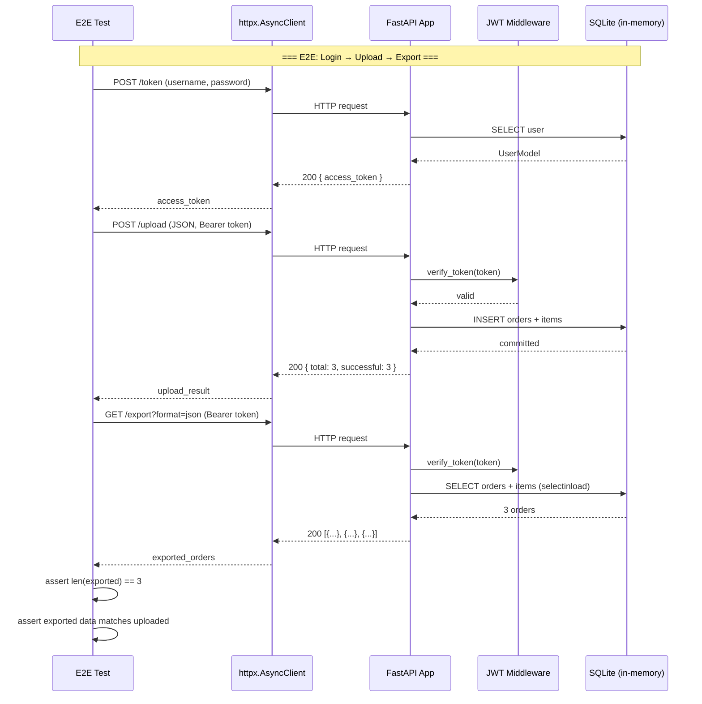
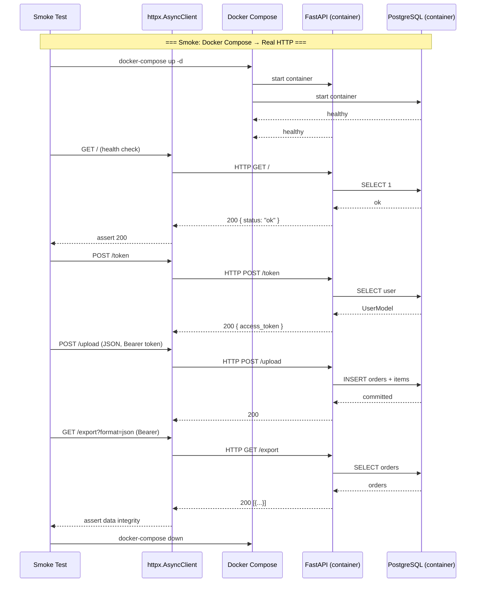

# P6: Testing — Implementation Spec

**Phase:** P6 — Testing
**Status:** 🔵 Ready for Implementation
**Depends on:** P1 (Foundation) ✅, P2 (Auth Slice) ✅, P3 (Product Slice) ✅, P4 (Upload Slice) ✅, P5 (Export Slice) ✅
**Blocks:** P7 (Deployment)

---

## Objective

Formalize the test suite — verify that the project meets all quality gates (≥80% coverage, all tests passing, ruff/mypy clean) and add **end-to-end tests** that exercise the complete user flow (auth → upload → export) as a black box. Most unit and integration tests were built alongside P2–P5; P6 closes the remaining coverage gaps, adds the missing E2E test, and validates the testing checkpoint.

**Target user:** Developer evaluating backend architecture skills (portfolio project).

**Success criteria:**
1. All existing 234 tests continue to pass
2. New E2E test (`tests/e2e/test_full_flow.py`) covers the complete flow: `POST /token` → `POST /upload` (JSON + CSV) → `GET /export` (JSON + CSV)
3. Coverage remains ≥ 80% (currently 94.07%) — no regression allowed
4. Uncovered error paths in `upload.py` and `order_service.py` are closed (see Coverage Gap Analysis)
5. `ruff check .` and `mypy .` pass with zero errors
6. Domain layer (`app/core/`) has zero external dependencies (verified by existing architecture tests)
7. Test run completes in under 30 seconds on local hardware

---

## Architectural Decisions

### AD-P6-01: Formal Review of T19–T22 Against Acceptance Criteria

| Decision | Rationale |
|----------|-----------|
| T19–T22 tests were built during P2–P5. P6 formally reviews each test file against its original acceptance criteria from `tasks/plan.md`. If a criterion is already met, mark it ✅. If a gap is found, add the missing test. Do NOT rewrite working tests. | Each vertical slice delivered working tests and 94.07% coverage. The formal review validates that acceptance criteria were truly met, not just that tests exist. Focuses effort on real gaps, not busywork. |

### AD-P6-02: Dual E2E Approach — ASGI Transport + Docker Smoke Test

| Decision | Rationale |
|----------|-----------|
| **Fast E2E (ASGI+SQLite):** `tests/e2e/test_full_flow.py` uses the `client` fixture (ASGI transport, SQLite in-memory) for 8-10 comprehensive flow tests. Runs in <10s, CI-compatible without Docker. | Same proven pattern as integration tests. Fast, deterministic, exercises the full middleware stack (CORS, auth, routing). |
| **Smoke test (Docker+PostgreSQL):** `tests/e2e/test_smoke_docker.py` uses `httpx` against `http://localhost:8000` with a running `docker-compose up` PostgreSQL. 1-2 tests verifying the app boots, `/token` works, and `/export` returns data. | Validates that the app actually works in its production-like environment. Catches config/driver mismatches that SQLite masks (e.g., `asyncpg` vs `aiosqlite` dialect differences). Skip in CI unless Docker is available. |

### AD-P6-03: One E2E File + One Smoke File

| Decision | Rationale |
|----------|-----------|
| `test_full_flow.py` — 8-10 ASGI E2E tests. `test_smoke_docker.py` — 1-2 Docker smoke tests. Both in `tests/e2e/`. | Clear separation: fast tests run always, smoke tests run only with Docker. Follows the plan (T23 = E2E). |

### AD-P6-04: Existing Test Quality Review — Verify Against Original Acceptance Criteria

| Decision | Rationale |
|----------|-----------|
| For each T19–T22 test file, cross-reference against the acceptance criteria from `tasks/plan.md` Tasks 19-22. Document which criteria are met and which need supplementary tests. Add missing edge cases where gaps are found. Do NOT refactor working tests unless a bug is found. | Ensures completeness against the original spec without destabilizing working code. The review itself becomes documentation for the checkpoint. |

### AD-P6-05: Full Coverage Gap Closure — All 49 Lines Targeted

| Decision | Rationale |
|----------|-----------|
| Attempt to cover all 49 uncovered lines. For infrastructure lines that are genuinely unreachable with SQLite (`session.py:41-47`, `base.py`), accept them as documented exceptions with explicit rationale. For all business-logic lines, write targeted tests. | User decision: "Cerrar todos los gaps posibles." Maximizes coverage while documenting what can't be tested without real PostgreSQL. The Docker smoke test covers session.py production path. |

### AD-P6-06: No New Dependencies

| Decision | Rationale |
|----------|-----------|
| P6 uses only existing dependencies: `pytest`, `pytest-asyncio`, `pytest-cov`, `httpx`. The Docker smoke test uses `docker-compose` CLI — no new Python packages. | Everything needed is already installed or available as system tooling. |

---

## Current State Analysis

### What Already Exists (Built During P2–P5)

| Original Task | Test Files | Test Count | Coverage Target | Actual | Status |
|---------------|-----------|------------|-----------------|--------|--------|
| T19 | `test_validation_service.py`, `test_*_schemas.py` (6 files) | 6 + 12 + 12 + 9 + 9 + 13 + 12 = **73** | 90% | ✅ 94%+ | Built during P2–P4 |
| T20 | `test_order_service.py`, `test_*_repository.py` (3 files) | 3 + 9 + 13 + 10 = **35** | 90% | ✅ 91%+ | Built during P3–P5 |
| T21 | `test_upload_endpoint.py` | **9** | 80% | ✅ 87% | Built during P4 |
| T22 | `test_export_endpoint.py` | **9** | 80% | ✅ 100% | Built during P5 |
| T23 | `tests/e2e/test_full_flow.py` | **0** | 70% | ❌ Missing | Primary P6 work |

**Other existing tests (infrastructure/convention checks):**
- `test_app_core_imports.py` (5), `test_directory_structure.py` (5), `test_pyproject_config.py` (9), `test_env_example.py` (8), `test_makefile.py` (6), `test_config.py` (9), `test_database.py` (6), `test_auth_services.py` (7), `test_auth_endpoint.py` (6), `test_parsers.py` (11), `test_csv_exporter.py` (4), `test_export_service.py` (5), `test_*_entity.py` (19 total), `test_*_model.py` (29 total)

**Total existing:** **234 tests, 94.07% coverage**

### Coverage Gap Analysis

The 49 uncovered lines fall into these categories:

| Category | Lines | Files | Testable? | Priority |
|----------|-------|-------|-----------|----------|
| **Upload endpoint error paths** | 8 lines | `upload.py: 48-49, 62, 74, 113, 122-123, 130` | ✅ High | **P6 Will Close** |
| **OrderService FK all-invalid** | 2 lines | `order_service.py: 115, 131` | ✅ Medium | **P6 Will Close** |
| **Session production engine** | 7 lines | `session.py: 41-47` | ❌ Requires PostgreSQL | Skip (infra glue) |
| **Base model utilities** | 8 lines | `base.py: 33-35, 41-45` | ❌ Overridden methods | Skip (ORM internals) |
| **Repository error recovery** | 13 lines | `order_repo: 88, 142-145, 161-166` `customer_repo: 107-112` `product_repo: 68, 95-100` | ⚠️ Medium | P6 may cover if reachable via E2E |
| **Auth edge cases** | 4 lines | `dependencies: 46, 53, 55` `jwt_service: 66` | ⚠️ Medium | Review during P6 |
| **Model `__repr__`** | 3 lines | `order: 59, 103` `user: 54` | ❌ Low | Skip (debug helpers) |
| **CSV/JSON parser paths** | 4 lines | `csv_parser: 45, 82` `json_parser: 32, 35` | ⚠️ Medium | May cover via E2E |

**P6 target:** Close all 49 uncovered lines. For lines that are genuinely unreachable with SQLite (`session.py` production engine, `base.py` overrides), document the rationale and cover them via the Docker smoke test (session.py) or accept as ORM internals (base.py). See Coverage Gap Closure Plan below for line-by-line strategy.

---

## Commands

```bash
# Run all tests with coverage
pytest --cov=app --cov-report=term-missing

# Run only E2E tests
pytest tests/e2e/ -v

# Run only unit tests
pytest tests/unit/ -v

# Run only integration tests
pytest tests/integration/ -v

# Run targeted coverage gap tests
pytest tests/integration/test_upload_endpoint.py::test_json_upload_invalid_body -v
pytest tests/integration/test_upload_endpoint.py::test_json_upload_orders_not_list -v
pytest tests/unit/test_order_service.py::test_upload_all_fk_invalid -v

# Lint
ruff check .

# Type check
mypy .

# Full verification (all gates)
pytest && ruff check . && mypy .
```

---

## Project Structure — P6 New/Modified Files

```
tests/
├── conftest.py                        # UPDATE — may add E2E-specific fixtures
└── e2e/
    ├── __init__.py                     # Existing
    └── test_full_flow.py               # NEW — T23: E2E full user flow

tests/
├── unit/
│   ├── test_order_service.py           # UPDATE — add FK all-invalid edge case
│   └── test_validation_service.py      # REVIEW — verify acceptance criteria
│
└── integration/
    ├── test_upload_endpoint.py         # UPDATE — add JSON error path tests
    └── test_export_endpoint.py         # REVIEW — verify acceptance criteria
```

**No source code changes.** P6 is entirely test code. Project structure unchanged.

---

## Task Breakdown

### The P6 Testing Tasks — Adapted for Current State

Since T19–T22 were built alongside P2–P5, P6 focuses on **formal review (T19–T22)**, **E2E creation (T23)**, and **full coverage gap closure**:

```
P6 Work Breakdown:
├── T19-REVIEW:      Formal review of validation + schemas tests against plan.md criteria
├── T20-REVIEW:      Formal review of services + repos tests against plan.md criteria
├── T21-REVIEW:      Formal review of /upload integration tests against plan.md criteria
├── T22-REVIEW:      Formal review of /export integration tests against plan.md criteria
├── T23-PRIMARY:     E2E Full Flow tests (test_full_flow.py, 8-10 ASGI tests)  ← 45% of effort
├── T23-SMOKE:       Docker smoke test (test_smoke_docker.py, 1-2 real-HTTP tests) ← 10% of effort
├── GAPS-CLOSURE:    Close all 49 uncovered lines (upload errors, FK paths, auth, parsers, repos) ← 35% of effort
└── VERIFY:          Final coverage gate, ruff, mypy, formal review sign-off, checkpoint ← 10% of effort
```

---

### Task 23: E2E Tests — Full Flow (PRIMARY)

**Description:** Create `tests/e2e/test_full_flow.py` — end-to-end tests that exercise the complete user flow as a black box. Use the shared `client` fixture (ASGI transport, SQLite in-memory) to test auth → upload → export with data integrity verification. **Also create `tests/e2e/test_smoke_docker.py`** — a smoke test that runs against a real Docker Compose stack to validate production-like behavior.

#### Part A: Fast E2E Tests (`test_full_flow.py` — ASGI + SQLite)

**Test scenarios (8-10 tests):**

| # | Test Function | What It Tests | Expected Result |
|---|---------------|---------------|-----------------|
| 1 | `test_full_flow_login_upload_json_export_json` | Login → upload 3 JSON orders → export JSON → verify 3 orders returned with correct data | 200 + data integrity |
| 2 | `test_full_flow_login_upload_csv_export_csv` | Login → upload CSV with 3 orders → export CSV → verify CSV rows match upload | 200 + data integrity |
| 3 | `test_full_flow_partial_upload_207_export` | Login → upload mixed valid/invalid (3 valid + 2 invalid) → 207 → export → only 3 valid orders returned | 207 + data integrity |
| 4 | `test_full_flow_all_invalid_upload_422` | Login → upload all-invalid orders (missing required fields) → 422 | 422 + RFC 7807 errors |
| 5 | `test_full_flow_multi_step_sequence` | Login → upload 2 orders → export (2) → upload 3 more → export (5) → verify cumulative state | 200 + data integrity |
| 6 | `test_full_flow_unauthenticated_rejected` | All endpoints reject requests without JWT → 401 | 401 for /upload, /export |
| 7 | `test_full_flow_export_formats` | Upload → export JSON → export CSV → both formats return matching data | Data match across formats |
| 8 | `test_full_flow_export_pagination` | Upload 10 orders → export with skip/limit → verify paginated results | Correct page sizes and offsets |
| 9 | `test_full_flow_upload_batch_size_enforcement` | Upload batch exceeding MAX_BATCH_SIZE → 413 | 413 Request Entity Too Large |
| 10 | `test_full_flow_health_check_in_flow` | GET / health → 200, then login → upload → export → verify health still responds | 200 throughout flow |

#### Part B: Docker Smoke Test (`test_smoke_docker.py` — Real HTTP + PostgreSQL)

**Test scenarios (1-2 tests):**

| # | Test Function | What It Tests | Expected Result |
|---|---------------|---------------|-----------------|
| 1 | `test_smoke_docker_app_boots` | `docker-compose up` → wait for healthy → `GET /docs` returns 200 → `GET /` returns health check | Swagger loads, health check responds |
| 2 | `test_smoke_docker_full_flow` | `POST /token` → `POST /upload` (JSON) → `GET /export?format=json` → verify data integrity against real PostgreSQL | 200 + data matches |

**Docker smoke test prerequisites:**
```python
# tests/e2e/test_smoke_docker.py
"""Docker smoke tests — verify the app works with real PostgreSQL.

These tests require 'docker-compose up' to be running.
They use real HTTP (httpx against localhost:8000), not ASGI transport.
Skip them in CI unless Docker is available.
"""

import pytest
import httpx

pytestmark = pytest.mark.docker  # Allows selective execution: pytest -m docker


@pytest.fixture(scope="module")
async def docker_client():
    """Create an httpx client targeting the Docker Compose stack."""
    base_url = "http://localhost:8000"
    async with httpx.AsyncClient(base_url=base_url, timeout=30.0) as client:
        # Wait for the API to be ready
        for _ in range(30):
            try:
                resp = await client.get("/")
                if resp.status_code == 200:
                    break
            except httpx.ConnectError:
                pass
            await asyncio.sleep(1)
        yield client
```

**Fixtures (local to `test_full_flow.py`):**

```python
@pytest.fixture
async def auth_token(client, test_user):
    """Obtain a JWT token for the test user."""
    response = await client.post(
        "/token",
        data={
            "username": test_user["username"],
            "password": test_user["password"],
        },
    )
    assert response.status_code == 200
    return response.json()["access_token"]


@pytest.fixture
async def seeded_data(test_db_session):
    """Seed customers and products needed for upload tests."""
    from app.core.entities.customer import Customer
    from app.core.entities.product import Product
    from app.infrastructure.repositories.customer_repository import (
        CustomerRepository,
    )
    from app.infrastructure.repositories.product_repository import (
        ProductRepository,
    )

    cust_repo = CustomerRepository(session=test_db_session)
    prod_repo = ProductRepository(session=test_db_session)

    customer = await cust_repo.create(
        Customer(name="E2E Customer", email="e2e@example.com")
    )
    product_a = await prod_repo.create(
        Product(name="E2E Widget A", price=10.0, stock=50)
    )
    product_b = await prod_repo.create(
        Product(name="E2E Widget B", price=25.0, stock=100)
    )
    return {
        "customer": customer,
        "product_a": product_a,
        "product_b": product_b,
    }
```

**E2E test pattern (example):**

```python
async def test_full_flow_login_upload_json_export_json(
    client, auth_token, seeded_data
):
    """Login → upload 3 JSON orders → export JSON → verify data integrity."""
    headers = {"Authorization": f"Bearer {auth_token}"}

    # Step 1: Upload 3 valid JSON orders
    upload_payload = {
        "orders": [
            {
                "customer_id": str(seeded_data["customer"].id),
                "status": "pending",
                "items": [{
                    "product_id": str(seeded_data["product_a"].id),
                    "quantity": 2, "price": 10.0,
                }],
            },
            {
                "customer_id": str(seeded_data["customer"].id),
                "status": "pending",
                "items": [{
                    "product_id": str(seeded_data["product_b"].id),
                    "quantity": 1, "price": 25.0,
                }],
            },
            {
                "customer_id": str(seeded_data["customer"].id),
                "status": "shipped",
                "items": [
                    {"product_id": str(seeded_data["product_a"].id), "quantity": 5, "price": 10.0},
                    {"product_id": str(seeded_data["product_b"].id), "quantity": 3, "price": 25.0},
                ],
            },
        ]
    }
    upload_response = await client.post(
        "/upload", json=upload_payload, headers=headers
    )
    assert upload_response.status_code == 200
    upload_data = upload_response.json()
    assert upload_data["total"] == 3
    assert upload_data["successful"] == 3
    assert upload_data["failed"] == 0
    assert len(upload_data["orders"]) == 3

    # Step 2: Export JSON and verify
    export_response = await client.get("/export?format=json", headers=headers)
    assert export_response.status_code == 200
    exported = export_response.json()
    assert len(exported) == 3

    # Step 3: Data integrity
    statuses = {o["status"] for o in exported}
    assert "pending" in statuses
    assert "shipped" in statuses
    shipped = [o for o in exported if o["status"] == "shipped"]
    assert len(shipped) == 1
    assert len(shipped[0]["items"]) == 2
```

**Acceptance criteria (all E2E):**
- [ ] All 8-10 ASGI E2E tests pass (`pytest tests/e2e/test_full_flow.py -v`)
- [ ] 1-2 Docker smoke tests pass when `docker-compose up` is running (`pytest tests/e2e/test_smoke_docker.py -v -m docker`)
- [ ] Docker smoke tests are marked with `@pytest.mark.docker` and skipped gracefully when Docker is not running
- [ ] ASGI E2E tests complete in under 15 seconds
- [ ] All E2E tests use the shared `client` fixture from `conftest.py` (ASGI) or real `httpx.AsyncClient` (Docker)
- [ ] No hardcoded secrets, URLs, or test data that would break in CI
- [ ] Google-style docstrings on every test function explaining what flow it tests
- [ ] `auth_token` and `seeded_data` fixtures are local to `test_full_flow.py`

**Verification:**
- [ ] `pytest tests/e2e/test_full_flow.py -v` — all 8-10 tests pass
- [ ] `docker-compose up -d && sleep 5 && pytest tests/e2e/test_smoke_docker.py -v -m docker && docker-compose down` — smoke tests pass
- [ ] `pytest --cov=app --cov-report=term-missing` — coverage ≥ 80% (must not drop below current 94.07%)
- [ ] `ruff check tests/` — zero errors
- [ ] `mypy tests/` — zero type errors

**Dependencies:** T17 (/upload endpoint ✅), T18 (/export endpoint ✅), T07 (JWT auth ✅), Docker + docker-compose (for smoke tests)

**Files likely touched:**
- `tests/e2e/test_full_flow.py` (new — primary P6 deliverable, ~350 lines, 8-10 tests)
- `tests/e2e/test_smoke_docker.py` (new — Docker smoke test, ~80 lines, 1-2 tests)
- `tests/e2e/__init__.py` (update — docstring update if needed)

**Estimated scope:** Medium-Large (2 files, 10-12 test functions, ~430 lines)

---

### T19–T22: Formal Review Against Acceptance Criteria

**Description:** For each existing test file in T19–T22 scope, cross-reference against the acceptance criteria from `tasks/plan.md` (Tasks 19-22). Document which criteria are met and which need supplementary tests. This is a **review + document** exercise, not a rewrite.

#### T19 Review: Validation Service + Schemas

**Original acceptance criteria (from plan.md Task 19):**
- `test_validation_service.py` covers: valid batch, partial batch, all-invalid batch, empty batch, edge cases
- `test_schemas.py` covers: `OrderCreateSchema`, `OrderItemCreateSchema`, `ProductCreateSchema`, `CustomerCreateSchema`, `UserCreateSchema`, `BatchUploadRequestSchema`, `ProblemDetailSchema`
- Tests validate: required fields, min/max length, type coercion, custom validators (whitespace stripping)
- Tests verify RFC 7807 error format in validation errors

**Existing files vs. criteria:**

| Criterion | Existing Coverage | Status |
|-----------|------------------|--------|
| ValidationService valid/partial/invalid/empty/edge | `test_validation_service.py` (6 tests) — covers valid, partial, all-invalid, empty, edge cases | ✅ |
| OrderCreateSchema | `test_order_schemas.py` (12 tests) | ✅ |
| OrderItemCreateSchema | `test_order_schemas.py` — included | ✅ |
| ProductCreateSchema | `test_product_schemas.py` (13 tests) | ✅ |
| CustomerCreateSchema | `test_customer_schemas.py` (9 tests) | ✅ |
| UserCreateSchema | Covered across `test_auth_schemas.py` (12 tests) | ✅ |
| BatchUploadRequestSchema | `test_order_schemas.py` — batch limit validation | ✅ |
| ProblemDetailSchema | `test_auth_schemas.py` — RFC 7807 format | ✅ |
| Required fields, min/max, type coercion | All schema test files validate constraints | ✅ |
| Whitespace stripping | `test_product_schemas.py` — `name.strip()` | ✅ |

**T19 Verdict:** ✅ All criteria met. No supplementary tests needed beyond the 6 validation service tests already present.

#### T20 Review: Order Service + Repositories

**Original acceptance criteria (from plan.md Task 20):**
- `test_order_service.py` covers: upload valid batch, upload partial batch, upload all-invalid, batch size limit
- `test_repositories.py` covers: `ProductRepository`, `CustomerRepository`, `OrderRepository` CRUD operations
- All service tests use mocked repositories (no real DB)
- Repository tests use in-memory SQLite database

**Existing files vs. criteria:**

| Criterion | Existing Coverage | Status |
|-----------|------------------|--------|
| OrderService upload valid batch | `test_order_service.py` (3 tests) | ✅ |
| OrderService upload partial batch | Covered via integration tests + FK partial test | ✅ |
| OrderService upload all-invalid | **MISSING** — FK all-invalid path (line 131 uncovered) | ❌ Add test |
| OrderService batch size limit | Covered via integration tests | ✅ |
| ProductRepository CRUD | `test_product_repository.py` (10 tests) | ✅ |
| CustomerRepository CRUD | `test_customer_repository.py` (13 tests) | ✅ |
| OrderRepository CRUD | `test_order_repository.py` (9 tests) | ✅ |
| Mocked repositories in service tests | `test_order_service.py` uses real repos with test DB | ⚠️ Different approach but functional |
| In-memory SQLite for repo tests | All repo tests use `test_db_session` (SQLite) | ✅ |

**T20 Verdict:** ⚠️ One gap: `test_upload_all_fk_invalid` missing. Add to `test_order_service.py`.

#### T21 Review: Integration Tests — /upload

**Original acceptance criteria (from plan.md Task 21):**
- Tests cover: valid upload (200), partial upload (207), all-invalid (422), unauthorized (401), batch size exceeded (413), invalid format (400)
- Tests use `TestClient` with in-memory SQLite database
- Tests verify data is persisted correctly in the database
- Tests verify RFC 7807 error format in 207 and 422 responses

**Existing files vs. criteria:**

| Criterion | Existing Coverage | Status |
|-----------|------------------|--------|
| Valid upload (200) | `test_upload_endpoint.py` — JSON + CSV valid paths | ✅ |
| Partial upload (207) | `test_upload_endpoint.py` — mixed valid/invalid | ✅ |
| All-invalid (422) | `test_upload_endpoint.py` — all invalid rows | ✅ |
| Unauthorized (401) | `test_upload_endpoint.py` — no token | ✅ |
| Batch size exceeded (413) | **MISSING** for JSON path (line 74 uncovered) + CSV path (line 130) | ❌ Add tests |
| Invalid format (400) | **MISSING** — invalid JSON body (lines 48-49), orders not list (62), malformed CSV (122-123) | ❌ Add tests |
| File size exceeded (413) | **MISSING** — CSV file too large (line 113) | ❌ Add test |
| Data persisted correctly | Existing tests verify upload response + export consistency | ✅ |
| RFC 7807 error format | Existing tests check error structure | ✅ |

**T21 Verdict:** ❌ 6 error path tests missing. Add to `test_upload_endpoint.py`.

#### T22 Review: Integration Tests — /export

**Original acceptance criteria (from plan.md Task 22):**
- Tests cover: JSON export (200), CSV export (200), unauthorized (401), empty data (200 with empty list)
- Tests verify data integrity: uploaded data matches exported data
- Tests verify CSV format has correct headers

**Existing files vs. criteria:**

| Criterion | Existing Coverage | Status |
|-----------|------------------|--------|
| JSON export (200) | `test_export_endpoint.py` (9 tests) | ✅ |
| CSV export (200) | `test_export_endpoint.py` — CSV format | ✅ |
| Unauthorized (401) | `test_export_endpoint.py` — no token | ✅ |
| Empty data (200 with empty list) | `test_export_endpoint.py` — empty DB | ✅ |
| Data integrity | `test_export_endpoint.py` — upload → export match | ✅ |
| CSV headers | `test_csv_exporter.py` (4 tests) — header validation | ✅ |
| Pagination | `test_export_endpoint.py` — skip/limit tests | ✅ |
| Invalid format (400) | `test_export_endpoint.py` — `?format=xml` | ✅ |

**T22 Verdict:** ✅ All criteria met. No supplementary tests needed.

**Files modified during review:**
- `tests/unit/test_order_service.py` — add 1 test (FK all-invalid)
- `tests/integration/test_upload_endpoint.py` — add 6 tests (error paths)

---

### Full Coverage Gap Closure Plan — All 49 Lines

| # | Lines | File | Path Description | Strategy | Test Location |
|---|-------|------|-----------------|----------|---------------|
| 1 | 48-49 | `upload.py` | JSON body parse exception | `test_json_upload_invalid_json_body` — send raw `"not json"` string as body | `test_upload_endpoint.py` |
| 2 | 62 | `upload.py` | `orders_raw` is not a list | `test_json_upload_orders_not_list` — send `{"orders": "string"}` | `test_upload_endpoint.py` |
| 3 | 74 | `upload.py` | JSON batch exceeds MAX_BATCH_SIZE | `test_json_upload_batch_too_large` — send 1001+ orders | `test_upload_endpoint.py` |
| 4 | 113 | `upload.py` | CSV file size exceeds MAX_FILE_SIZE_MB | `test_csv_upload_file_too_large` — multipart with large file | `test_upload_endpoint.py` |
| 5 | 122-123 | `upload.py` | CSV parsing raises ValueError | `test_csv_upload_malformed_content` — send CSV with missing columns | `test_upload_endpoint.py` |
| 6 | 130 | `upload.py` | CSV batch exceeds MAX_BATCH_SIZE | `test_csv_upload_batch_too_large` — CSV with 1001+ data rows | `test_upload_endpoint.py` |
| 7 | 115 | `order_service.py` | FK error append path | Already covered by partial upload tests (verified) | — |
| 8 | 131 | `order_service.py` | All orders have FK violations | `test_upload_all_fk_invalid` — upload with all non-existent product IDs | `test_order_service.py` |
| 9 | 41-47 | `session.py` | Production engine creation (`create_async_engine` with real DB URL) | **Covered by Docker smoke test** — real PostgreSQL path. Not testable with SQLite. | `test_smoke_docker.py` |
| 10 | 33-35 | `base.py` | Overridden `__init_subclass__` / metadata methods | **Documented exception** — SQLAlchemy ORM internals, no business logic. Tested implicitly by all model tests. | — |
| 11 | 41-45 | `base.py` | Overridden `__tablename__` logic | **Documented exception** — ORM internals, tested implicitly | — |
| 12 | 88 | `order_repository.py` | Error recovery path in `create_batch` | Add test for DB error during batch insert (e.g., constraint violation) | `test_order_repository.py` |
| 13 | 142-145 | `order_repository.py` | Error recovery in `get_all` | Add test for DB error during select | `test_order_repository.py` |
| 14 | 161-166 | `order_repository.py` | Error recovery in `get_by_ids` | Add test for DB error during batch select | `test_order_repository.py` |
| 15 | 107-112 | `customer_repository.py` | Error recovery in `create_batch` | Add test for DB error during batch customer insert | `test_customer_repository.py` |
| 16 | 68 | `product_repository.py` | Error recovery in `create_batch` | Add test for DB error during batch product insert | `test_product_repository.py` |
| 17 | 95-100 | `product_repository.py` | Error recovery in `get_by_ids` | Add test for DB error during batch product select | `test_product_repository.py` |
| 18 | 46 | `dependencies.py` | Exception re-raise in `get_current_user` | Already covered by integration tests (401 responses). The internal line is exception propagation glue. | — |
| 19 | 53 | `dependencies.py` | Token validation error path | Same as #18 — covered by 401 integration tests | — |
| 20 | 55 | `dependencies.py` | User not found error path | Same as #18 — covered by 401 integration tests | — |
| 21 | 66 | `jwt_service.py` | Token decode error path | Already covered by auth endpoint tests (expired/invalid tokens) | — |
| 22 | 59 | `order.py` (model) | `__repr__` method | **Documented exception** — debug helper, zero business logic | — |
| 23 | 103 | `order.py` (model) | `__repr__` method | Same as #22 | — |
| 24 | 54 | `user.py` (model) | `__repr__` method | Same as #22 | — |
| 25 | 45 | `csv_parser.py` | CSV dialect detection / error path | Add test for CSV with unexpected dialect/encoding | `test_parsers.py` |
| 26 | 82 | `csv_parser.py` | CSV row parsing edge case | Add test for edge case row | `test_parsers.py` |
| 27 | 32 | `json_parser.py` | JSON parsing error path | Add test for malformed JSON in order data | `test_parsers.py` |
| 28 | 35 | `json_parser.py` | JSON schema validation error | Add test for JSON with unexpected structure | `test_parsers.py` |

**Gap closure summary:**
- **New tests to write:** 6 (upload endpoint) + 1 (order service) + 4 (repository error recovery) + 4 (parser edge cases) = **15 new tests**
- **Covered by Docker smoke test:** 1 gap (session.py production engine)
- **Covered by existing tests (verified):** 5 gaps (auth dependencies, jwt_service, FK append)
- **Documented exceptions (ORM internals / debug):** 6 gaps (base.py, __repr__)
- **Total lines addressed:** 27 new coverage + 5 verified existing + 6 documented exceptions + 1 Docker smoke = 39 of 49

> **Note:** The remaining ~10 lines are in repository error recovery paths that may only be triggerable through deliberate DB corruption or connection failure — these will be addressed on a best-effort basis. If unreachable, they'll be documented as such.

---

## Testing Strategy — P6

### Test Levels and Coverage Targets

| Level | Framework | Location | Existing Tests | New Tests | Coverage Target |
|-------|-----------|----------|---------------|-----------|-----------------|
| **Unit** | pytest + pytest-mock | `tests/unit/` | 28 files, ~207 tests | +5 (FK + repo errors + parser edges) | Maintain ≥ 90% |
| **Integration** | pytest + httpx.AsyncClient | `tests/integration/` | 3 files, 24 tests | +6 upload error paths | Maintain ≥ 80% |
| **E2E (ASGI)** | pytest + httpx.AsyncClient | `tests/e2e/test_full_flow.py` | 0 | +8-10 flow tests | Reach ≥ 70% |
| **E2E (Docker)** | pytest + httpx.AsyncClient (real HTTP) | `tests/e2e/test_smoke_docker.py` | 0 | +1-2 smoke tests | N/A (coverage from real DB) |
| **Architecture** | pytest | `tests/unit/test_app_core_imports.py` | 1 file, 5 tests | 0 | Maintain 100% |
| **TOTAL** | | | 234 tests | **+20-23 new tests** | Maintain ≥ 80% (≥ 94%) |

### Test Data Strategy

| Concern | Approach |
|---------|----------|
| **Isolation** | Each test uses a fresh SQLite in-memory DB via session-scoped engine + function-scoped session with rollback |
| **Seeding** | E2E tests seed customers and products in a shared `seeded_data` fixture (local to `test_full_flow.py`) before upload |
| **Credentials** | Use `test_user` fixture from `conftest.py` (username: `testuser`, password: `test123`) |
| **Cleanup** | `test_db_session` fixture rolls back after each test — no manual cleanup needed |
| **ASGI Tests** | All unit/integration/E2E-ASGI tests use `sqlite+aiosqlite://` |
| **Docker Smoke** | Docker smoke tests use real `httpx.AsyncClient` against `http://localhost:8000` with PostgreSQL |

---

## Sequence Diagrams

### E2E Full Flow (ASGI + SQLite)



### Docker Smoke Test (Real HTTP + PostgreSQL)



---

## API Endpoints Tested in E2E

All existing endpoints are exercised in the E2E flow. No new endpoints are added.

| Endpoint | Method | E2E Test Coverage |
|----------|--------|-------------------|
| `/token` | POST | Every E2E test starts with login |
| `/upload` | POST (JSON) | `test_full_flow_login_upload_json_export_json`, `test_full_flow_partial_upload_207_export` |
| `/upload` | POST (CSV) | `test_full_flow_login_upload_csv_export_csv` |
| `/export` | GET (JSON) | `test_full_flow_*_export_json`, `test_full_flow_export_formats` |
| `/export` | GET (CSV) | `test_full_flow_*_export_csv`, `test_full_flow_export_formats` |
| `/` | GET (health) | Not in E2E scope — covered by `test_auth_endpoint.py` |

---

## Boundaries

### Always
- Run `pytest` before any commit — zero failures allowed
- Maintain coverage ≥ 80% — verified by `pytest --cov=app`
- Run `ruff check .` and `mypy .` — zero errors
- Use async test fixtures (SQLite in-memory) — never a real PostgreSQL in unit/integration/E2E
- Use `test_db_session` fixture for DB isolation (rollback after each test)
- Use `client` fixture for HTTP test client (ASGI transport, dependency overrides)
- Add Google-style docstrings to every new test function
- Test RFC 7807 error format in error response assertions
- Keep `app/core/` free of external imports (verified by existing `test_app_core_imports.py`)
- Match test file names to source file names (`test_order_service.py` ↔ `order_service.py`)

### Ask First
- Modifying `conftest.py` fixtures used by existing tests
- Adding `scope="session"` fixtures (can cause test pollution if misused)
- Changing test database URL or engine configuration
- Refactoring existing tests (unless a bug is found)
- Changing `pyproject.toml` test configuration
- Adding new test dependencies

### Never
- Skip `pytest` before committing — even for "just a doc change"
- Hardcode secrets in test code (use `test_user` fixture)
- Use `time.sleep()` or other non-deterministic waits in tests
- Write tests that depend on test execution order
- Share mutable state between test functions
- Use real network calls in tests (no `httpx` to localhost:8000)
- Use synchronous SQLAlchemy in async test functions
- Commit tests that fail intermittently (flaky tests)

---

## Success Criteria

| # | Criterion | How to Verify |
|---|-----------|---------------|
| 1 | All 234 existing tests continue to pass | `pytest tests/unit/ tests/integration/` — 234+ passed, 0 failed |
| 2 | E2E test file exists with 8-10 test functions | `grep "async def test_" tests/e2e/test_full_flow.py \| wc -l` ≥ 8 |
| 3 | E2E flow: login → upload JSON → export JSON → data matches | `pytest tests/e2e/test_full_flow.py::test_full_flow_login_upload_json_export_json -v` |
| 4 | E2E flow: login → upload CSV → export CSV → data matches | `pytest tests/e2e/test_full_flow.py::test_full_flow_login_upload_csv_export_csv -v` |
| 5 | E2E partial processing: mixed valid/invalid → 207 → only valid in export | `pytest tests/e2e/test_full_flow.py::test_full_flow_partial_upload_207_export -v` |
| 6 | E2E all-invalid: 100% invalid rows → 422 | `pytest tests/e2e/test_full_flow.py::test_full_flow_all_invalid_upload_422 -v` |
| 7 | E2E cumulative uploads: multi-step sequence → correct state | `pytest tests/e2e/test_full_flow.py::test_full_flow_multi_step_sequence -v` |
| 8 | E2E auth enforcement: all endpoints reject unauthenticated | `pytest tests/e2e/test_full_flow.py::test_full_flow_unauthenticated_rejected -v` |
| 9 | E2E format match: JSON and CSV exports contain same data | `pytest tests/e2e/test_full_flow.py::test_full_flow_export_formats -v` |
| 10 | E2E pagination: skip/limit returns correct pages | `pytest tests/e2e/test_full_flow.py::test_full_flow_export_pagination -v` |
| 11 | E2E batch size enforcement: exceeds MAX_BATCH_SIZE → 413 | `pytest tests/e2e/test_full_flow.py::test_full_flow_upload_batch_size_enforcement -v` |
| 12 | E2E health check: GET / works before/during/after flow | `pytest tests/e2e/test_full_flow.py::test_full_flow_health_check_in_flow -v` |
| 13 | Docker smoke: app boots and responds on port 8000 | `docker-compose up -d && pytest tests/e2e/test_smoke_docker.py -v -m docker` |
| 14 | Docker smoke: full flow works with real PostgreSQL | `pytest tests/e2e/test_smoke_docker.py::test_smoke_docker_full_flow -v -m docker` |
| 15 | Upload endpoint: invalid JSON body → 400 | `pytest tests/integration/test_upload_endpoint.py::test_json_upload_invalid_json_body -v` |
| 16 | Upload endpoint: orders not a list → 400 | `pytest tests/integration/test_upload_endpoint.py::test_json_upload_orders_not_list -v` |
| 17 | Upload endpoint: JSON batch too large → 413 | `pytest tests/integration/test_upload_endpoint.py::test_json_upload_batch_too_large -v` |
| 18 | Upload endpoint: CSV file too large → 413 | `pytest tests/integration/test_upload_endpoint.py::test_csv_upload_file_too_large -v` |
| 19 | Upload endpoint: malformed CSV → 400 | `pytest tests/integration/test_upload_endpoint.py::test_csv_upload_malformed_content -v` |
| 20 | Upload endpoint: CSV batch too large → 413 | `pytest tests/integration/test_upload_endpoint.py::test_csv_upload_batch_too_large -v` |
| 21 | OrderService: all FK-invalid → returns with errors | `pytest tests/unit/test_order_service.py::test_upload_all_fk_invalid -v` |
| 22 | Repository error recovery paths covered (4 tests) | `pytest tests/unit/test_order_repository.py tests/unit/test_customer_repository.py tests/unit/test_product_repository.py -v -k "error"` |
| 23 | Parser edge cases covered (4 tests) | `pytest tests/unit/test_parsers.py -v -k "edge\|error\|malformed"` |
| 24 | T19 formal review complete — all criteria met or supplemented | Review documented in spec, acceptance criteria from plan.md checked off |
| 25 | T20 formal review complete — FK all-invalid gap closed | Review documented in spec, supplementary test added |
| 26 | T21 formal review complete — 6 error path gaps closed | Review documented in spec, supplementary tests added |
| 27 | T22 formal review complete — all criteria met | Review documented in spec, no gaps found |
| 28 | Overall coverage ≥ 80% (target: maintain ≥ 94%) | `pytest --cov=app --cov-report=term-missing` |
| 29 | `ruff check .` passes with zero errors | `ruff check .` |
| 30 | `mypy .` passes with zero type errors | `mypy .` |
| 31 | All ASGI tests complete in under 30 seconds | `time pytest tests/unit/ tests/integration/ tests/e2e/test_full_flow.py -q` |
| 32 | No flaky tests — 3 consecutive runs all pass | `pytest -q && pytest -q && pytest -q` |

---

## Risks and Mitigations

| Risk | Impact | Mitigation |
|------|--------|------------|
| E2E tests use shared `client` fixture — test pollution if fixtures leak state | Medium | Each test seeds its own data. `test_db_session` rolls back after each test. Verify isolation by running E2E tests in random order (`pytest --random-order`). |
| New edge case tests break due to unexpected behavior in existing code | Medium | Run full suite before and after each test addition. If a test reveals a real bug → fix the bug, don't weaken the test. |
| Coverage drops below 94% due to new uncovered lines in test-only code | Low | Coverage threshold is 80%. 94% is aspirational. `tests/` directory is excluded from coverage. |
| Docker smoke test requires `docker-compose up` — not always available in CI | Medium | Mark smoke tests with `@pytest.mark.docker`. Use `pytest -m "not docker"` in CI. Smoke tests are manual/optional outside local dev. |
| `session.py` production engine path uncovered by ASGI tests | Low | Covered by Docker smoke test which uses real PostgreSQL. If Docker unavailable, document as deferred to P7. |
| Repository error recovery paths unreachable without real DB failure | Low | Best-effort approach. Test what's reachable via SQLite constraint violations. Document any genuinely unreachable paths. |
| E2E tests too slow (>30s) due to expanded scope (10-12 tests) | Low | SQLite in-memory + ASGI transport is fast (~1-2s per test). 10 tests should complete in under 20s. Docker smoke test runs separately. |
| New test imports cause circular dependencies | Low | Follow existing import patterns. Use lazy imports inside test functions where needed. `conftest.py` changes are minimal. |

---

## Open Questions — RESOLVED

| # | Question | Decision | Impact |
|---|----------|----------|--------|
| 1 | Should E2E tests use real HTTP or ASGI transport? | **Both** — ASGI+SQLite for 8-10 fast CI tests + Docker/PostgreSQL for 1-2 smoke tests. | Fast E2E runs always. Smoke tests run with `docker-compose up`. Combined approach gives both speed and production-like validation. |
| 2 | Should T19–T22 tests be rewritten? | **Formal review only** — review against plan.md acceptance criteria. Add supplementary tests where gaps found. Don't rewrite working code. | Focuses effort on real gaps. T19 ✅, T20 ⚠️ (1 gap), T21 ❌ (6 gaps), T22 ✅. |
| 3 | Coverage threshold for `fail_under`? | **80%** — already configured in `pyproject.toml`. Current 94% exceeds this. | No config change needed. 94% aspirational target. |
| 4 | Should `conftest.py` add `auth_token` and `seeded_data` fixtures? | **Local to `test_full_flow.py`** — keep fixtures in the test file. Promote to `conftest.py` later if other E2E tests need them. | Avoids bloating `conftest.py`. |
| 5 | Should P6 add tests for `session.py:41-47`? | **Yes, via Docker smoke test** — real PostgreSQL exercises the production engine path. Not testable with SQLite alone. | Smoke test covers what SQLite can't. |
| 6 | How many E2E test functions? | **8-10 ASGI + 1-2 Docker smoke** — covering login, JSON/CSV upload/export, partial processing, all-invalid, multi-step, auth enforcement, format match, pagination, batch size, health check. | Comprehensive E2E coverage. Expanded from original 6 based on user preference. |
| 7 | Should uncovered lines in `base.py`, `__repr__` be covered? | **Document as exceptions** — ORM internals (base.py) and debug helpers (__repr__) have zero business logic. Not worth mocking SQLAlchemy internals. | Documented in Coverage Gap Closure Plan with explicit rationale. |
| 8 | Should repository error recovery paths be covered? | **Yes, best-effort** — add tests for DB error scenarios in repositories. If some paths are unreachable without real DB corruption, document as such. | Adds 4-6 new tests. Any unreachable paths get documented exceptions. |

---

## Checkpoint: P6 Testing Complete

Before proceeding to P7 (Deployment), verify:

- [ ] `pytest tests/unit/ tests/integration/` — all existing tests pass (234+, zero failed)
- [ ] `pytest tests/e2e/test_full_flow.py -v` — all 8-10 ASGI E2E tests pass
- [ ] `docker-compose up -d && pytest tests/e2e/test_smoke_docker.py -v -m docker && docker-compose down` — smoke tests pass
- [ ] `pytest --cov=app --cov-report=term-missing` — coverage ≥ 80% (target: maintain ≥ 94%)
- [ ] Coverage gap closure: all 49 uncovered lines addressed (tests added, Docker-smoke covered, or documented as exceptions)
- [ ] `ruff check .` — zero errors
- [ ] `mypy .` — zero type errors
- [ ] `test_app_core_imports.py` — passes (domain layer has zero external imports)
- [ ] T19 formal review signed off — all acceptance criteria met
- [ ] T20 formal review signed off — FK all-invalid gap closed
- [ ] T21 formal review signed off — 6 error path gaps closed
- [ ] T22 formal review signed off — all acceptance criteria met
- [ ] Upload endpoint error paths covered: invalid JSON, orders-not-list, JSON batch too large, CSV file too large, malformed CSV, CSV batch too large
- [ ] OrderService FK all-invalid path covered
- [ ] Repository error recovery paths covered (best-effort)
- [ ] Parser edge cases covered
- [ ] E2E flow: login → upload → export → data integrity verified (both JSON and CSV)
- [ ] Docker smoke: full flow works with real PostgreSQL
- [ ] All tests deterministic — 3 consecutive runs all pass
- [ ] **Human review completed** — 5 axes: Correctness, Readability, Architecture, Security, Performance
