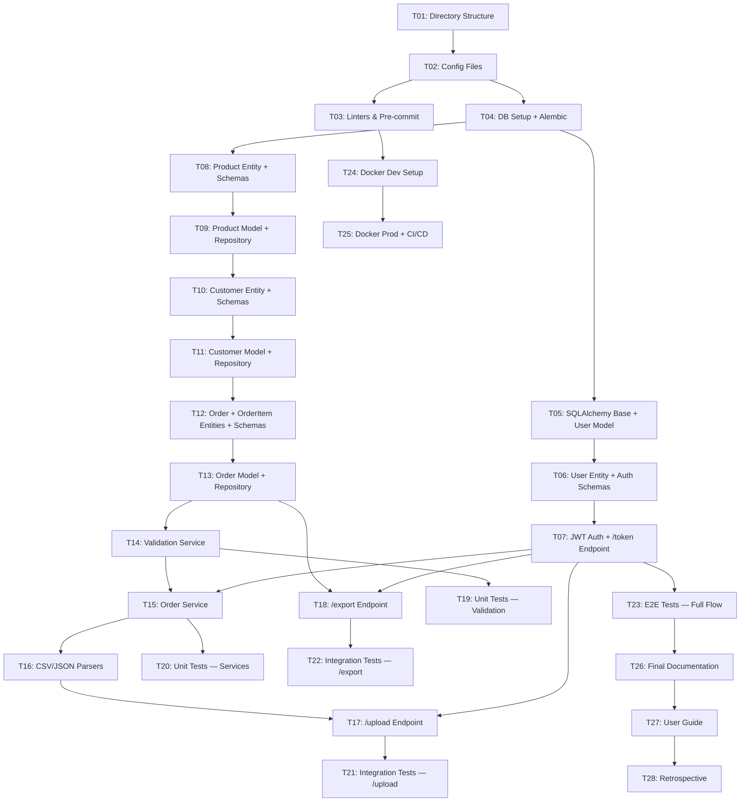

# Implementation Plan: API de Importación/Exportación Masiva con Validación Estricta

**Project:** API de Importación/Exportación Masiva con Validación Estricta
**Methodology:** Spec-Driven Development (SDD) — Vertical Slice Planning
**Date:** 2026-05-25
**Author:** quetzalcoatl (Architect of Specifications)

---

## Overview

Build a **REST API with FastAPI** for bulk import/export of relational data (orders, products, customers) with strict Pydantic validation, partial processing (valid rows succeed, invalid rows are reported), JWT authentication, and RFC 7807 error reporting.

The project currently has **Phase 1 (Foundation) completed** — directory structure, configuration files, linters, and 33 verification tests all passing. No implementation code yet (no endpoints, services, or models). This plan reorganizes the original horizontal phases (F0–F6 from WORKFLOW.md) into **vertical slices** that each deliver working, testable functionality end-to-end.

---

## Architecture Decisions

| Decision | Rationale |
|----------|-----------|
| **Vertical slicing over horizontal layers** | Each slice delivers a complete path (DB → domain → endpoint). Failures are caught early; each checkpoint leaves the system in a working state. |
| **DDD layering (core → infrastructure → API)** | Domain layer has zero external dependencies. Repository interfaces in `core/`, implementations in `infrastructure/`. |
| **Contract-first (Pydantic schemas before endpoints)** | Schemas define the API contract. Endpoints consume schemas, not raw dicts. |
| **Partial processing (HTTP 207)** | Valid rows succeed even when others fail. Client receives a detailed RFC 7807 error report per invalid row. |
| **JWT via OAuth2 Password Flow** | Standard, well-supported by FastAPI, demonstrates security knowledge. |
| **PostgreSQL with SQLAlchemy 2.x + Alembic** | Native JSON support, advanced transactions, scalability. |
| **Testing pyramid: unit → integration → E2E** | Unit tests for domain logic (90% target), integration for endpoints (80%), E2E for full flows (70%). |

---

## Dependency Graph

---

## Task List

### Phase 1: Foundation

---

#### Task 1: Directory Structure (DDD)

**Description:** Create the full DDD directory structure as defined in `specs/F0-PREPARACION.md` and `docs/ARCHITECTURE.md`. Every package gets an `__init__.py` with a module docstring placeholder. The `app/core/` directory must have ZERO external imports.

**Acceptance criteria:**
- [ ] All directories in the spec tree exist (`app/`, `app/core/`, `app/core/entities/`, `app/core/repositories/`, `app/core/services/`, `app/infrastructure/`, `app/infrastructure/database/`, `app/infrastructure/database/models/`, `app/infrastructure/repositories/`, `app/infrastructure/auth/`, `app/infrastructure/api/`, `app/infrastructure/api/endpoints/`, `app/schemas/`, `app/utils/`, `tests/`, `tests/unit/`, `tests/integration/`, `tests/e2e/`, `migrations/`, `migrations/versions/`)
- [ ] Every directory has an `__init__.py` with a docstring
- [ ] `app/core/` has no imports from `sqlalchemy`, `fastapi`, or `http` modules
- [ ] `migrations/versions/` has a `.gitkeep` file

**Verification:**
- [ ] `find app/ tests/ migrations/ -type d | sort` — all directories present
- [ ] `find app/ tests/ -name "__init__.py" | sort` — all init files present
- [ ] `grep -r "from sqlalchemy\|from fastapi\|import http" app/core/` — returns nothing

**Dependencies:** None

**Files likely touched:**
- `app/__init__.py`, `app/core/__init__.py`, `app/core/entities/__init__.py`, `app/core/repositories/__init__.py`, `app/core/services/__init__.py`
- `app/infrastructure/__init__.py`, `app/infrastructure/database/__init__.py`, `app/infrastructure/database/models/__init__.py`, `app/infrastructure/repositories/__init__.py`, `app/infrastructure/auth/__init__.py`, `app/infrastructure/api/__init__.py`, `app/infrastructure/api/endpoints/__init__.py`
- `app/schemas/__init__.py`, `app/utils/__init__.py`
- `tests/__init__.py`, `tests/unit/__init__.py`, `tests/integration/__init__.py`, `tests/e2e/__init__.py`
- `migrations/versions/.gitkeep`

**Estimated scope:** Medium (3-5 files, but ~25 directories)

---

#### Task 2: Configuration Files

**Description:** Create all project configuration files with real content (not placeholders): `requirements.txt`, `pyproject.toml`, `.env.example`, and `Makefile`. Content is fully specified in `specs/F0-PREPARACION.md` Spec-F0-002.

**Acceptance criteria:**
- [ ] `requirements.txt` lists all dependencies with version pins (FastAPI, Pydantic, SQLAlchemy, etc.)
- [ ] `pyproject.toml` contains `[project]`, `[tool.ruff]`, `[tool.ruff.lint]`, `[tool.ruff.format]`, `[tool.mypy]`, `[tool.pytest.ini_options]`, `[tool.coverage.run]`, `[tool.coverage.report]` sections
- [ ] `.env.example` has all required env vars with placeholder values (no real secrets)
- [ ] `Makefile` has targets: `help`, `install`, `dev`, `lint`, `format`, `type-check`, `test`, `test-cov`, `run`, `migrate`

**Verification:**
- [ ] `pip install --dry-run -r requirements.txt` — succeeds
- [ ] `python -c "import tomllib; tomllib.load(open('pyproject.toml', 'rb'))"` — valid TOML
- [ ] `grep -i "password\|secret.*=" .env.example | grep -v "change-me\|your_\|postgres:postgres"` — returns nothing
- [ ] `make help` — prints available targets

**Dependencies:** Task 1 (directory structure must exist)

**Files likely touched:**
- `requirements.txt` (replace placeholder)
- `pyproject.toml` (new)
- `.env.example` (replace placeholder)
- `Makefile` (replace placeholder)

**Estimated scope:** Medium (4 files)

---

#### Task 3: Linters & Pre-commit Configuration

**Description:** Configure ruff, mypy, and pytest via `pyproject.toml` (already in Task 2) and create `.pre-commit-config.yaml`. Since all tool configs are centralized in `pyproject.toml`, no separate `.ruff.toml`, `mypy.ini`, or `pytest.ini` files are needed.

**Acceptance criteria:**
- [ ] `.pre-commit-config.yaml` exists with ruff and mypy hooks
- [ ] `ruff check --config pyproject.toml .` runs without config errors
- [ ] `mypy --config-file pyproject.toml app/` runs without config errors (may report missing files, which is expected)
- [ ] `pytest --co` runs without config errors (may report no tests collected)

**Verification:**
- [ ] `pre-commit install` — installs hooks successfully
- [ ] `ruff check .` — runs (0 files checked is acceptable at this stage)
- [ ] `mypy .` — runs (errors about missing modules are acceptable)
- [ ] `pytest --co` — runs (no tests collected is acceptable)

**Dependencies:** Task 2 (pyproject.toml must exist)

**Files likely touched:**
- `.pre-commit-config.yaml` (new)

**Estimated scope:** Small (1 file)

---

### Checkpoint: Foundation ✅ COMPLETED (2026-05-25)

- [x] All directories exist with `__init__.py` files
- [x] `pip install -r requirements.txt` succeeds
- [x] `ruff check .`, `mypy .`, `pytest --co` all run without config errors
- [x] `make help` prints all targets
- [x] `app/core/` has zero external imports
- [x] **Review with human completed** — 5 axes passed

**Results:** 33 tests passing, ruff zero issues, mypy zero issues. 8 commits on `feature/api-import-export`.

---

### Phase 2: Auth Vertical Slice

> **Goal:** A user can register, obtain a JWT token via `POST /token`, and the token is validated on protected endpoints.

---

#### Task 4: Database Setup + Alembic

**Description:** Configure PostgreSQL connection via SQLAlchemy 2.x, create the declarative base (`app/infrastructure/database/base.py`), session factory (`app/infrastructure/database/session.py`), and initialize Alembic for migrations. Create `app/config.py` with `pydantic-settings` to load all env vars.

**Acceptance criteria:**
- [ ] `app/config.py` defines `Settings` class with all env vars (DATABASE_URL, SECRET_KEY, ALGORITHM, ACCESS_TOKEN_EXPIRE_MINUTES, MAX_BATCH_SIZE, MAX_FILE_SIZE_MB, RATE_LIMIT_PER_MINUTE, DEBUG)
- [ ] `app/infrastructure/database/base.py` defines `Base = declarative_base()` and a `UUIDType` for primary keys
- [ ] `app/infrastructure/database/session.py` provides `get_db()` dependency and `engine`/`SessionLocal` configuration
- [ ] `migrations/env.py` is configured to import `Base.metadata` and use `Settings.DATABASE_URL`
- [ ] `alembic.ini` points to the correct migrations directory
- [ ] `alembic revision --autogenerate -m "initial"` runs without errors (requires running PostgreSQL or SQLite for test)

**Verification:**
- [ ] `python -c "from app.config import Settings; s = Settings(); print(s.DATABASE_URL)"` — prints configured URL
- [ ] `python -c "from app.infrastructure.database.base import Base; print(Base)"` — imports successfully
- [ ] `python -c "from app.infrastructure.database.session import get_db; print(get_db)"` — imports successfully
- [ ] `alembic upgrade head` — runs (may need PostgreSQL running)

**Dependencies:** Task 2 (config files, requirements)

**Files likely touched:**
- `app/config.py` (new)
- `app/dependencies.py` (new — DI helpers)
- `app/infrastructure/database/base.py` (new)
- `app/infrastructure/database/session.py` (new)
- `migrations/env.py` (new or modify Alembic template)
- `migrations/alembic.ini` (new)
- `migrations/script.mako` (new)

**Estimated scope:** Medium (5-6 files)

---

#### Task 5: SQLAlchemy Base + User Model

**Description:** Create the SQLAlchemy `UserModel` in `app/infrastructure/database/models/user.py` with fields: `id` (UUID), `username` (unique), `hashed_password`, `is_active`, `created_at`. Create the initial Alembic migration for the `users` table.

**Acceptance criteria:**
- [ ] `UserModel` inherits from `Base` with `__tablename__ = "users"`
- [ ] Fields: `id` (UUID primary key), `username` (String, unique, indexed), `hashed_password` (String), `is_active` (Boolean, default True), `created_at` (DateTime, server_default=now)
- [ ] `alembic revision --autogenerate -m "add_users_table"` generates a migration creating the `users` table
- [ ] `alembic upgrade head` applies the migration

**Verification:**
- [ ] `python -c "from app.infrastructure.database.models.user import UserModel; print(UserModel.__tablename__)"` — prints "users"
- [ ] Migration file exists in `migrations/versions/`
- [ ] `alembic upgrade head` — succeeds

**Dependencies:** Task 4 (DB setup, Base, session)

**Files likely touched:**
- `app/infrastructure/database/models/user.py` (new)
- `app/infrastructure/database/models/__init__.py` (update exports)
- `migrations/versions/xxxx_add_users_table.py` (auto-generated)

**Estimated scope:** Small (2-3 files)

---

#### Task 6: User Entity + Auth Schemas

**Description:** Create the `User` domain entity in `app/core/entities/user.py` (pure Python, no SQLAlchemy imports) and Pydantic schemas for authentication: `TokenSchema`, `TokenDataSchema`, `UserCreateSchema`, `UserResponseSchema` in `app/schemas/user.py`. Also create `app/schemas/error.py` with RFC 7807 `ProblemDetailSchema`.

**Acceptance criteria:**
- [ ] `User` entity has: `id` (UUID), `username` (str), `hashed_password` (str), `is_active` (bool), `created_at` (datetime) — no SQLAlchemy imports
- [ ] `TokenSchema` has: `access_token` (str), `token_type` (str, default "bearer")
- [ ] `TokenDataSchema` has: `username` (str)
- [ ] `UserCreateSchema` has: `username` (str, min_length=3, max_length=50), `password` (str, min_length=8, max_length=50)
- [ ] `UserResponseSchema` has: `id` (UUID), `username` (str), `is_active` (bool), `created_at` (datetime)
- [ ] `ProblemDetailSchema` follows RFC 7807: `type` (str), `title` (str), `status` (int), `detail` (Optional[str]), `instance` (Optional[str])
- [ ] `app/core/entities/user.py` has ZERO imports from `sqlalchemy`, `fastapi`, or `http`

**Verification:**
- [ ] `python -c "from app.core.entities.user import User; print(User)"` — imports successfully
- [ ] `python -c "from app.schemas.user import TokenSchema, UserCreateSchema; print(TokenSchema, UserCreateSchema)"` — imports successfully
- [ ] `python -c "from app.schemas.error import ProblemDetailSchema; print(ProblemDetailSchema)"` — imports successfully
- [ ] `grep -r "from sqlalchemy\|from fastapi\|import http" app/core/` — returns nothing

**Dependencies:** Task 1 (directory structure), Task 2 (pydantic in requirements)

**Files likely touched:**
- `app/core/entities/user.py` (new)
- `app/core/entities/__init__.py` (update exports)
- `app/schemas/user.py` (new)
- `app/schemas/error.py` (new)
- `app/schemas/__init__.py` (update exports)

**Estimated scope:** Medium (4-5 files)

---

#### Task 7: JWT Auth + /token Endpoint

**Description:** Implement `jwt_service.py` (create/verify tokens), `password_service.py` (hash/verify passwords), and `dependencies.py` (get_current_user dependency) in `app/infrastructure/auth/`. Create the `/token` endpoint in `app/infrastructure/api/endpoints/auth.py` using FastAPI's `OAuth2PasswordRequestForm`. Wire up the router in `app/infrastructure/api/routers.py` and create `app/main.py` with the FastAPI app factory.

**Acceptance criteria:**
- [ ] `JWTService.create_token(username: str) -> str` creates a JWT with configurable expiration
- [ ] `JWTService.verify_token(token: str) -> TokenDataSchema` validates and decodes a JWT
- [ ] `PasswordService.hash_password(password: str) -> str` hashes with bcrypt
- [ ] `PasswordService.verify_password(plain_password: str, hashed_password: str) -> bool` verifies against bcrypt
- [ ] `get_current_user(token: str = Depends(oauth2_scheme)) -> UserResponseSchema` dependency validates JWT and returns user
- [ ] `POST /token` accepts `OAuth2PasswordRequestForm` and returns `TokenSchema` on success, 401 on failure
- [ ] `app/main.py` creates the FastAPI app with CORS, routers, and startup/shutdown events
- [ ] All auth-related env vars (`SECRET_KEY`, `ALGORITHM`, `ACCESS_TOKEN_EXPIRE_MINUTES`) are loaded from `Settings`

**Verification:**
- [ ] `python -c "from app.infrastructure.auth.jwt_service import JWTService; print(JWTService)"` — imports successfully
- [ ] `python -c "from app.infrastructure.auth.password_service import PasswordService; print(PasswordService)"` — imports successfully
- [ ] `uvicorn app.main:app &` then `curl -X POST http://localhost:8000/token -d "username=test&password=test"` — returns 401 (no user in DB yet, but endpoint exists)
- [ ] `curl http://localhost:8000/docs` — Swagger UI loads with `/token` endpoint visible

**Dependencies:** Task 5 (User model), Task 6 (User entity, auth schemas)

**Files likely touched:**
- `app/infrastructure/auth/jwt_service.py` (new)
- `app/infrastructure/auth/password_service.py` (new)
- `app/infrastructure/auth/dependencies.py` (new)
- `app/infrastructure/auth/__init__.py` (update exports)
- `app/infrastructure/api/endpoints/auth.py` (new)
- `app/infrastructure/api/routers.py` (new)
- `app/main.py` (new)

**Estimated scope:** Large (6-7 files) — consider splitting if needed

---

### Checkpoint: Auth Vertical Slice ✅

- [ ] `POST /token` returns JWT for valid credentials, 401 for invalid
- [ ] `get_current_user` dependency validates JWT tokens
- [ ] Swagger UI at `/docs` shows the `/token` endpoint
- [ ] `ruff check .` and `mypy .` pass
- [ ] **Review with human before proceeding**

---

### Phase 3: Product Vertical Slice

> **Goal:** Product entity, repository, and model exist. This is the simplest domain, used to validate the DDD pattern before building the more complex Order/Customer domains.

---

#### Task 8: Product Entity + Schemas

**Description:** Create the `Product` domain entity in `app/core/entities/product.py` and Pydantic schemas in `app/schemas/product.py`: `ProductCreateSchema`, `ProductResponseSchema`. Product fields: `id` (UUID), `name` (str, 1-100 chars), `price` (float, gt=0, le=1000000), `stock` (int, ge=0).

**Acceptance criteria:**
- [ ] `Product` entity has: `id`, `name`, `price`, `stock` — no SQLAlchemy imports
- [ ] `ProductCreateSchema` validates: `name` (str, min_length=1, max_length=100), `price` (float, gt=0, le=1000000), `stock` (int, ge=0)
- [ ] `ProductResponseSchema` includes all fields plus `id` (UUID) and uses `from_attributes=True`
- [ ] `ProductCreateSchema` includes `@field_validator("name")` that strips whitespace

**Verification:**
- [ ] `python -c "from app.core.entities.product import Product; print(Product)"` — imports successfully
- [ ] `python -c "from app.schemas.product import ProductCreateSchema; p = ProductCreateSchema(name='Test', price=10.0, stock=5); print(p)"` — validates correctly
- [ ] `python -c "from app.schemas.product import ProductCreateSchema; ProductCreateSchema(name='', price=10.0, stock=5)"` — raises ValidationError

**Dependencies:** Task 1 (directory structure)

**Files likely touched:**
- `app/core/entities/product.py` (new)
- `app/schemas/product.py` (new)
- `app/core/entities/__init__.py` (update exports)
- `app/schemas/__init__.py` (update exports)

**Estimated scope:** Small (2-4 files)

---

#### Task 9: Product Model + Repository

**Description:** Create `ProductModel` in `app/infrastructure/database/models/product.py`, the `IProductRepository` interface in `app/core/repositories/product_repository.py`, and `ProductRepository` implementation in `app/infrastructure/repositories/product_repository.py`. Generate Alembic migration for the `products` table.

**Acceptance criteria:**
- [ ] `ProductModel` has: `id` (UUID PK), `name` (String, indexed), `price` (Numeric/Float), `stock` (Integer), `created_at`, `updated_at`
- [ ] `IProductRepository` defines: `get_by_id(id)`, `get_all(skip, limit)`, `create(product)`, `create_batch(products)`, `get_by_ids(ids)`
- [ ] `ProductRepository` implements `IProductRepository` using SQLAlchemy session
- [ ] `create_batch` uses `INSERT ... ON CONFLICT DO NOTHING` for partial processing
- [ ] Alembic migration for `products` table is generated and applies cleanly

**Verification:**
- [ ] `python -c "from app.infrastructure.database.models.product import ProductModel; print(ProductModel.__tablename__)"` — prints "products"
- [ ] `python -c "from app.core.repositories.product_repository import IProductRepository; print(IProductRepository)` — interface imports
- [ ] `python -c "from app.infrastructure.repositories.product_repository import ProductRepository; print(ProductRepository)"` — implementation imports
- [ ] `alembic upgrade head` — applies migration

**Dependencies:** Task 4 (DB setup), Task 5 (Base), Task 8 (Product entity)

**Files likely touched:**
- `app/infrastructure/database/models/product.py` (new)
- `app/core/repositories/product_repository.py` (new)
- `app/infrastructure/repositories/product_repository.py` (new)
- `app/infrastructure/database/models/__init__.py` (update exports)
- `app/core/repositories/__init__.py` (update exports)
- `app/infrastructure/repositories/__init__.py` (update exports)
- `migrations/versions/xxxx_add_products_table.py` (auto-generated)

**Estimated scope:** Medium (5-6 files)

---

### Phase 4: Customer + Order Upload Slice

> **Goal:** Customer and Order entities, repositories, validation service, parsers, and the `/upload` endpoint all work together. An authenticated user can POST CSV/JSON data and receive 200 (all valid), 207 (partial), or 422 (all invalid).

---

#### Task 10: Customer Entity + Schemas

**Description:** Create the `Customer` domain entity in `app/core/entities/customer.py` and Pydantic schemas in `app/schemas/customer.py`: `CustomerCreateSchema`, `CustomerResponseSchema`. Customer fields: `id` (UUID), `name` (str, 1-100), `email` (EmailStr).

**Acceptance criteria:**
- [ ] `Customer` entity has: `id`, `name`, `email` — no SQLAlchemy imports
- [ ] `CustomerCreateSchema` validates: `name` (str, min_length=1, max_length=100), `email` (EmailStr)
- [ ] `CustomerResponseSchema` includes all fields plus `id` (UUID)
- [ ] `CustomerCreateSchema` includes `@field_validator("name")` that strips whitespace

**Verification:**
- [ ] `python -c "from app.core.entities.customer import Customer; print(Customer)"` — imports successfully
- [ ] `python -c "from app.schemas.customer import CustomerCreateSchema; c = CustomerCreateSchema(name='John', email='john@example.com'); print(c)"` — validates correctly
- [ ] `python -c "from app.schemas.customer import CustomerCreateSchema; CustomerCreateSchema(name='John', email='invalid')"` — raises ValidationError

**Dependencies:** Task 1 (directory structure)

**Files likely touched:**
- `app/core/entities/customer.py` (new)
- `app/schemas/customer.py` (new)
- `app/core/entities/__init__.py` (update exports)
- `app/schemas/__init__.py` (update exports)

**Estimated scope:** Small (2-4 files)

---

#### Task 11: Customer Model + Repository

**Description:** Create `CustomerModel`, `ICustomerRepository`, and `CustomerRepository` implementation. Generate Alembic migration for the `customers` table.

**Acceptance criteria:**
- [ ] `CustomerModel` has: `id` (UUID PK), `name` (String, indexed), `email` (String, unique, indexed), `created_at`, `updated_at`
- [ ] `ICustomerRepository` defines: `get_by_id(id)`, `get_all(skip, limit)`, `create(customer)`, `create_batch(customers)`, `get_by_ids(ids)`
- [ ] `CustomerRepository` implements `ICustomerRepository` using SQLAlchemy session
- [ ] Alembic migration for `customers` table applies cleanly

**Verification:**
- [ ] `python -c "from app.infrastructure.database.models.customer import CustomerModel; print(CustomerModel.__tablename__)"` — prints "customers"
- [ ] `alembic upgrade head` — applies migration

**Dependencies:** Task 4 (DB setup), Task 10 (Customer entity)

**Files likely touched:**
- `app/infrastructure/database/models/customer.py` (new)
- `app/core/repositories/customer_repository.py` (new)
- `app/infrastructure/repositories/customer_repository.py` (new)
- `migrations/versions/xxxx_add_customers_table.py` (auto-generated)

**Estimated scope:** Medium (4-5 files)

---

#### Task 12: Order + OrderItem Entities + Schemas

**Description:** Create `Order` and `OrderItem` domain entities in `app/core/entities/order.py` and Pydantic schemas in `app/schemas/order.py`: `OrderItemCreateSchema`, `OrderCreateSchema`, `OrderResponseSchema`, `BatchUploadRequestSchema`, `BatchUploadResponseSchema`, `BatchErrorDetailSchema`.

**Acceptance criteria:**
- [ ] `Order` entity has: `id` (UUID), `customer_id` (UUID), `status` (str), `created_at` (datetime), `items` (list[OrderItem]) — no SQLAlchemy imports
- [ ] `OrderItem` entity has: `product_id` (UUID), `quantity` (int), `price` (float) — no SQLAlchemy imports
- [ ] `OrderCreateSchema` validates: `customer_id` (UUID), `items` (list[OrderItemCreateSchema], min_length=1)
- [ ] `OrderItemCreateSchema` validates: `product_id` (UUID), `quantity` (int, gt=0, le=1000), `price` (float, gt=0, le=1000000)
- [ ] `BatchUploadRequestSchema` validates: `orders` (list[OrderCreateSchema], max_length=1000)
- [ ] `BatchUploadResponseSchema` includes: `total` (int), `successful` (int), `failed` (int), `errors` (list[BatchErrorDetailSchema])
- [ ] `BatchErrorDetailSchema` follows RFC 7807: `type`, `title`, `status`, `detail`, `instance`, plus `row_number` (int)

**Verification:**
- [ ] `python -c "from app.core.entities.order import Order, OrderItem; print(Order, OrderItem)"` — imports successfully
- [ ] `python -c "from app.schemas.order import BatchUploadRequestSchema; ..."` — validates batch with max 1000 items
- [ ] `python -c "from app.schemas.order import BatchUploadRequestSchema; BatchUploadRequestSchema(orders=[])"` — raises ValidationError (empty batch)

**Dependencies:** Task 1 (directory structure)

**Files likely touched:**
- `app/core/entities/order.py` (new)
- `app/schemas/order.py` (new)
- `app/core/entities/__init__.py` (update exports)
- `app/schemas/__init__.py` (update exports)

**Estimated scope:** Medium (3-4 files)

---

#### Task 13: Order Model + Repository

**Description:** Create `OrderModel` and `OrderItemModel` in `app/infrastructure/database/models/order.py`, `IOrderRepository` interface, and `OrderRepository` implementation. Generate Alembic migration for `orders` and `order_items` tables.

**Acceptance criteria:**
- [ ] `OrderModel` has: `id` (UUID PK), `customer_id` (UUID FK), `status` (String, default="pending"), `created_at`, `updated_at`
- [ ] `OrderItemModel` has: `id` (UUID PK), `order_id` (UUID FK), `product_id` (UUID FK), `quantity` (Integer), `price` (Numeric)
- [ ] `IOrderRepository` defines: `get_by_id(id)`, `get_by_customer(customer_id)`, `create(order)`, `create_batch(orders)`, `get_all(skip, limit)`
- [ ] `OrderRepository` implements `IOrderRepository` with `INSERT ... ON CONFLICT DO NOTHING` for batch operations
- [ ] Alembic migration for `orders` + `order_items` tables applies cleanly

**Verification:**
- [ ] `python -c "from app.infrastructure.database.models.order import OrderModel, OrderItemModel; print(OrderModel.__tablename__, OrderItemModel.__tablename__)"` — prints "orders", "order_items"
- [ ] `alembic upgrade head` — applies migration

**Dependencies:** Task 4 (DB setup), Task 9 (Product model for FK), Task 11 (Customer model for FK), Task 12 (Order entity)

**Files likely touched:**
- `app/infrastructure/database/models/order.py` (new)
- `app/core/repositories/order_repository.py` (new)
- `app/infrastructure/repositories/order_repository.py` (new)
- `migrations/versions/xxxx_add_orders_order_items_tables.py` (auto-generated)

**Estimated scope:** Medium (4-5 files)

---

#### Task 14: Validation Service

**Description:** Create `ValidationService` in `app/core/services/validation_service.py`. This service validates a list of Pydantic schemas and returns a tuple of (valid_items, errors_with_row_numbers). Each error follows RFC 7807 format. This is a pure domain service with NO external dependencies.

**Acceptance criteria:**
- [ ] `ValidationService.validate_batch(items: list[BaseModel]) -> tuple[list[BaseModel], list[BatchErrorDetailSchema]]` validates each item
- [ ] Valid items are collected into the success list; invalid items produce RFC 7807 error details with `row_number`
- [ ] `ValidationService.validate_batch` has ZERO imports from `sqlalchemy`, `fastapi`, or `http`
- [ ] Handles Pydantic `ValidationError` and converts to RFC 7807 format
- [ ] Returns `(valid_items, errors)` — valid items succeed even when others fail (partial processing)

**Verification:**
- [ ] `python -c "from app.core.services.validation_service import ValidationService; print(ValidationService)"` — imports successfully
- [ ] `grep -r "from sqlalchemy\|from fastapi\|import http" app/core/services/validation_service.py` — returns nothing
- [ ] Unit test: validate batch with 5 valid + 3 invalid items → 5 valid returned, 3 errors with row numbers

**Dependencies:** Task 6 (error schemas), Task 12 (order schemas)

**Files likely touched:**
- `app/core/services/validation_service.py` (new)
- `app/core/services/__init__.py` (update exports)

**Estimated scope:** Small (1-2 files)

---

#### Task 15: Order Service

**Description:** Create `OrderService` in `app/core/services/order_service.py`. This service orchestrates the upload flow: validate batch → separate valid/invalid → persist valid items → return batch result. It depends on `IOrderRepository`, `IProductRepository`, `ICustomerRepository`, and `ValidationService` via dependency injection.

**Acceptance criteria:**
- [ ] `OrderService.upload_orders(orders_data: list[OrderCreateSchema], user_id: UUID) -> BatchUploadResponseSchema` orchestrates the full upload flow
- [ ] Uses `ValidationService.validate_batch` for validation
- [ ] Uses `IOrderRepository.create_batch` for persistence
- [ ] Returns `BatchUploadResponseSchema` with `total`, `successful`, `failed`, `errors`
- [ ] Depends on repository interfaces (not implementations) — follows DIP
- [ ] `OrderService` has ZERO imports from `sqlalchemy` or `fastapi`

**Verification:**
- [ ] `python -c "from app.core.services.order_service import OrderService; print(OrderService)"` — imports successfully
- [ ] `grep -r "from sqlalchemy\|from fastapi" app/core/services/order_service.py` — returns nothing
- [ ] Unit test with mocked repositories: upload 5 valid + 3 invalid → 5 created, 3 errors reported

**Dependencies:** Task 13 (Order repository interface), Task 14 (Validation service)

**Files likely touched:**
- `app/core/services/order_service.py` (new)
- `app/core/services/__init__.py` (update exports)

**Estimated scope:** Small (1-2 files)

---

#### Task 16: CSV/JSON Parsers

**Description:** Create `csv_parser.py` and `json_parser.py` in `app/utils/`. These parsers normalize CSV and JSON input into a common format (list of dicts) that can be validated by Pydantic schemas. Also create `file_utils.py` for file size validation.

**Acceptance criteria:**
- [ ] `csv_parser.parse_csv(content: str) -> list[dict]` parses CSV content into a list of dictionaries
- [ ] `json_parser.parse_json(content: str | dict) -> list[dict]` normalizes JSON input into a list of dictionaries
- [ ] `file_utils.validate_file_size(size: int, max_mb: int = 10) -> bool` validates file size against limit
- [ ] Parsers handle encoding issues gracefully (UTF-8 default)
- [ ] Parsers raise `ValueError` with descriptive message on invalid format

**Verification:**
- [ ] `python -c "from app.utils.csv_parser import parse_csv; print(parse_csv)"` — imports successfully
- [ ] `python -c "from app.utils.json_parser import parse_json; print(parse_json)"` — imports successfully
- [ ] Unit test: parse valid CSV → list of dicts
- [ ] Unit test: parse invalid CSV → raises ValueError with row info

**Dependencies:** Task 1 (directory structure)

**Files likely touched:**
- `app/utils/csv_parser.py` (new)
- `app/utils/json_parser.py` (new)
- `app/utils/file_utils.py` (new)
- `app/utils/__init__.py` (update exports)

**Estimated scope:** Small (3-4 files)

---

#### Task 17: /upload Endpoint

**Description:** Create the `/upload` endpoint in `app/infrastructure/api/endpoints/upload.py`. Accept CSV (multipart) or JSON (body), parse, validate, process via `OrderService`, and return appropriate HTTP status codes (200, 207, 422). Requires JWT authentication.

**Acceptance criteria:**
- [ ] `POST /upload` accepts `application/json` body with `BatchUploadRequestSchema`
- [ ] `POST /upload` accepts `multipart/form-data` with CSV file
- [ ] Returns 200 when all rows are valid
- [ ] Returns 207 (Multi-Status) when some rows are invalid (partial processing)
- [ ] Returns 422 when all rows are invalid
- [ ] Returns 401 when no JWT token is provided
- [ ] Returns 413 when batch size exceeds `MAX_BATCH_SIZE`
- [ ] Returns 400 when format is invalid (not CSV or JSON)
- [ ] Error responses follow RFC 7807 `ProblemDetailSchema`

**Verification:**
- [ ] `curl -X POST http://localhost:8000/upload -H "Authorization: Bearer <token>" -H "Content-Type: application/json" -d '{"orders": [...]}'` — returns 200/207/422
- [ ] `curl -X POST http://localhost:8000/upload` (no auth) — returns 401
- [ ] Swagger UI shows `/upload` endpoint with proper schema

**Dependencies:** Task 7 (JWT auth), Task 15 (Order service), Task 16 (parsers)

**Files likely touched:**
- `app/infrastructure/api/endpoints/upload.py` (new)
- `app/infrastructure/api/routers.py` (update — add upload router)
- `app/main.py` (update — include upload router)

**Estimated scope:** Medium (2-3 files)

---

### Checkpoint: Upload Vertical Slice ✅

- [ ] Authenticated user can `POST /upload` with valid JSON → 200
- [ ] Authenticated user can `POST /upload` with mixed valid/invalid → 207 with RFC 7807 errors
- [ ] Authenticated user can `POST /upload` with all invalid → 422
- [ ] Unauthenticated request → 401
- [ ] `ruff check .` and `mypy .` pass
- [ ] **Review with human before proceeding**

---

### Phase 5: Export Vertical Slice

---

#### Task 18: /export Endpoint

**Description:** Create the `/export` endpoint in `app/infrastructure/api/endpoints/export.py`. Allow authenticated users to export orders in JSON or CSV format, filtered by the authenticated user's data. Support `Accept` header for format negotiation. **Includes pagination** with `skip` and `limit` query parameters (defaults: `skip=0`, `limit=100`).

**Acceptance criteria:**
- [ ] `GET /export` returns JSON when `Accept: application/json` (default)
- [ ] `GET /export` returns CSV when `Accept: text/csv`
- [ ] `GET /export?format=csv` returns CSV (query param override)
- [ ] `GET /export?format=json` returns JSON (query param override)
- [ ] `GET /export?skip=0&limit=100` returns paginated results (defaults: skip=0, limit=100)
- [ ] `GET /export?limit=0` returns total count without data (count-only mode)
- [ ] Returns 401 when no JWT token is provided
- [ ] Returns 200 with data (may be empty list if no orders exist)
- [ ] JSON response includes `orders` with nested `items` and pagination metadata (`total`, `skip`, `limit`)
- [ ] CSV response includes headers: `order_id,customer_id,status,product_id,quantity,price,created_at`

**Verification:**
- [ ] `curl -H "Authorization: Bearer <token>" http://localhost:8000/export` — returns JSON with pagination
- [ ] `curl -H "Authorization: Bearer <token>" -H "Accept: text/csv" http://localhost:8000/export` — returns CSV
- [ ] `curl -H "Authorization: Bearer <token>" "http://localhost:8000/export?skip=10&limit=50"` — returns paginated results
- [ ] `curl http://localhost:8000/export` (no auth) — returns 401
- [ ] Swagger UI shows `/export` endpoint with pagination params

**Dependencies:** Task 7 (JWT auth), Task 13 (Order repository)

**Files likely touched:**
- `app/infrastructure/api/endpoints/export.py` (new)
- `app/infrastructure/api/routers.py` (update — add export router)
- `app/main.py` (update — include export router)

**Estimated scope:** Medium (2-3 files)

---

### Checkpoint: Full Upload → Export Flow ✅

- [ ] Full E2E flow: `POST /token` → `POST /upload` → `GET /export` works
- [ ] Data integrity: uploaded data matches exported data
- [ ] Pagination works: `GET /export?skip=10&limit=50` returns correct page
- [ ] `ruff check .` and `mypy .` pass
- [ ] **Review with human before proceeding**

---

### Phase 6: Testing

---

#### Task 19: Unit Tests — Validation Service + Schemas

**Description:** Create unit tests for `ValidationService` and all Pydantic schemas in `tests/unit/test_validation_service.py` and `tests/unit/test_schemas.py`. Test validation rules, boundary conditions, and RFC 7807 error format.

**Acceptance criteria:**
- [ ] `test_validation_service.py` covers: valid batch, partial batch, all-invalid batch, empty batch, edge cases
- [ ] `test_schemas.py` covers: `OrderCreateSchema`, `OrderItemCreateSchema`, `ProductCreateSchema`, `CustomerCreateSchema`, `UserCreateSchema`, `BatchUploadRequestSchema`, `ProblemDetailSchema`
- [ ] Tests validate: required fields, min/max length, type coercion, custom validators (whitespace stripping)
- [ ] Tests verify RFC 7807 error format in validation errors
- [ ] All tests pass with `pytest tests/unit/`

**Verification:**
- [ ] `pytest tests/unit/test_validation_service.py -v` — all pass
- [ ] `pytest tests/unit/test_schemas.py -v` — all pass
- [ ] Coverage for `app/core/services/validation_service.py` ≥ 90%

**Dependencies:** Task 14 (Validation service), Task 6, 8, 10, 12 (schemas)

**Files likely touched:**
- `tests/unit/test_validation_service.py` (new)
- `tests/unit/test_schemas.py` (new)
- `tests/conftest.py` (update — add shared fixtures)

**Estimated scope:** Medium (2-3 files)

---

#### Task 20: Unit Tests — Order Service + Repositories

**Description:** Create unit tests for `OrderService` and repository implementations in `tests/unit/test_order_service.py` and `tests/unit/test_repositories.py`. Use `pytest-mock` to mock repository interfaces.

**Acceptance criteria:**
- [ ] `test_order_service.py` covers: upload valid batch, upload partial batch, upload all-invalid, batch size limit
- [ ] `test_repositories.py` covers: `ProductRepository`, `CustomerRepository`, `OrderRepository` CRUD operations
- [ ] All service tests use mocked repositories (no real DB)
- [ ] Repository tests use in-memory SQLite database
- [ ] All tests pass with `pytest tests/unit/`

**Verification:**
- [ ] `pytest tests/unit/test_order_service.py -v` — all pass
- [ ] `pytest tests/unit/test_repositories.py -v` — all pass
- [ ] Coverage for `app/core/services/order_service.py` ≥ 90%

**Dependencies:** Task 15 (Order service), Task 9, 11, 13 (repositories)

**Files likely touched:**
- `tests/unit/test_order_service.py` (new)
- `tests/unit/test_repositories.py` (new)
- `tests/conftest.py` (update — add DB fixtures)

**Estimated scope:** Medium (2-3 files)

---

#### Task 21: Integration Tests — /upload Endpoint

**Description:** Create integration tests for the `/upload` endpoint in `tests/integration/test_upload_endpoint.py`. Test the full request/response cycle including authentication, validation, and persistence.

**Acceptance criteria:**
- [ ] Tests cover: valid upload (200), partial upload (207), all-invalid (422), unauthorized (401), batch size exceeded (413), invalid format (400)
- [ ] Tests use `TestClient` with in-memory SQLite database
- [ ] Tests verify data is persisted correctly in the database
- [ ] Tests verify RFC 7807 error format in 207 and 422 responses
- [ ] All tests pass with `pytest tests/integration/`

**Verification:**
- [ ] `pytest tests/integration/test_upload_endpoint.py -v` — all pass
- [ ] Coverage for `app/infrastructure/api/endpoints/upload.py` ≥ 80%

**Dependencies:** Task 17 (/upload endpoint), Task 7 (JWT auth)

**Files likely touched:**
- `tests/integration/test_upload_endpoint.py` (new)
- `tests/conftest.py` (update — add TestClient fixtures)

**Estimated scope:** Medium (1-2 files)

---

#### Task 22: Integration Tests — /export Endpoint

**Description:** Create integration tests for the `/export` endpoint in `tests/integration/test_export_endpoint.py`. Test JSON and CSV export formats, authentication, and data integrity.

**Acceptance criteria:**
- [ ] Tests cover: JSON export (200), CSV export (200), unauthorized (401), empty data (200 with empty list)
- [ ] Tests verify data integrity: uploaded data matches exported data
- [ ] Tests verify CSV format has correct headers
- [ ] All tests pass with `pytest tests/integration/`

**Verification:**
- [ ] `pytest tests/integration/test_export_endpoint.py -v` — all pass
- [ ] Coverage for `app/infrastructure/api/endpoints/export.py` ≥ 80%

**Dependencies:** Task 18 (/export endpoint)

**Files likely touched:**
- `tests/integration/test_export_endpoint.py` (new)

**Estimated scope:** Small (1 file)

---

#### Task 23: E2E Tests — Full Flow

**Description:** Create end-to-end tests for the complete user flow in `tests/e2e/test_full_flow.py`: authenticate → upload → export. Test the entire API as a black box.

**Acceptance criteria:**
- [ ] Test: `POST /token` → obtain JWT
- [ ] Test: `POST /upload` with valid data → 200
- [ ] Test: `POST /upload` with mixed data → 207
- [ ] Test: `GET /export` → verify data matches upload
- [ ] Test: `GET /export?format=csv` → verify CSV format
- [ ] Test: Full flow: login → upload → export → verify integrity
- [ ] All tests pass with `pytest tests/e2e/`

**Verification:**
- [ ] `pytest tests/e2e/test_full_flow.py -v` — all pass
- [ ] Overall coverage ≥ 80%: `pytest --cov=app --cov-report=term-missing`

**Dependencies:** Task 17 (/upload), Task 18 (/export), Task 7 (JWT auth)

**Files likely touched:**
- `tests/e2e/test_full_flow.py` (new)

**Estimated scope:** Medium (1 file)

---

### Checkpoint: Testing Complete ✅

- [ ] `pytest` — all tests pass
- [ ] `pytest --cov=app` — coverage ≥ 80%
- [ ] `ruff check .` — zero errors
- [ ] `mypy .` — zero type errors
- [ ] **Review with human before proceeding**

---

### Phase 7: Deployment

---

#### Task 24: Docker Dev Setup

**Description:** Create production-ready `Dockerfile` and `docker-compose.yml` for development. The Dockerfile uses multi-stage builds. Docker Compose starts PostgreSQL + API.

**Acceptance criteria:**
- [ ] `Dockerfile` uses multi-stage build: builder stage (install deps) + runtime stage (copy app)
- [ ] `Dockerfile` uses Python 3.12-slim as base image
- [ ] `docker-compose.yml` defines `api` and `db` services
- [ ] `db` service uses PostgreSQL 16 with health check
- [ ] `api` service depends on `db` and waits for it to be healthy
- [ ] `.dockerignore` excludes unnecessary files
- [ ] `docker-compose up` starts the full stack and API responds on port 8000

**Verification:**
- [ ] `docker-compose build` — succeeds
- [ ] `docker-compose up -d` — starts both services
- [ ] `curl http://localhost:8000/docs` — Swagger UI loads
- [ ] `docker-compose down` — stops and removes containers

**Dependencies:** Task 3 (linters), Task 17 (/upload endpoint working)

**Files likely touched:**
- `Dockerfile` (replace placeholder)
- `docker-compose.yml` (replace placeholder)
- `.dockerignore` (new)

**Estimated scope:** Medium (3 files)

---

#### Task 25: Docker Prod + CI/CD

**Description:** Create `docker-compose.prod.yml` for production overrides and GitHub Actions CI/CD workflow for testing and deployment.

**Acceptance criteria:**
- [ ] `docker-compose.prod.yml` overrides dev defaults with production settings (no debug, proper secrets, resource limits)
- [ ] `.github/workflows/ci.yml` runs on push/PR: lint → type-check → test → coverage check
- [ ] CI workflow uses PostgreSQL service container for integration tests
- [ ] CI workflow fails if coverage < 80%
- [ ] CI workflow caches pip dependencies

**Verification:**
- [ ] `docker-compose -f docker-compose.yml -f docker-compose.prod.yml up -d` — starts production stack
- [ ] CI workflow YAML is valid: `action-validator` or manual review
- [ ] Push to branch triggers CI workflow

**Dependencies:** Task 24 (Docker dev setup), Task 23 (E2E tests)

**Files likely touched:**
- `docker-compose.prod.yml` (new)
- `.github/workflows/ci.yml` (new)

**Estimated scope:** Medium (2 files)

---

### Phase 8: Closure

---

#### Task 26: Final Documentation

**Description:** Update `README.md`, `AGENTS.md`, and `WORKFLOW.md` to reflect the completed implementation. Update spec statuses from ❌/🔵 to ✅.

**Acceptance criteria:**
- [ ] `README.md` has: project description, tech stack, quick start, API endpoints, testing commands, deployment instructions
- [ ] `AGENTS.md` reflects final project state
- [ ] `WORKFLOW.md` has all specs marked as ✅ with completion dates
- [ ] All docstrings are present in code files (Google format)

**Verification:**
- [ ] All links in README are valid
- [ ] `WORKFLOW.md` shows all specs as ✅
- [ ] `grep -r "TODO\|FIXME" app/` — returns nothing

**Dependencies:** Task 23 (all tests passing)

**Files likely touched:**
- `README.md` (update)
- `AGENTS.md` (update)
- `WORKFLOW.md` (update)

**Estimated scope:** Medium (3 files)

---

#### Task 27: User Guide

**Description:** Create `USER_GUIDE.md` (or update existing) with practical usage examples: `curl` commands for all endpoints, Postman collection reference, and common workflows.

**Acceptance criteria:**
- [ ] User guide includes: authentication flow, upload examples (JSON + CSV), export examples (JSON + CSV), error handling examples
- [ ] All `curl` commands are tested and work against a running instance
- [ ] Includes example requests and responses for each status code (200, 207, 400, 401, 413, 422)

**Verification:**
- [ ] All `curl` commands in the guide return expected status codes
- [ ] Guide covers all 3 endpoints (`/token`, `/upload`, `/export`)

**Dependencies:** Task 26 (final documentation)

**Files likely touched:**
- `USER_GUIDE.md` (update or create)

**Estimated scope:** Medium (1 file)

---

#### Task 28: Retrospective

**Description:** Document lessons learned, what went well, what could be improved, and potential future enhancements. Update `CONTRIBUTING.md` with contribution guidelines.

**Acceptance criteria:**
- [ ] Retrospective document covers: what went well, what could be improved, future enhancements
- [ ] `CONTRIBUTING.md` has: how to set up dev environment, coding standards, PR process, commit message format
- [ ] All open questions from `SPEC.md` are resolved or documented as future work

**Verification:**
- [ ] `CONTRIBUTING.md` is no longer empty
- [ ] All open questions from SPEC.md have answers or are marked as "future work"

**Dependencies:** Task 27 (user guide)

**Files likely touched:**
- `CONTRIBUTING.md` (update)
- `docs/RETROSPECTIVE.md` (new, or section in WORKFLOW.md)

**Estimated scope:** Small (1-2 files)

---

## Risks and Mitigations

| Risk | Impact | Mitigation |
|------|--------|------------|
| PostgreSQL not available during development | High | Use SQLite for unit/integration tests; Docker Compose for local dev |
| Pydantic v2 breaking changes | Medium | Pin versions in `requirements.txt`; read migration guide |
| Alembic migration conflicts | Medium | Create migrations incrementally; review before applying |
| CSV parsing edge cases (encoding, delimiters) | Medium | Use Python's `csv` module with `csv.Sniffer` for dialect detection |
| JWT token expiration handling | Low | Configurable via `ACCESS_TOKEN_EXPIRE_MINUTES` env var |
| Batch processing performance with large files | Medium | Enforce `MAX_BATCH_SIZE=1000` and `MAX_FILE_SIZE_MB=10` limits |
| Test coverage below 80% | High | Write tests alongside code (TDD approach); track coverage per task |

## Open Questions — RESOLVED

> All open questions from SPEC.md have been resolved on 2026-05-25. No pending questions remain.

| # | Question | Resolution | Impact on Plan |
|---|----------|-----------|----------------|
| 1 | Should `/export` support filtering? | **MVP: basic export only** — no date/status filters in v1 | Task 18 implements basic export; filters are future work |
| 2 | Max batch size for `/upload`? | **1000 rows** — enforced in `BatchUploadRequestSchema` | Reflected in `.env.example` as `MAX_BATCH_SIZE=1000` |
| 3 | Should `/upload` support file upload? | **JSON body + multipart** — both formats supported | Task 16 implements both parsers; Task 17 accepts both |
| 4 | Should `/export` support pagination? | **Yes, from v1** — `skip`/`limit` with defaults (skip=0, limit=100) | Task 18 implements pagination with `skip`/`limit` query params and pagination metadata |
| 5 | JWT token expiration? | **30 minutes** — configurable via env var | Reflected in `.env.example` as `ACCESS_TOKEN_EXPIRE_MINUTES=30` |

## Mapping to WORKFLOW.md Specs

This plan reorganizes the original horizontal phases into vertical slices. Here's the mapping:

| Plan Task | WORKFLOW.md Spec(s) |
|-----------|---------------------|
| Task 1 | Spec-F0-001 (Directory Structure) |
| Task 2 | Spec-F0-002 (Config Files) |
| Task 3 | Spec-F0-003 (Linters & Testing) |
| Task 4 | Spec-F1-001 (PostgreSQL Config) |
| Task 5 | Spec-F1-002 (SQLAlchemy Base) + Spec-F2-003 (User Model) |
| Task 6 | Spec-F2-001 (User Entity) + Spec-F2-005 (Auth Schemas) |
| Task 7 | Spec-F1-003 (JWT Auth) + Spec-F3-001 (/token Endpoint) |
| Task 8 | Spec-F2-001 (Product Entity) + Spec-F2-005 (Product Schemas) |
| Task 9 | Spec-F2-003 (Product Model) + Spec-F2-002/004 (Product Repository) |
| Task 10 | Spec-F2-001 (Customer Entity) + Spec-F2-005 (Customer Schemas) |
| Task 11 | Spec-F2-003 (Customer Model) + Spec-F2-002/004 (Customer Repository) |
| Task 12 | Spec-F2-001 (Order/OrderItem Entities) + Spec-F2-005 (Order Schemas) |
| Task 13 | Spec-F2-003 (Order Model) + Spec-F2-002/004 (Order Repository) |
| Task 14 | Spec-F2-006 (Validation Service) |
| Task 15 | Spec-F2-007 (Order Service) |
| Task 16 | New (CSV/JSON Parsers — not in original specs) |
| Task 17 | Spec-F3-002 (/upload Endpoint) |
| Task 18 | Spec-F3-003 (/export Endpoint) |
| Task 19 | Spec-F4-001 (Unit Tests — Validation) |
| Task 20 | Spec-F4-002 (Unit Tests — Services) |
| Task 21 | Spec-F4-003 (Integration Tests — /upload) |
| Task 22 | Spec-F4-004 (Integration Tests — /export) |
| Task 23 | Spec-F4-005 (E2E Tests) |
| Task 24 | Spec-F1-004 (Docker Dev) |
| Task 25 | Spec-F5-001 (Docker Prod) + Spec-F5-002 (CI/CD) |
| Task 26 | Spec-F6-001 (Final Documentation) |
| Task 27 | Spec-F6-002 (User Guide) |
| Task 28 | Spec-F6-003 (Retrospective) |